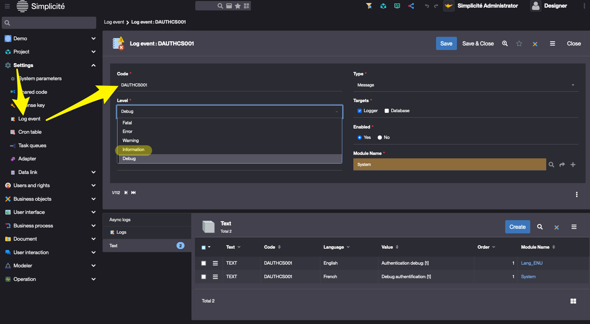

Authentication providers
=================================

> This document applies to version **4.0 P23** and above.

Simplicité offers a wide array of authentication solutions with the following ones working out-of-the-box, with no coding involved:
- **internal:** this is the default classic Simplicité mechanism that store user's passwords in the database
- **OAuth2**
- **SAML**
- **LDAP**
- **Crowd** *(external Atlassian Crowd authentication)*

There can be as many providers as necessary.

## Configuration

The authentication providers are to be configured with the `AUTH_PROVIDERS` system parameter, e.g.

```json
[
	{
		"type": "internal",
		"name": "simplicite",
		"visible": false 
	},
	{
		"type": "oauth2",
		"name": "google",
		"label": "Sign in with Google OAuth2 IdP",
		"sync": true,
		"client_id": "<my client ID>",
		"client_secret": "<my client secret>"
	},
	{ 
		"type": "saml",
		"name": "google",
		"label": "Sign in with Google SAML IdP",
		"sync": true
	},
	{
		"type": "ldap",
		"name": "openldap", 
		"visible": [ "http://localhost:8080"]
	}
]
```

### Common settings

The JSON settings include the common attributes:

| Setting   | Supported values                              | Required     | Comment                                                        |
|-----------|-----------------------------------------------|--------------|----------------------------------------------------------------|
| `type`    | `internal`, `oauth2`, `saml`, `ldap`, `crowd` | **Required** |                                                                |
| `name`    | String                                        | **Required** | provider name (must be unique per type)                        |
| `visible` | `true` (default) / `false` / Array            | optional     | can be an array of base URLs for which the provider is visible |
| `label`   | String                                        | optional     | label on the provider choice page                              |
| `sync`    | `true` / `false`                              | optional     |                                                                |
| `image`   | String                                        | optional     | disposition resource name                                      |

:::warning

For historical reasons the names `google`, `microsoft`, `linkedin` and `franceconnect` are **reserved** as they correspond to dedicated connectors.

:::


If the provider is configured as **not visible**, it is still accessible by appending `?_provider=<type>:<name>` (e.g.: `?_provider=internal:simplicite`) to the base URL.


### Specific settings

Extra mandatory settings might exist depending on the provider's type, please refer to the corresponding authentication documentation for details.

### Deprecated syntax

Before Simplicité v4, providers were configured in individual system parameters instead of one single JSON. PEM certificates are embedable in the JSON as base64 starting of v5.3.39.

|                                                                     | Setting specification                                             | Example                   |
|---------------------------------------------------------------------|-------------------------------------------------------------------|---------------------------|
| In `AUTH_PROVIDERS` as JSON                                         | `<setting (lowercase)>`                                           | `"client_id"`             |
| ⚠️ Deprecated in v4 ⚠️ Individual system parameters                 | `<type (uppercase)>_<setting (uppercase)> <provider (lowercase)>` | `OAUTH2_CLIENT_ID google` |
| ⚠️ Deprecated in v5 ⚠️ Image as implicitely specified resource name | `<type (uppercase)>_SIGNIN_<provider (uppercase)>`                | `LDAP_SIGNIN_MYOPENLDAP`  |


:::warning

You might still find some provider settings documented with the deprecated syntax.

:::

## Troubleshooting

To investigate authentication issues you can **temporarly** activate the `DAUTHCS001` log event.



If you can't change the value, it's probably because your user does not have the `ADMIN_SYSTEM` user parameter that allows for system modification.

:::warning

Make sure to deactivate it as it produces **very verbose** output.

:::

:::info

Before Simplicité v6, this menu item used to be in the "Operation" domain, in the extended view.

:::
