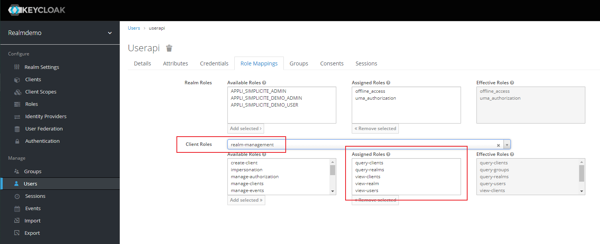
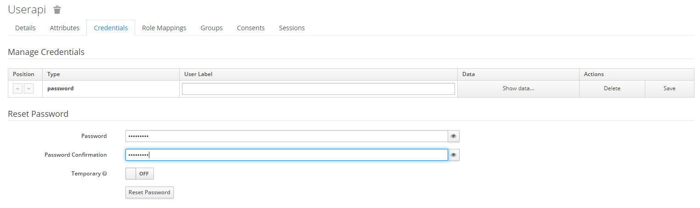
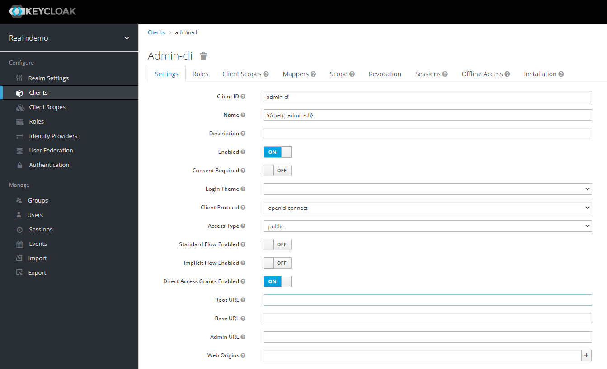

KeyCloak&reg; integration
=========================

OpenIDConnect configuration
---------------------------

The authentication providers are to be configured as the `AUTH_PROVIDERS` system parameter.
Simply add the Keycloak provider as follow:

```json
{
	"name": "keycloak",
	"type": "oauth2",
	"label": "Sign in with Keycloak OAuth2 IdP",
	"sync": true,
	"visible": <true|false|<array of URLs>>,
	"client_id": "<my client ID>",
	"client_secret": "<my client secret>",
	"authorize_url": "https://<host:port>/auth/realms/<myrealm>/protocol/openid-connect/auth",
	"token_url":     "https://<host:port>/auth/realms/<myrealm>/protocol/openid-connect/token",
	"userinfo_url":  "https://<host:port>/auth/realms/<myrealm>/protocol/openid-connect/userinfo",
	"logout_url":    "https://<host:port>/auth/realms/<myrealm>/protocol/openid-connect/logout",
	"userinfo_mappings": {
		"login":     "preferred_username",
		"firstname": "given_name",
		"lastname":  "family_name",
		"email":     "email",
		"address":   { "field": "usr_address1" },
		"myfield":   { "field": "myUserField" },
		"myparam":   { "param": "APP_MYPARAM" },
		"title":     { "field": "usr_title", "transform": { "M.":"MR", "Mme":"MRS", "Mlle":"MS" } },
		"unit":      { "field": "myUserUnit", "param": "APP_USER_UNIT" },
		"groups":    [ "realm.roles", "groups", "group.name" ],
		"whitelist": [ "GROUP1", "GROUP2", "MYPREFIX_*", "MYAPP_*" ]
	}
}
```

V5 `userinfo_mappings`has features to map simple fields:

- `field`: optional to set a User field with the userinfo value
- `transform`: optional to change the value with a simple mapped value
- `param`: optional to add a user's system parameter
- `groups`: optional list of paths to specify where the user's responsibilities are listed
- `whitelist`: optional list of allowed groups (to exclude all other groups from user-info), syntax supports the wildcard `*`

For instance, `"groups": [ "realm.roles", "groups", "group.name" ]` means that userinfo contains:
- path within objects: `"realms": { "roles": [ "PROFILE1", "PROFILE2" ] }`
- array of groups `"groups": [ "GROUP1", "GROUP2" ]`
- or a single name `"group": { name: "GROUP3" }`
 
The `groups` mapping rule indicates a list of path in the userinfo containing a group or a list of groups to add to user's responsibilities.
When this `groups` rule is specified, the user synchronization through API will not be used, so the userinfo must contains all the granted groups on each logon.

Note: 5.3 supports several Keycloak providers, names must start with `keycloak` to be identified in `AUTH_PROVIDERS`.

Roles and groups synchronization through API
-----------------------------------------

> **Note**: This section only applies to **version 5.0** and above.

A cron job can synchronize periodically through the Keycloak REST API the users/roles/groups from Keycloak to local users/responsibilities/groups.

1) Create a system parameter `KEYCLOAK_SYNC` 

It specifies the list of Keycloak roles and groups to synchronize:
- search: define the users to search in groups, roles and/or clients names
	- groups: optional list of groups
	- roles: optional list of realm roles
	- clients: optional list of clients
- import: 
	- `groups`: true to synchronize users's groups
	- `realmRoles`: true to synchronize users's realm roles
	- `clientRoles`: true to synchronize users's client roles
	- `prefix` will be added to the synchronized group or role to be identified against local group names

Note: 5.3 supports several providers, named `KEYCLOAK_SYNC <provider name>` 

```json
{
	"search": {
		"groups": [ "GROUP_USER", "GROUP_ADMIN" ],
		"roles": [ "APPLI_SIMPLICITE_DEMO_ADMIN", "APPLI_SIMPLICITE_DEMO_ADMIN" ],
		"clients": [ "my-app-name" ]
	},
	"import": {
		"groups": true,
		"realmRoles": true,
		"clientRoles": true,
		"prefix": "KEYCLOAK_"
	}
}
```

2) Local user/group mapping

| Parameter                | Value                                                                             | Description                                                                |
|--------------------------|-----------------------------------------------------------------------------------|----------------------------------------------------------------------------|
| USER_SYNC                | `true`                                                                            | Synchronize the user and responsibilities on new session with SESSION_INFO |
| USER_SYNC_DEFAULTS       | `{ "usr_lang":"FRA", "usr_minrows":"20", "usr_maxrows":"50", "viw_name":"Home" }` | Default values during a user synchronization with the external repository  |
| USER_SYNC_GROUPS_INCLUDE | `["APPLI_SIMPLICITE_*"]`                                                          | List of groups to include in responsibilities (accept wildcard *)          |
| USER_SYNC_GROUPS_EXCLUDE | `["ADMIN", "GRANT_ADMIN", "SOCIAL_ADMIN", "KEYCLOAK_*"]`                          | List of local groups to preserve in user responsibilities (accept wildcard *) |
| USER_SYNC_GROUPS_FORCED  | `["SOCIAL_USER"]`                                                                 | List of local groups to add in user responsibilities                       |

- The names of Keycloak groups or roles have to be set into `USER_SYNC_GROUPS_INCLUDE`, and must be configured as local Group (or group profile).
- It is strongly recommended to prefix all roles and groups with an application name (MYAPP_ADMIN, MYAPP_USER...) to simplify the mapping
- Local rights to preserve (local admin, designer...) must be added into `USER_SYNC_GROUPS_EXCLUDE`, otherwise it will be removed
- And `USER_SYNC_GROUPS_FORCED` can add common groups but unknown from Keycloak

Example: 

- Keycloak has a role "SALES_MANAGER" and Simplicité a group "APP_SALES_MANAGER" with granted functions
- All users must have the social features
- Paul is a local ADMIN to manage all the platform

The platform must define:

- a group "SALES_MANAGER" with profile "APP_SALES_MANAGER"
- at least "SALES_MANAGER" in `USER_SYNC_GROUPS_INCLUDE` = `["SALES_MANAGER", "SALES_USER"...]` 
- add social features with `USER_SYNC_GROUPS_FORCED` = `["SOCIAL_USER" ...]`
- the administrators must keep their local rights: `USER_SYNC_GROUPS_EXCLUDE` = `["ADMIN", "GRANT_ADMIN", "SOCIAL_ADMIN", "KEYCLOAK_*"]`


API Configuration
-----------------

1) Simplicite parameter

The `KeycloakTool` requires the system parameter `KEYCLOAK_API` to connect the Keyclock REST API.

Note: 5.3 supports several providers, named `KEYCLOAK_API <provider name>` 

```json
{
	"url": "https://<host:port>/auth",
	"service_root": "/admin/realms",
	"realm": "<my realm name>",
	"client_id": "admin-cli",
	"username": "<my user api>",
	"password": "<my user password>",
	"debug": false
}
```

- You must clear the cache to reset the parameters into memory
- Turn `debug` to `true` to see in logs during your integration tests:

	- all requests and responses: token, user, group search...
	- re-connection with the refresh_token when the API session has expired

**IMPORTANT**: the API does not support special characters, spaces or accents in name of groups and roles.

2) Keycloak API user

Keycloak must define a user with credential to access the API:

- The API user needs at least the right to read users, groups, roles, clients and realm. 
- In `role mapping` section ensure that the client roles `realm-management` has the following records:

    - query-clients
    - query-realms
    - view-clients
    - view-realm
    - view-users



Make sure to create a credential with a non-temporary password:



The client `admin-cli` must be enabled and with the protocol `openid-connect` as follow:



If the `access type` is set to `confidential`, you will have to add the `client_secret` in the parameters of `KEYCLOAK_API`.
This parameter is not used by `public` access.


You can test the API with `curl` before testing the connection through Simplicite.

- The admin RESTful API has a base path /auth/admin/realms/
- To get one access_token:

```
curl -X POST https://<host:port>/auth/realms/<myrealm>/protocol/openid-connect/token \
   -H "Content-Type: application/json" \
   -d '{"grant_type": "password", "client_id": "admin-cli", "username": "<userapi>", "password": "<userpassword>"}'
```

- To list users:

```
curl -X GET https://<host:port>/auth/admin/realms/<myrealm>/users \
	-H "Accept: application/json" \
	-H "Authorization: Bearer <access_token>"
```

See https://www.keycloak.org

See https://www.keycloak.org/docs-api/12.0/rest-api/index.html


Synchronization scheduling
--------------------------

A synchronization task must be added to your `Crontab` to launch periodically the following action:

- Function name: `KEYCLOAK_SYNC`
- Related action: `KEYCLOAK_SYNC`
- Related object: `Group`

The run-as user must be granted to this function, by default `ADMIN` has the right to launch this action.

This action is also accessible individually on UI through the Groups list if the user is granted to the function.
