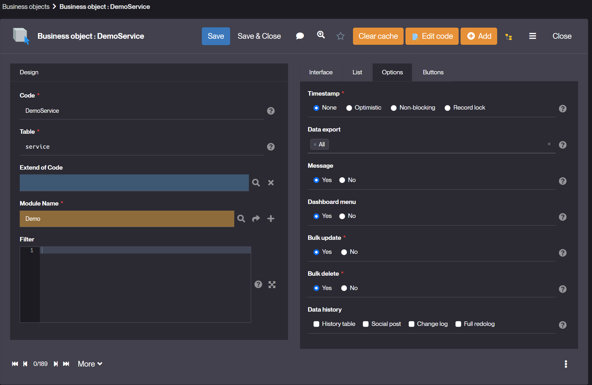

Service Object
====================

### What is a Service Object ?

A **Service Object** is an object whose data is based on a service call.    
The name of its table will be **service**.  

It is used to make a service call in order to obtain data without storing it in the database.  
The most common use case is to query the referential database services (country database, municipality database, etc.) without having to duplicate the data.  
As many attributes need to be associated with the service object as are returned by the service call, and the names of the attributes need to be mapped to the names received in the flow.  

The service object is seen by the platform as a [business object](/platform/businessobjects/business-objects).

The hooks to be implemented are **loadServiceConfig**, **countService()**, **searchService**, **selectService**, **createService**,  **updateService**, **deleteService**.  

> The service-opendata, service-salesforce, service-ldap, service-rest and service-servicenow objects are special cases of service objects integrated into the platform (the named hooks have been implemented). All you need to do is set the configuration in the object's filter or implement the **loadServiceConfig** hook. 

### How to create a Service Object ?

1. Create a [business object](/tutorial/getting-started/object) whose table is **service** with no timestamp (setting the **Timestamp** attribute of the object to the "None"). A read-only function is sufficient for this object. 

2. Add as many attributes as data sent by the service. The object attribute (logical or physical) names must match the key names of the data received from the REST service. 
3. Implement the **countService** and **searchService** hooks to display the list. 
Implement the **selectService** hook to display the form, create and update when it is possible.

> When the API you are using does not allow you to perform a count, it is recommended that you store the search result in the countService method. Then, preserve the result either by using setCurrentList(), or by storing it in an object parameter. This allows the data to be reused in searchService, avoiding a redundant API call. 