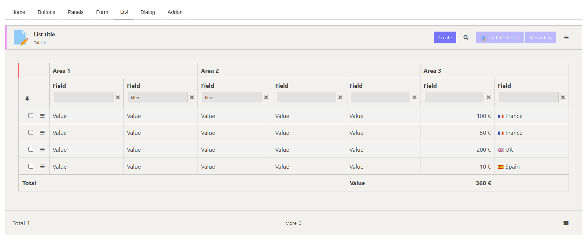
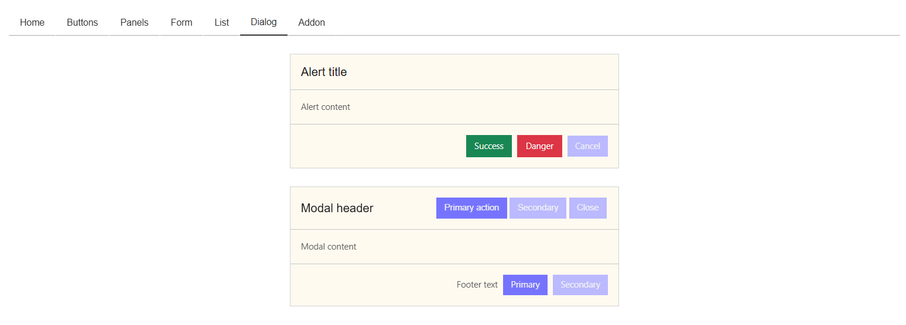
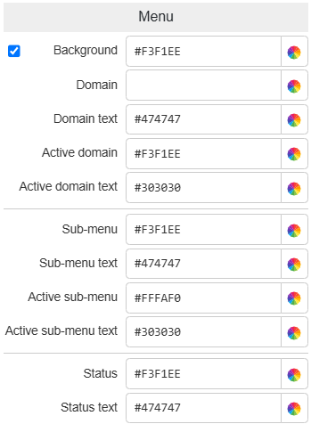
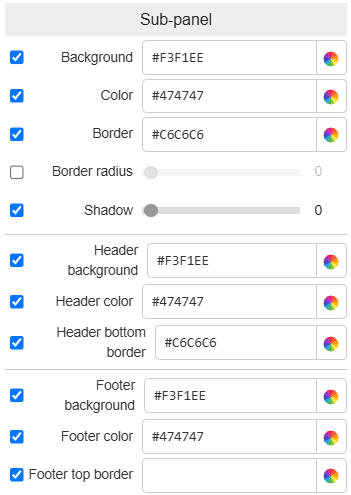
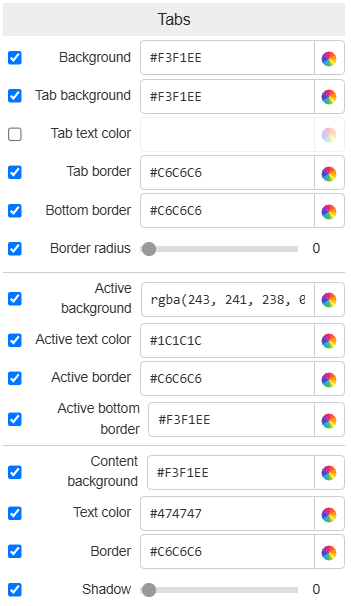

Theme Editor Overview
===================

:::warning
This lesson is part of the **Frontend Development** category, designed to guide you through frontend customization within Simplicité.
:::

The **Theme Editor** enables visual customization of your Simplicité instance for both designer and user interfaces.

## Accessing the Theme Editor

1. Navigate to **User Interface > Themes**
2. Select a theme
3. Click the **Preview** button

## Default Themes

Simplicité includes several predefined themes:

**ThemeAdmin**: Dark mode for administrators

Preview

**ThemeDesign**: Light mode alternative

Preview

**ThemeEtat**: DSFR (French government) compliant

Preview

## Creating a Theme

1. Click **Create** in **User Interface > Themes**
2. Select a base theme:
   - **Dark Base**: Minimal dark foundation
   - **Light Base**: Minimal light foundation
   - **Default Base**: Refined light foundation
3. Choose name and module

:::warning
Base themes are building blocks, not for direct use. Create custom themes extending them.
:::

## Theme Files

After creation, three files are generated:

1. **constants.less**: Theme Editor values as Less constants
2. **addons.less**: Custom style overrides
3. **themeName_gen.css**: Compiled final stylesheet

## Theme Editor Interface

The editor has three sections:

1. **Interface Preview**: Live visualization
2. **Values Menu**: Style controls
3. **DOM Path**: Structural element view

### 1. Interface Preview

Navigate through tabs to preview different UI elements:

**Home**: Header and menu elements

Preview

**Buttons**: All button types with customizable properties

Preview

**Panels**: Structural elements (Panels, Sub-Panels, Tabs)

Preview

**Form**: Field types and inputs

Preview

**List**: Table-format data display

Preview

**Dialog**: Pop-up interfaces

Preview

### 2. Style Values Menu

Organized by Preview tabs, the menu controls:

1. **Background**: Color and opacity
2. **Text**: Font size, color, weight
3. **Border**: Color, opacity, radius, width
4. **Hover**: Interactive element states

#### Base Settings

Controls fundamental styles: background color, fonts, spacing.

#### Main Elements

Configures header, footer, and navigation breadcrumb.

#### Menu

Styles main menu, including active/inactive states.

#### Panel

Top-level panel styles (container, header, footer).

#### Sub-panel

Nested panel styles within main panels.

#### Tabs

Tab organization and navigation styles.

#### Field

Input field styles (labels, inputs, readonly, references).

#### List

Table component customization (headers, rows, filters).

#### Dialog

Modal dialog styles (container, header, footer).

### 3. DOM Path Viewer

Displays element structure for:
- Understanding layouts
- Defining custom styles
- Ensuring consistency

**Usage**: Hover over Preview elements to see their DOM path in Less format.

**Common paths**:
- Home: `div.main > div.simplicite.wrapper > ... > element.class`
- Form: `div.objform > div.card > ... > element.class`
- List: `div.objlist > div.card.panel-list > ... > element.class`