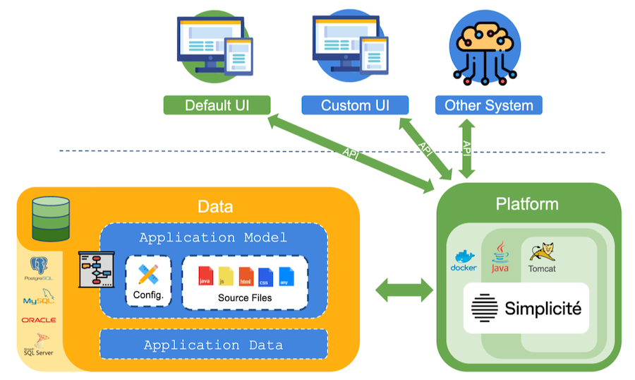
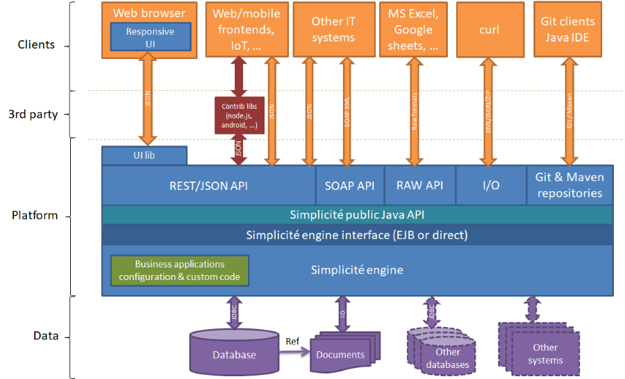
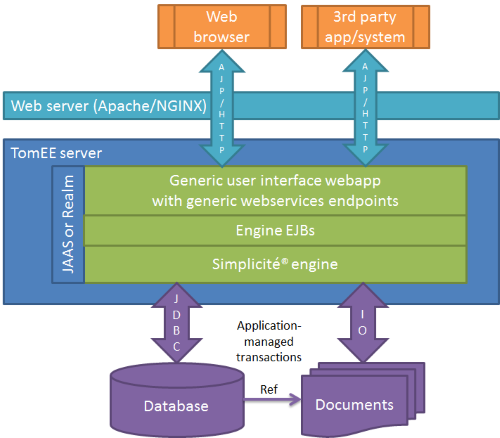
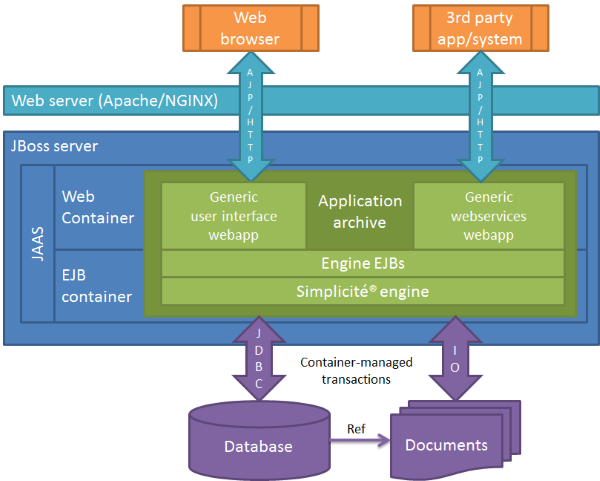
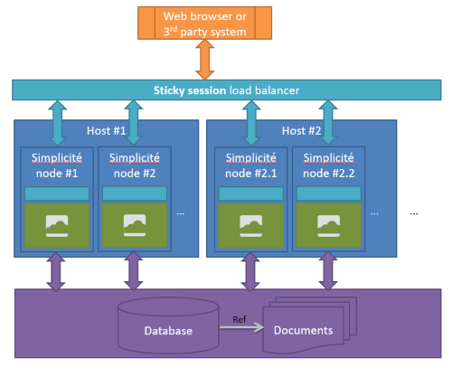

Architecture
============

Introduction
---------------------------

Simplicité is a low-code platform running on Java. It interprets your business application modelisation (app configuration, data schema, processes, code) to serve a number of APIs and a default back-office UI. It is extendable with external librairies, and puts an emfasis on giving a lot of control to the developer.

Although **many other deployement configurations are possible**, it is usually run on the Docker image delivered through our private docker registry. That default Docker image is Kubernetes compatible and contains a JDK, a Tomcat Java Webapp server, and our proprietary platform.

Architecture Overview
--------

> **Note**: documents can be either stored on file storages (e.g. file system) with a path reference in the database or as binary content (BLOB) in the database

For more details on generic integration components (webservices, I/O interface, etc.) please refer to the documents referenced in the _Integration services_ section of [the documentation index](/docs/documentation/integration/in-out).
Some of these generic webservices are wrapped into generic libraries/APIs in various technologies, please refer to the documents referenced in the _APIs_ section of the document index.

Beyond these generic integration components, Simplicit&eacute; being a Java platform, any kind of integration that is possible in Java is possible with Simplicité.
Some examples are available in [this document](/docs/documentation/core/third-party-apis-examples) but many other third part public or private services integration can be implemented. 

Compliance
----------

Please refer to [this document](/docs/documentation/compatibility) for details on compliant components (OS, application servers, database, browsers, ...).

Deployment modes
----------------

Exposing the application server thru a Apache/NGINX reverse proxy as described below is not mandatory but rather a good practice.

### Web mode

In this mode the publication layers (UI and API) have direct access to Simplicité engine.

### JEE web profile mode

In this mode the publication layers (UI and API) have access to an EJB lite-wrapped Simplicité engine.

### JEE full profile mode

In this mode the publication layers (UI and API) have access to an EJB wrapped Simplicité engine.

Clustering
----------

Simplicit&eacute; instances can be clustered to provide several nodes using the same database, the right approach for load balancing being a **sticky session** load balancing.

