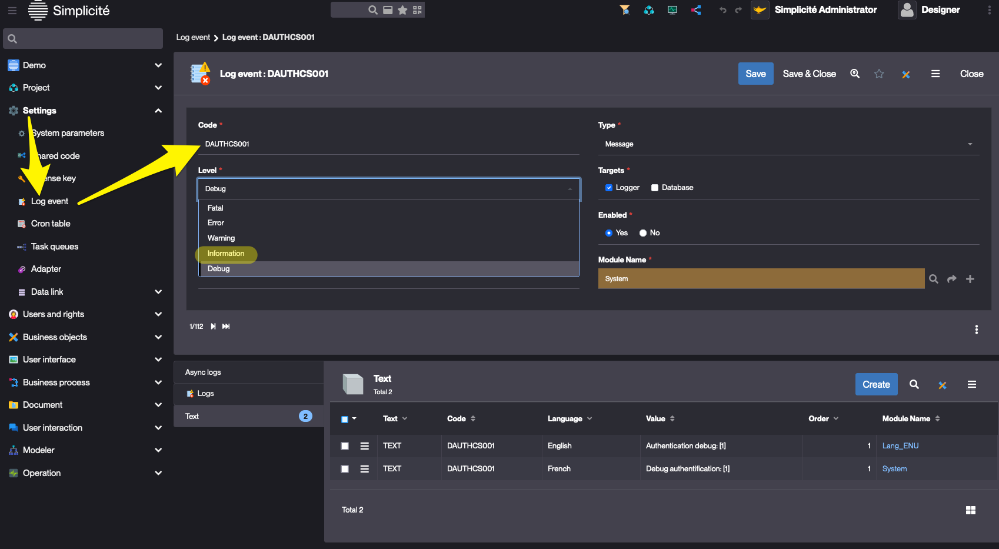

Authentication providers
=================================

> This document applies to version **4.0 P23** and above.

## Introduction

Simplicité offers a wide array of authentication solutions with the following ones working out-of-the-box, with no coding involved:
- **internal:** this is the default classic Simplicité mechanism that store user's passwords in the database
- **OAuth2**
- **SAML**
- **LDAP**
- **Crowd** *(external Atlassian Crowd authentication)*

There can be as many providers as necessary.

## Configuration

The authentication providers are to be configured with the `AUTH_PROVIDERS` system parameter, e.g.

```json
[
	{
		"type": "internal",
		"name": "simplicite",
		"visible": false 
	},
	{
		"type": "oauth2",
		"name": "google",
		"label": "Sign in with Google OAuth2 IdP",
		"sync": true,
		"client_id": "<my client ID>",
		"client_secret": "<my client secret>"
	},
	{ 
		"type": "saml",
		"name": "google",
		"label": "Sign in with Google SAML IdP",
		"sync": true
	},
	{
		"type": "ldap",
		"name": "openldap", 
		"visible": [ "http://localhost:8080"]
	}
]
```

You might find some provider settings documented with the deprecated syntax. With recent versions, you should be able to specify all 
of the provider's settings in the JSON (including, from v5.3.39, PEM certificates encoded as base64)

|                                          | Setting specification                                           | Example                   |
|------------------------------------------|-----------------------------------------------------------------|---------------------------|
| In `AUTH_PROVIDERS` as JSON              | `<setting (lowercase)>`                                          | `"client_id"`             |
| ⚠️ Deprecated ⚠️ As individual sys param   | `<type (uppercase)>_<setting (uppercase)> <provider (lowercase)>` | `OAUTH2_CLIENT_ID google` |

### Common settings

The JSON settings include the common attributes:

| Setting   | Supported values                              | Required     | Comment                                                        |
|-----------|-----------------------------------------------|--------------|----------------------------------------------------------------|
| `type`    | `internal`, `oauth2`, `saml`, `ldap`, `crowd` | **Required** |                                                                |
| `name`    | String                                        | **Required** | provider name (must be unique per type)                        |
| `visible` | `true` (default) / `false` / Array            | optional     | can be an array of base URLs for which the provider is visible |
| `label`   | String                                        | optional     | label on the provider choice page                              |
| `sync`    | `true` / `false`                              | optional     |                                                                |
| `image`   | String                                        | optional     | disposition resource name                                      |


If the provider is configured as **not visible**, it is still accessible by appending `?_provider=<type>:<name>` (e.g.: `?_provider=internal:simplicite`) to the base URL.

**Note**: : You can also customize/add a custom logo for a given provider on the provider choice page by configuring
an SVG image resource named `<type (in uppercase)>_SIGNIN_<name (in uppercase)>` (e.g. `LDAP_SIGNIN_MYOPENLDAP`).
As of version 5 it is configured through the `image` setting.

### Specific settings

The other settings depends on the provider's type, please refer to the following document for details:

- [OAuth2](/documentation/authentication/oauth2) 
- [SAML](/documentation/authentication/saml)

## Troubleshooting

To investigate authentication issues you can **temporarly** activate the `DAUTHCS001` log event.

> Make sure to deactivate it as it produces **very verbose** output.

<details>
<summary>Click to open</summary>



> Before Simplicité v6, this menu item used to be in the "Operation" domain, in the extended view.

</details>
