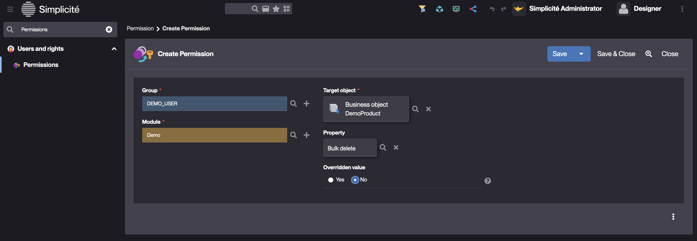

Permissions
==========================

Since version 6.0, Permissions have replaced Functions for several Objects of the metamodel.  

The Function Configuration Object is now dedicated to Business Objects only.  

### What is a Permission ?

A Permission is a Configuration Object of the metamodel that contains an object-type attribute. 
This makes it possible to create Permissions for the following Configuration Objects :
- Agenda  
- Domain  
- External object  
- Link  
- Modeltemplate  
- Pivot table  
- Places map  
- Publication  
- Search  
- Shortcut   
- Simple view  
- Timesheet  
- Tree view  

For these Configuration Objects, Permissions replace Functions by setting the Object's `visible` property and provide the option to grant access to the relevant Groups.

It is also possible to create Permissions for :
- Business object
- Field
- Object Field

For these objects, Permissions allow properties to be overridden and restricted to specific Groups. In this way, they can replace certain constraints.

Examples : 
- Override the `List update` property of a Business Object for a specific Group
- Override the `filter` property of a Business Object to set a SQL filter for a specific Group 
- Override Object Field visibility for a specific Group
- Override the `mandatory` property of a Field for a specific Group

### How to create a Permission ?

Adding a Permission can be done via the `Permissions` panel in any of the objects listed above.
Alternatively, use the menu search bar to find the Permissions configuration object.

1. Create a Permission
2. Select the Group
3. Set the Module
4. Select the target object
5. Select the property to override
6. Set the overriden value

It is required to clear the platform's cache to apply changes made to Permissions

