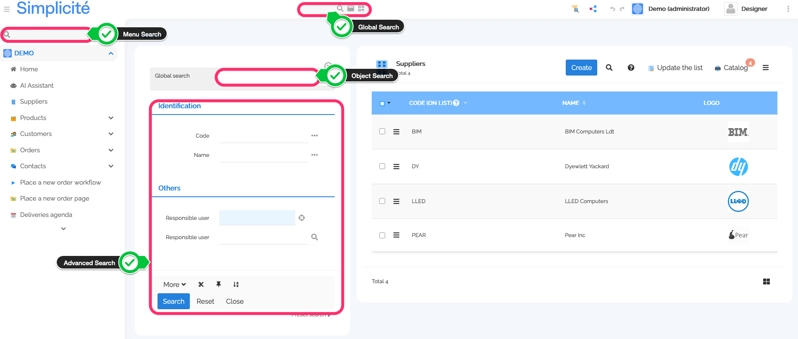
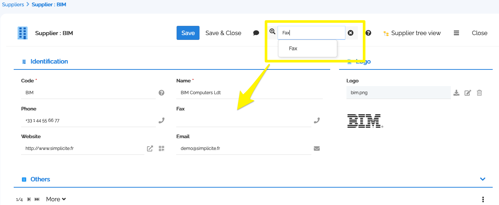

Search
=======

## Searching with the UI

There are differend kind of searches in Simplicité : 
- Global Search
- Advanced Search
- Object Search
- Domain Search
- Form Search



### Global Search

The global search (aka fulltext search, or indexed search) works by searching the **index** for the string the user types in the header search bar. Needless to say, only objects that the user has access to are displayed.

For the objects to appear in the search:
1. The object must be **indexable** (property set on the Business Object configuration options)
2. At least one of its fields must be indexable (property set on the Field configuration)

The search index can be configured in `USE_SEARCH_INDEX`
- `sql` is the default Simplicité index
- `lucene` refers to the industry standard [Apache Lucene](https://lucene.apache.org/core) index (*on which ElasticSearch is built on for example*)
- `no` to deactivate global search

The **Simplicité index** is quite simple: it uses a single database table (`m_index`) to store a concatenation of all the indexable fields. It is the default and is by far the most used. That index is available for the designe to see under the **Object Index** object (for example if there is a need to understand why some terms don't give results). It is easy to use, and easy to debug, but its performance and precision can be affected/limited by:
- the database used
- the quantity of indexed data
- the query language (SQL)

The **Lucene index** relies on the lucene engine to index objects and retrieve results. Please refer to its documentation for more information.

<!-- TODO global search results https://community.simplicite.io/t/recherche-limitee-a-un-domaine/1885/7 -->

### Advanced Search

The advanced search is a by-column search on an object. 

The be activated, the object needs to have at least one searchable field (*be careful: indexable->global vs searchable->object*).

It has three main presentations: 
- **detached** as a floating container
- **pinned to columns**
- **docked**

The detached and pinned modes have a richer UI with components to help the user build advanced queries based on the [Simplicité Search Syntax](/docs/documentation/ui/search-syntax).

Basically, each filter is translated to a SQL `WHERE` clause, allowing filtering on the table.

### Object Search

The Object Search is just the Global Search functionnality (using the same index and specificities) but applied to one object only.

### Menu Search

The Menu search facilitates the task of finding a particular item in the domain bar. It is deactivatable via the `MENU_SEARCHABLE` system parameter.

> The menu search is not to be mistaken with the domain search, which is a tab in the global search results.

### Form Search

The Form search facilitated finding a particular attribute in a big form, highlighting and putting the focus on the attribute. It is deactivatable on the configuration of each object.



## Customizing results

To customize results and modify the object search behavior object by object, you can use the dedicated object hooks, `preSearch` and `postSearch`.

## Searching in...

### Java

```java
try{
	ObjectDB o = getGrant().getTmpObject("MyObject");
	synchronized(o.getLock()){
		for(String[] row : o.getTool().search(Map.of(
			"myField", "is not null"
		))){
			o.setValues(row);
			// do something
		}
	}
}
catch(SearchException e){
	AppLog.error(e, Grant.getSystemAdmin());
}
```

<!--

### JS

TBD... lib ajax & lib npm

### API

TBD... 

-->