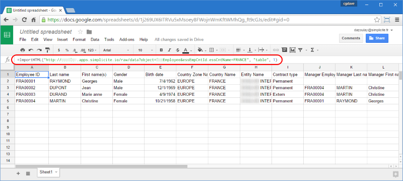

RAW services
=============

<h2 id="intro">Introduction</h2>

This document describes how raw data services are working.

These generic raw data services should only be used on the **API endpoint**.

The authentication mechanisms available on this API endpoint are described in [this document](/lesson/docs/integration/services-auth)
the credentials that needs to be passed to the calls are noted `<credentials>`.

> **Warning**: never use the **public UI endpoint** instead of the API endpoint: the public UI endpoint
> is a statefull UI endpoint that is **only** supposed to be used by the non authenticated pages of the generic UI.
> It does not have the scalability and performance of the API enpoint.
> In other word using the public UI endpoint for services purposes is an **absolute anti-pattern**.

The calls examples are given using the `curl` command line tool
(that can easily be transposed to any HTTP client tool or API).

> **Note**: in legacy versions 3.x the `-b cookies.txt -c cookies.txt` parameters of the `curl` calls below are **required**
> as they allow to re-use the same server session (identified by the `JSESSIONID` cookie).
> In versions 4.0+ a technical session is used to avoid taking care of the session cookie.

For an application named `myapp`, the base URL of the raw data services endpoint is:
```
http[s]://<host[:<port>]>/myappws/raw
```
As of version 3.0 MAINTENANCE 20, the API endpoint is also available in the main webapp `/myapp` (this allows to avoid deploying the webservice gateway webapp `/myappws`):
```
http[s]://<host[:<port>]>/myapp/api/raw
```

if you are using this API endpoint please refer to [this document](/lesson/docs/integration/services-auth) for details on the authentication mechanisms.

It will be noted `<base URL>` in the rest of the document.

> **Note**: In production the services endpoint's URL should be restricted only to allowed origins e.g. using URL filtering based on request's origin IP address or similar approaches.

<h2 id="pooling">Scalability and performances</h2>

For optimal performances under high concurrent volume it may be useful to enable the API pooling by setting the `USE_WEBSERVICES_OBJECTPOOL` to `yes`, especially
when using a single user (e.g. calls from a "public" frontend).

This allow calls to the services to be processed by a per-user pool of business objects.
The pool size can be adjusted/limied using the `WEBSERVICES_OBJECTPOOL_MAXPEROBJECT`  and `WEBSERVICES_OBJECTPOOL_MAXTOTAL` system parameters.

<h2 id="services">Data services</h2>

### Business object service

The object raw data service returns the rows of a business object as a plain HTML table. The values are formatted using the user's locale settings (dates, floats, ...)
and the field labels are returned in the user's language.

To get data from the `SystemParam` business object the call is:
```shell
	curl -u <login>[:<password>] "<base URL>/data?object=SystemParam"
```
### List of values service

The list of values raw data service returns the code and values of a list of values as a plain HTML table. The values are returned using the user's language.

To get data from the `LANG` list of values the call is:
```shell
	curl -u <login>[:<password>] "<base URL>/data?lov=LANG"
```
<h3 id="excel">Usage in Microsoft Excel&reg;</h3>

Typical usage of raw data services is to configure traditional external datasources in Microsoft Excel&reg;.

> **Note**: In recent Excel versions (Office 2016+) a much better approach is to use the **PowerQuery** tool (which is now provided by default with Excel) and the REST services.
> See dedicated section in [this document](/lesson/docs/misc/excel) for details.

<h3 id="googlespreadsheets">Usage in Google Spreadsheets&reg;</h3>

As of version 3.1 MAINTENANCE 07, another possible usage of raw data services is to configure external datasources in Google Spreadsheetsl&reg;.

Note that only **public** data can be loaded (unless your application uses the same Google OAuth2 authentication than the spreadsheet).

To do so create a formula like: `=ImportHTML("<base URL>/raw/data?object=<object name>[&<filters>]"; "table"; 1)`



<!-- 
**TO BE COMPLETED** 

Document services
-----------------

**TO BE COMPLETED** 

Resources services
------------------

**TO BE COMPLETED** 
-->

