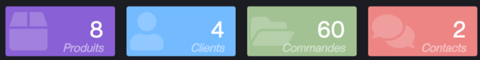
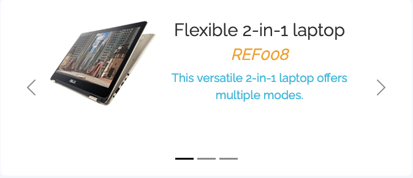

Widgets
====================

Widgets are easily configurable external objects, usually used to compose home pages. 


How to integrate (reminder)
---------------------------

This is just a reminder, as widgets just build on the existing external objects 

- create a view (home page, domain home, etc)
- through the view template editor, add a view area
    - type : External Page
    - source : External Object
    - External Object : "MyCounterName" (copy that name)
- create a new External Object
    - name: "MyCounterName"
    - UI Widget: Yes
    - Nature: UI Page or component
    - Class: one of the available widgets
        - `com.simplicite.webapp.web.widgets.CountersExternalObject`
        - `com.simplicite.webapp.web.widgets.CarouselExternalObject`
        - `com.simplicite.webapp.web.widgets.CardsExternalObject`

Counters
--------

The **CountersExternalObject** counts how many of some objects there is in the database.



Configuration is done like such in the configuration field of the external object:
- **color** must be an available CSS class, typically one of the color classes
- **name** is the functional name of the object you need to count
- **icon** is one of the available SVG icons in the app

```json
{
	"objects": [
		{
			"color": "violet",
			"name": "MyObject",
			"icon": "fas/box"
		}
	]
}
```


Carousel
---------



The **CarouselExternalObject** displays a carousel of data and is configured with the following JSON:

```json
{
	"name": "DemoProduct",
	"imageField": "demoPrdPicture",
	"titleField": "demoPrdName",
	"subTitleField": "demoPrdReference",
	"descriptionField": "demoPrdDescription",
	"filters": {
		"demoPrdFeatured": true
	},
	"height": "18rem"
}
```

Cards
------


The **CardsExternalObject** displays data as cards and is configured with the following JSON:

```json
{
	"subTitleField": "nws_human_readable_date",
	"instance": "web_WebNews",
	"imageField": "nws_image",
	"titleField": "nws_title",
	"onclick": false,
	"name": "WebNews",
	"cardWidth": "15rem",
	"rowClasses": "row-horizontal",
	"descriptionField": "nws_description"
}
```


