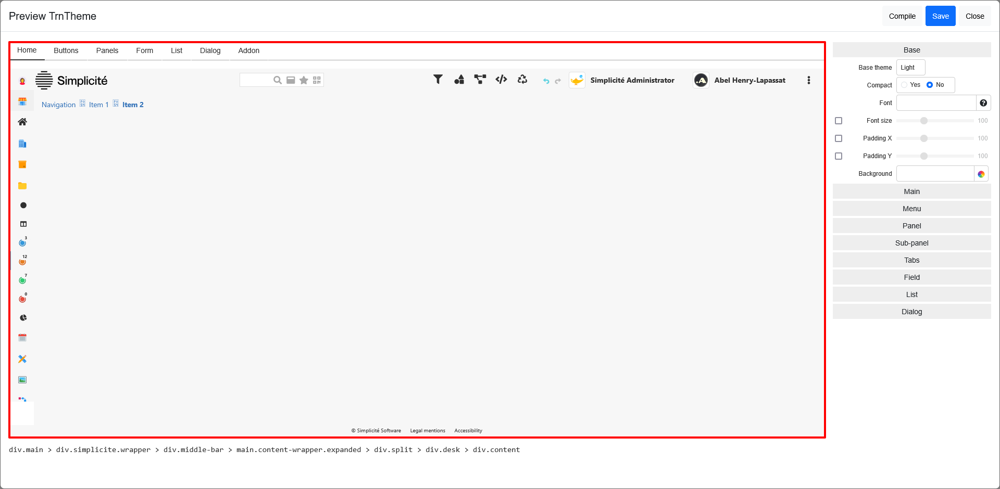
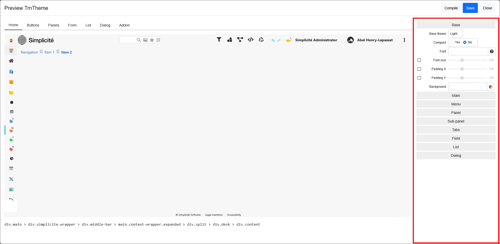
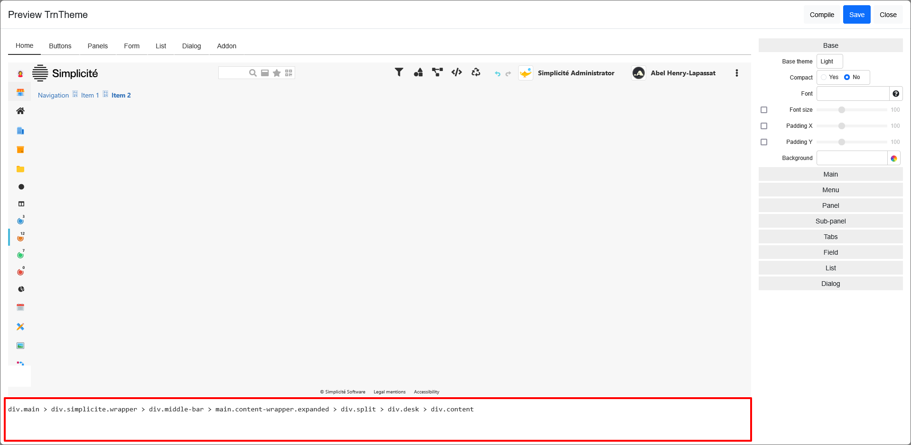
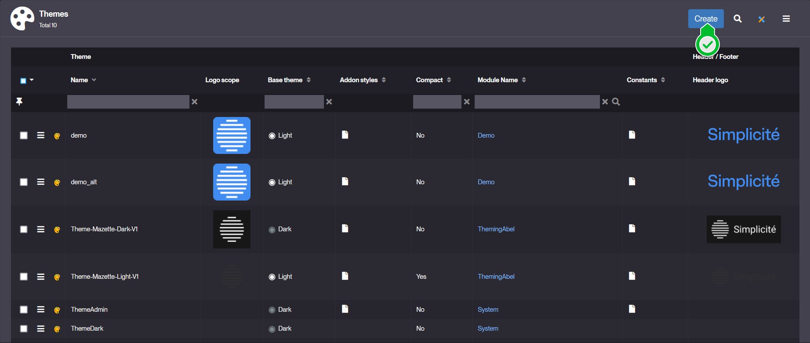
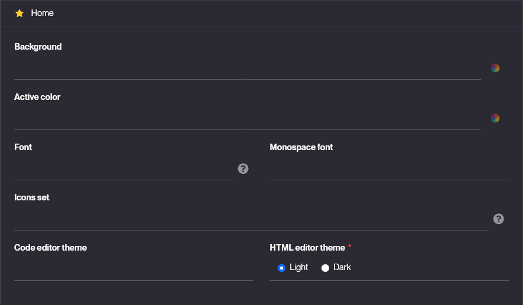
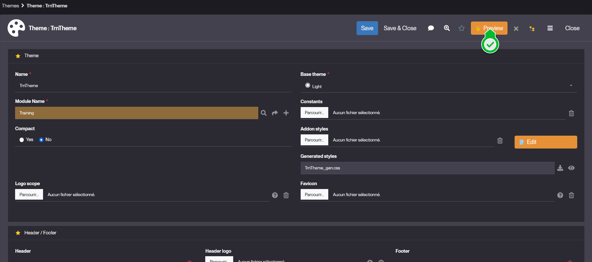
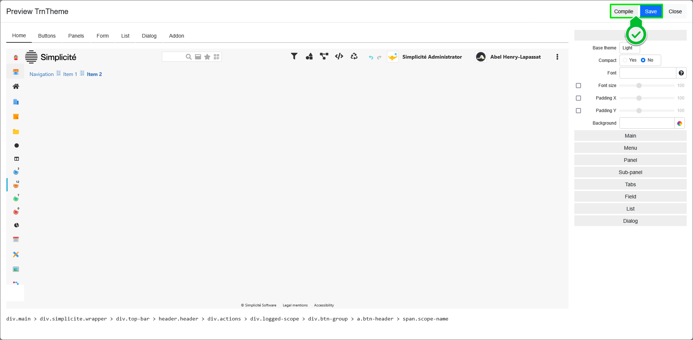
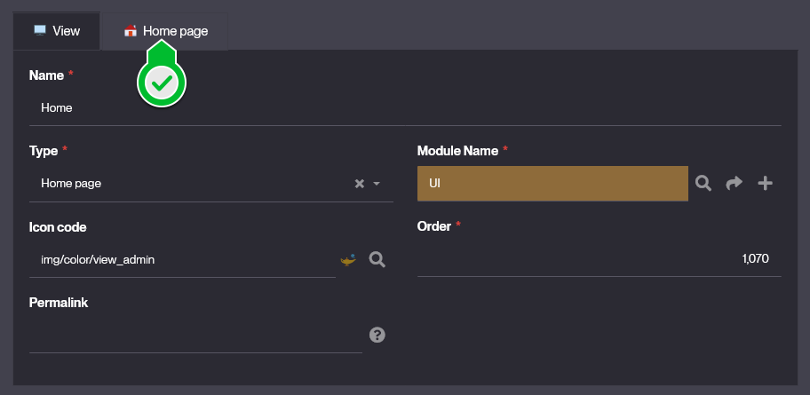

# Themes

## What is a Theme ?

A theme is an object that defines the visual & graphics styles of a Simplicité's native interface. You create it through the embedded **Theme Editor**, and you then have the possibility to refine it by adding a custom stylesheet (written in LESS or CSS) that will define styles applied globally over your interfaces.

A theme has to be associated to a [scope]/docs/platform/userinterface/views/home-page#scopes.

## Theme Editor

Simplicité provides an embedded tool to create your themes' styles: the **Theme Editor**. In which you can select the styles of all Simplicité's native elements and preview theme before applying.

The tool is composed of 3 parts, each representing a core feature:
- **(1) Editing Area:** in which you can see the live-result of your theme.
    - It is organized in tabs that regroups elements that have similar styles, or that exists in similar zones of your interfaces.
    - By clicking on any element that is customizable from the tool, you'll have its attribute displayed in the *Theme Palette*.
    - Hovering on specific elements will display their DOM-location in the *Class Path*, only if they are a part of a class that has global styles.  
      

- **(2) Theme Palette:** where you will make all of your changes through color pickers and sliders, triggering the live-preview on the *Editing Area*.
    - It is organized by groups of styles, either that appears in same configurations, or that are appart of the same element.
    - The *Buttons* are the only elements that you can't style here, you can go to *Editing Area > Buttons* in order to specify their styles.  
      

- **(3) Class path:** which displays the currently hovered element's path through the DOM, allowing you to know what is the element's *html class* and where it is located in the DOM.  
      

## Creating a Theme 

Start by creating the theme object by going to *User Interface > Themes* and clicking on **Create** in the workspace's headbar.

  

1. Setup your object.
    - Enter a valid and unique **Name** for your theme
    - Select the **Module Name** to associate your theme to.
    - Choose your **Base theme**, which will define the base values for your elements, within the list; *Default*, *Light*, *Dark*. Those are gonna be mostly override by your future choices.
    > Example values:  
    > 

    - Scroll down and select the **HTML editor theme** style, which is recommended to match your *Base theme*.
      

2. *Save* your object.

3. Click on **Preview** to open the *Theme Editor*  
      
    - Here you can freely define styles for elements that you wish to customize.
    - Click **Compile** to make sure your modifications appear in the live preview.
    - Click **Save** to apply the changes to your theme object.  
      

4. *(optional)* If you have more specific styles in mind, you can then add them through the *addons.less* stylesheet.
    - Click **Edit** next to the **Addon styles** field to open the stylesheet in the *Code Editor*.
     
    - Implement your styles, and click **Save** and **Close** to come back to your theme's form.
    - Click **Save** to apply those last styles.
    > It is possible that you see some issues here from your *addon.less* files that might be caused by syntax errors. If you have doubts or need a quick reminder for *LESS* features.

## Usage

Once that you created your theme, you can use it on any **View** that is of type [Home page]/docs/platform/userinterface/views/home-page by applying it from the view's form:

1. Open your view's form at *User Interface > Views > Home page*.

2. Go to the *Home page* tab-item.  
  

3. Through the field *Theme Name*, select the theme you want to apply.  
  

4. **Save** & **Clear your cache**. When connecting back to your session and opening the targeted *Home Page* you'll see the applied theme.

## LESS breakthrough

### What is Less ?

Leaner CSS (Less), is a dynamic preprocessor style sheet language that extends the capabilities of CSS. It introduces features like variables, nesting, mixins and functions. Thus making style sheets more maintainable, customizable and easier to scale.

### Key Features

*Variables:* Store reusable values for colors, fonts or dimensions:
<details>
<summary>Code Snippet</summary>

```less
@primary-color: #3498db;
body {
    color: @primary-color;
}
```
</details>

*Nesting:* Write styles in a structured & hierarchical way. Allowing to specify depending on contexts when it's needed. Below are shown two ways to use nesting, and shows a use case where items with same class have different styles depending on their parent:
<details>
<summary>Code Snippet</summary>

```less
.container {
    .header {
        .box {
            background-color: red;
        }
    }
    .body > .box {
        background-color: blue;
    }
}
```
</details>

> **Warning:** the nesting `.parent > .child` and `.parent .child` have different meanings: **">"** targets only the *direct .child*, otherwise *all .child* are targeted.

*Interactions Nesting:* Same way as nesting works for children elements or contexts, yo ucan use it to dynamically handle different type of interactions for your elements:
<details>
<summary>Code Snippet</summary>

```less
body {
    .container {
        .box {
            background-color: yellow;
            transition: background-color 0.5s ease;

            &:hover {
                background-color: orange;
            }
            &:active {
                background-color: red;
            }
        }
    }
}
```
</details>

*Mixins:* Define reusable style blocks for consistency:
<details>
<summary>Code Snippet</summary>

```less
.rounded-corners(@radius: 0.5rem) {
    border-radius: @radius;
}
div {
    .rounded-corners(1rem);
}
```
</details>

*Functions:* Perform calculations and color operations directly in your styles:
<details>
<summary>Code Snippet</summary>

```less
@primary-color: #3498db;
body {
    color: darken(@primary-color, 16%);
}
```
</details>

> **Note:** Most of the described features are also available in regular CSS.

## Read More

- [Styles]/docs/front/styles using *addon.less*.