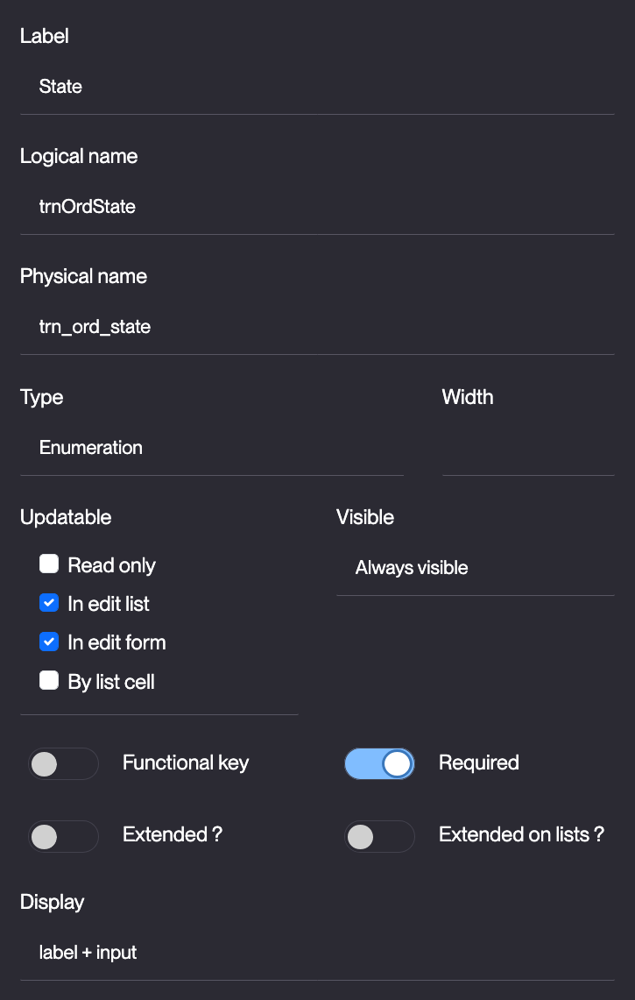
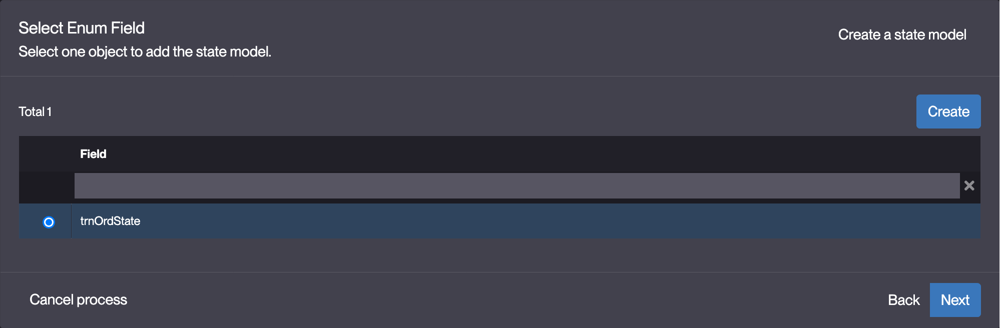

# Building the "Order Management" Training App : Creating a State model

> Prerequisite : [The Supplier, Product, Client and Order objects are complete and linked together](/tutorial/expanding/fieldarea)

## What is a State model ?

A state model defines the different statuses a business object can have and controls how it transitions between them. It enables filtered views, enforces permissions on state changes, and automates actions triggered by transitions. Setting up a state model ensures a structured workflow for business objects... [Learn more](/platform/businessprocess/state)

## Creating a State model for the Order Business object

### Adding a mandatory "State" field

To add a State field to the Order Business object, follow the steps below :

1. Add a **mandatory enumeration** field to the **TrnOrder** Business object in the [previously](/tutorial/expanding/fieldarea#structuring-the-order-template) created "Order" Field Area
    > For a detailed guide on how to add a field, see [Getting started : Create field](/tutorial/getting-started/attribute)
2. Fill in the Field fields like so : 
    - Label : **State**
    - Logical name : **trnOrdState** *should be auto-completed* 
    - Physical name : **trn_ord_state** *should be auto-completed*
    - Required : **Toggled**  
    
3. Click **Save**
4. Hover over the created **State** field and click the **Edit** icon  
    
5. Click **Edit list**  
    
6. Fill in the List items like so :  

| Code | Value |
| ----------- | ----------- |
| P | Pending |
| C | Canceled |
| V | Validated |
| S | Shipped |  

*Click **Add** to add an element to the List*  

7. Click **Save**
8. Close the Template editor

### Creating the State model based on the "State field"

To create a State model for the the Order Business object, follow the steps below :

1. On the "TrnOrder" Business object's form, click **+ Add > Add State Model**  
    
2. Select the enumeration field that the State model is based on  
    
    > *By default "trnOrdState" is selected*
3. Click **Next**
4. Fill in the State transition matrix like so :   
    
5. Click **Next**
6. Grant every State transition to the **TRN_SUPERADMIN** Group  
    
    > The *Associate Action* checkbox creates a button for each State transition
7. Click **Next**
8. Fill in the Translations (button labels) for the State transitions like so :  
    

| | English | French |
| -- | --- | --- |
| TRN_ORD_STATE-C-P	| Back to Pending | Retour à En Attente |
| TRN_ORD_STATE-C-V	| Back to Validated  | Retour à Validée |
| TRN_ORD_STATE-P-C	| Cancel | Annuler |
| TRN_ORD_STATE-P-V	| Validate | Valider |
| TRN_ORD_STATE-V-C	| Cancel | Annuler |
| TRN_ORD_STATE-V-S	| Ship | Envoyer |

9. Click **Next**

:::tip[Success]
  A state model has been added to the TrnOrder Business object.
:::

## Test the State model with the usertest User

To test the State model, follow the steps below :

1. Clear the platform's cache and log in using *usertest*
    > For a detailed step-by-step, see : [Testing the User](/tutorial/getting-started/user#activating-and-testing-the-user)

:::tip[Success]
  <b>Expected result :</b>
    <ul>
        <li>In the Order menu</li>
        <li>The list of States are visible</li>
    </ul>
    
:::

2. Open or create an Order 
    For a detailed step-by-step, see : [Adding data](/tutorial/expanding/relations#create-an-order)
3. Click **Validate**  
    
4. Click **Yes**

:::tip[Success]
  <b>Expected result :</b>
    <ul>
        <li>The state field is updated with : "Validated"</li>
        <li>The buttons "Cancel" and "Ship" are available</li>
    </ul>
    
:::

