# Building the "Order Management" Training App : Adding icons and a theme

> Prerequisite : [The Order has a state model](/lesson/tutorial/expanding/states) and a [home page](/lesson/tutorial/expanding/views) exists

## What is a Theme ?

A theme defines the logo and the main colors of the interface...[Learn more](/lesson/docs/platform/userinterface/themes)

## Creating a Theme

To create a Theme and add it to the App, follow the steps below :

1. In the **User interface > Themes** menu, click **Create**  
    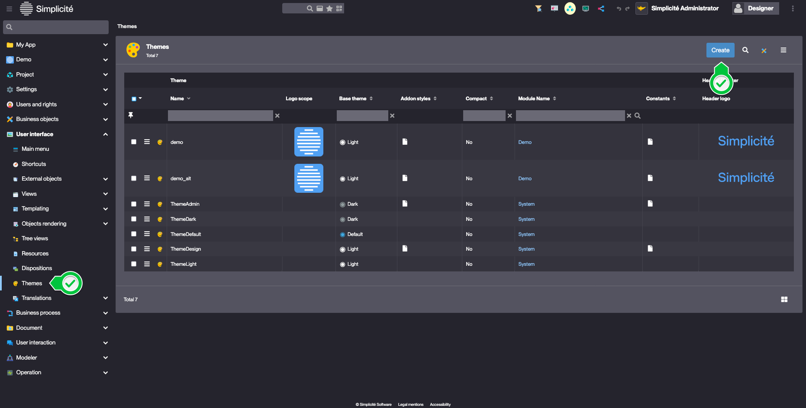
2. Fill in the Theme's information like so : 
    - Name : **TrnTheme**
    - Base theme : **Dark**
    - Module Name : **Training**
    - Header logo :   
    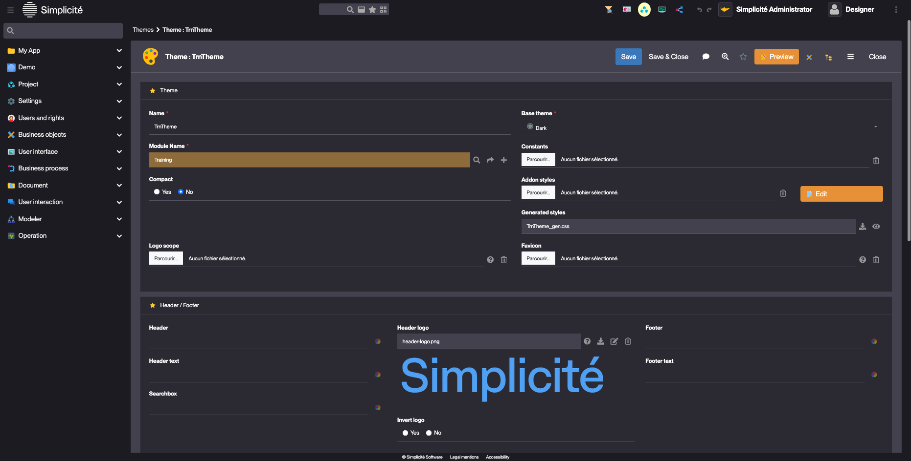
3. Click **Save**  
4. In the **User interface > Views > Home page** menu, open **TrainingScope**
5. In the **Home page** tab, click on the *magnifying glass* button next to the **Theme name** field  
    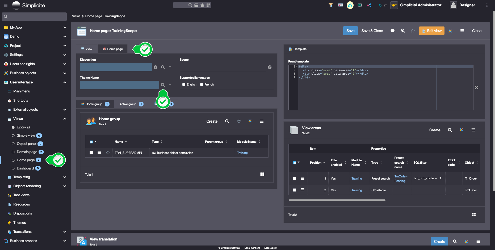
6. Select the previously created **TrnTheme** theme  
    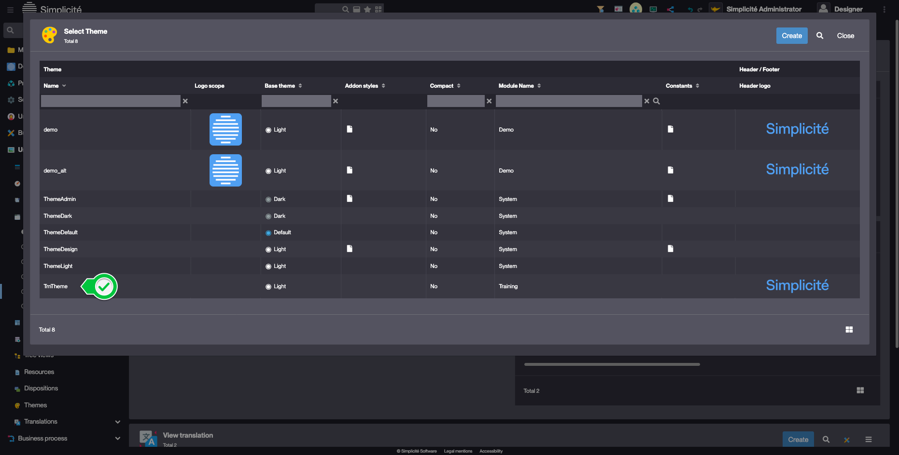
7. Click **Save**

## Adding icons to the Supplier, Product, Client and Order

To add an icon to a Supplier Business object, follow the steps below :

1. In the **Buiness objects > Business objects** menu, open **TrnSupplier**
2. Click the *magnifying glass* on the **Icon code** field to select an icon  
    
3. Click **Save**

Repeat these steps for the TrnProduct, TrnClient and TrnOrder objects.

## Styling the Order's state field

To add colours and icons to the Order's state field, follow the steps below :

1. Open the **trnOrdState** field :
    - Via the list of Orders, click on the **State** label  
    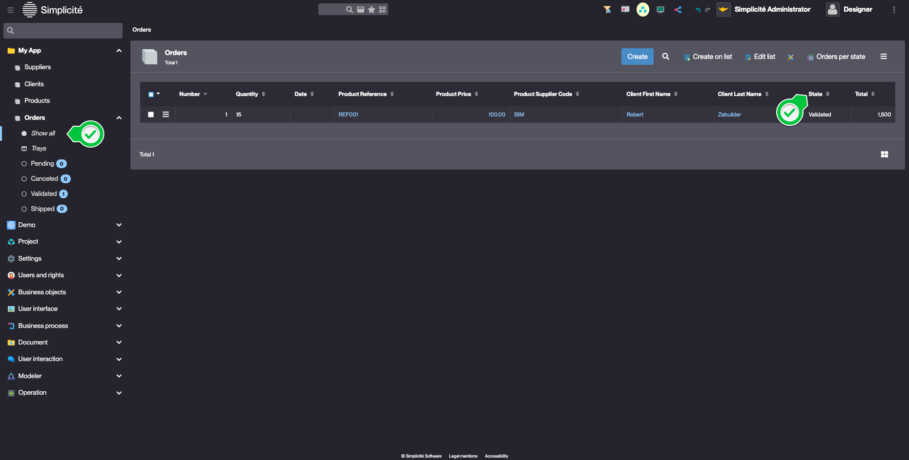
    - Via the **Business objects > Fields** menu  
    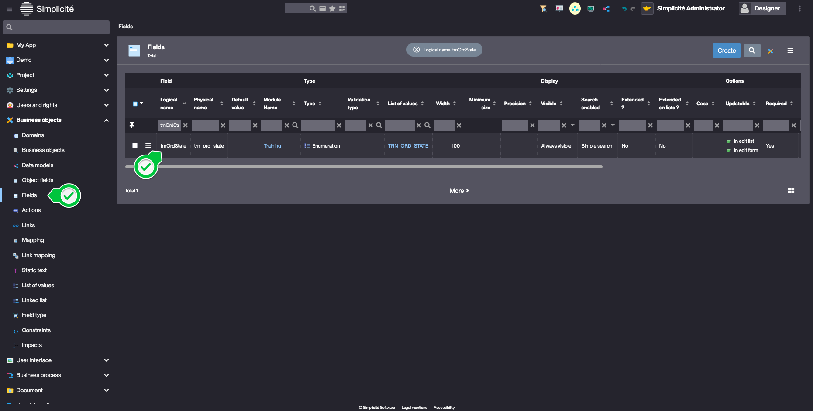
2. Click on the *arrow* next to the **List of values** field, to open the **TRN_ORD_STATE** List of values   
    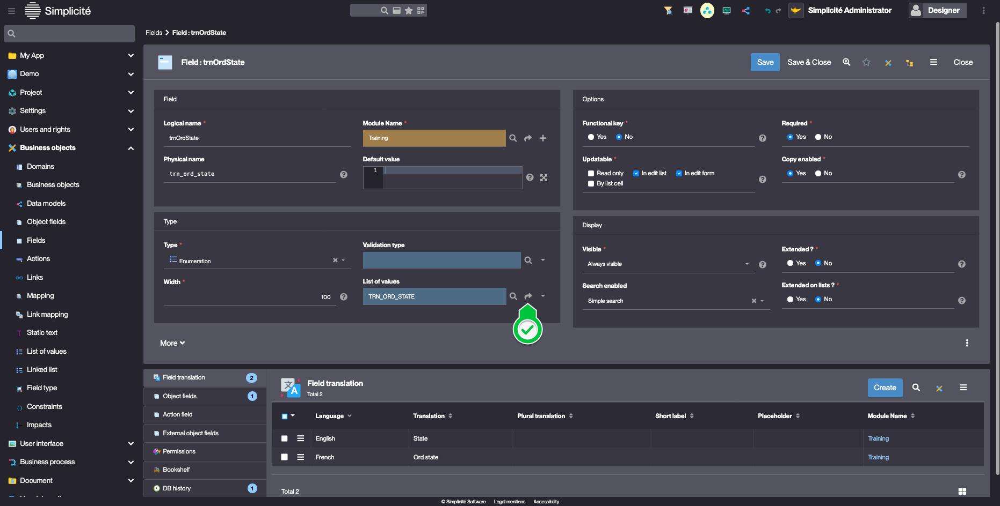
3. In the **List code** list linked to the List of values, open the first (Pending) List code  
    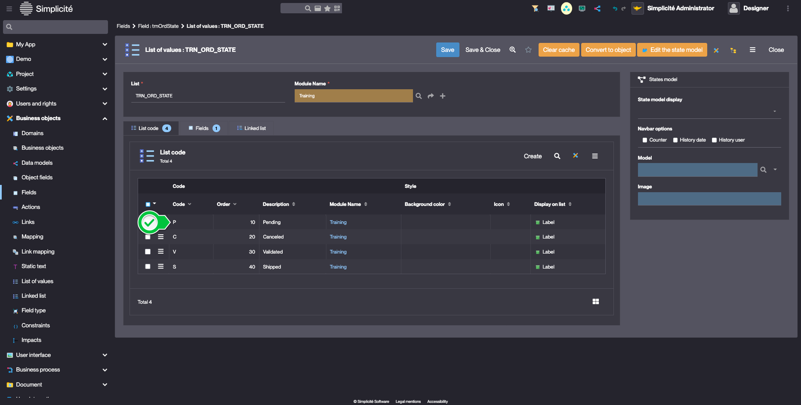
4. Fill in the List code information like so :
    - Background color : **#6fa8dc**
    - Icon : **icon/color/btn_blue**
    - Text color : **#ffffff**
    - Display on list : **Icon | Label**  
    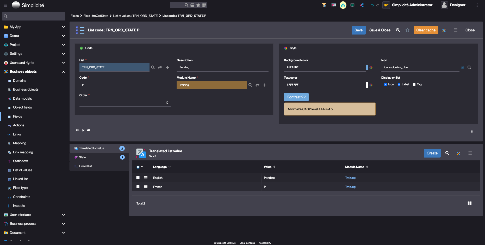
5. Click **Save & Close**

Repeat these step 3 -> 5 for :
- Canceled : 
    - Background color : **#e06666**
    - Icon : **icon/color/btn_red**
    - Text color : **#ffffff**
    - Display on list : **Icon | Label**  
- Validated 
    - Background color : **#f6b26b**
    - Icon : **icon/color/btn_orange**
    - Text color : **#ffffff**
    - Display on list : **Icon | Label**    
- Validated 
    - Background color : **#93c47d**
    - Icon : **icon/color/btn_green**
    - Text color : **#ffffff**
    - Display on list : **Icon | Label**    

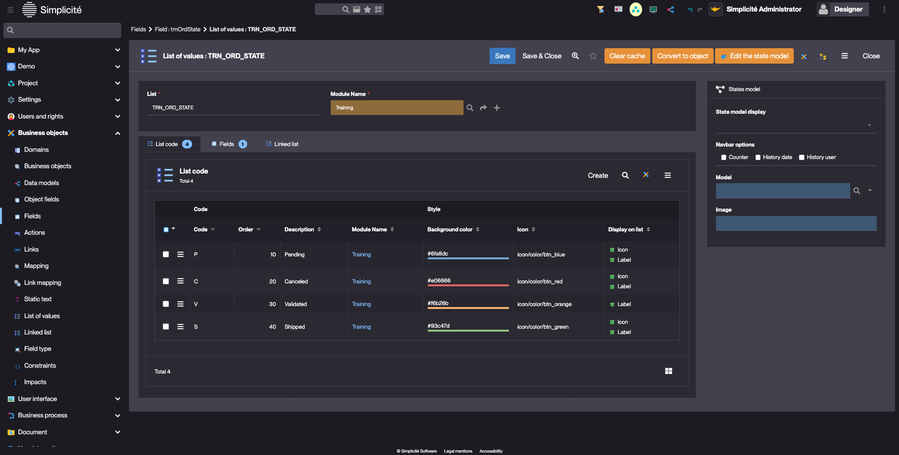

## Test the Theme with the usertest User

1. Clear the platform's cache and log in using *usertest*
    > For a detailed step-by-step, see : [Testing the User](/lesson/tutorial/getting-started/user#activating-and-testing-the-user)

:::tip[Success]
  
The new Theme and header logo are applied to the App

    
The objects have icons

    
The Order's state field have icons

    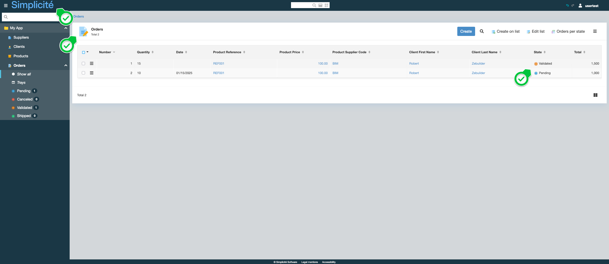
    
The Order's state transition actions have colours

    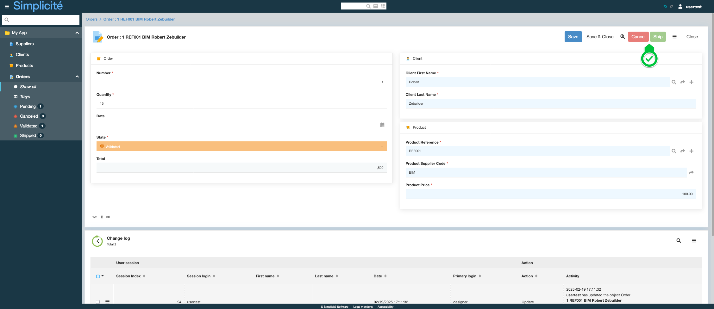
:::