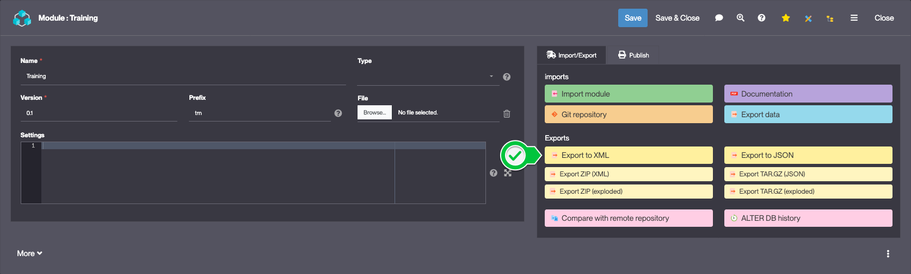
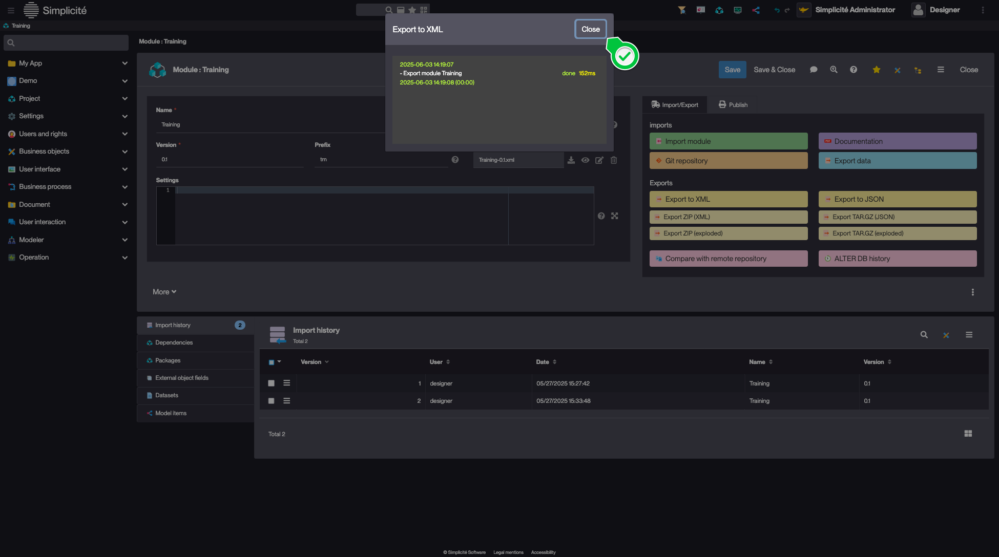
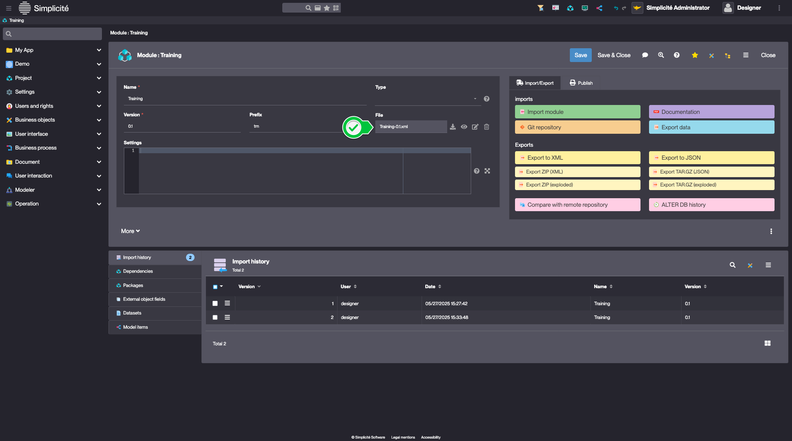

# Building the "Order Management" Training App : Exporting a Module

> Prerequisite : You have successfully completed the previous steps

## What is Module Export ?

Module export allows you to save your application configuration as a package that can be imported into another instance. This is essential for version control, backup, and deployment purposes... [Learn more](/make/project/module#exporting-a-module)

## Exporting your Module

To export your Training module, follow the steps below :

1. In the **Project > Modules** menu, open **Training**
2. Click **Export to XML** in the "Import/Export" panel  
    
3. In the confirmation dialog, click **Yes**
4. Once the export is done, close the modal
    

:::tip[Success]
  
The module is exported as an XML file containing the configuration

    
:::

