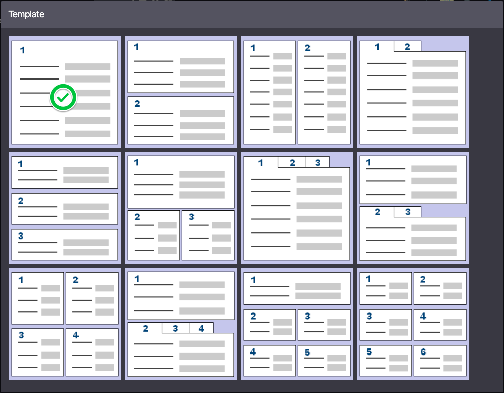
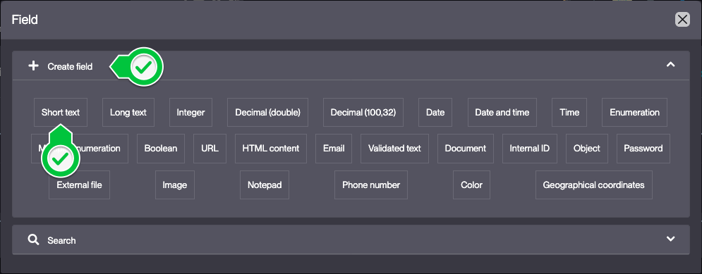
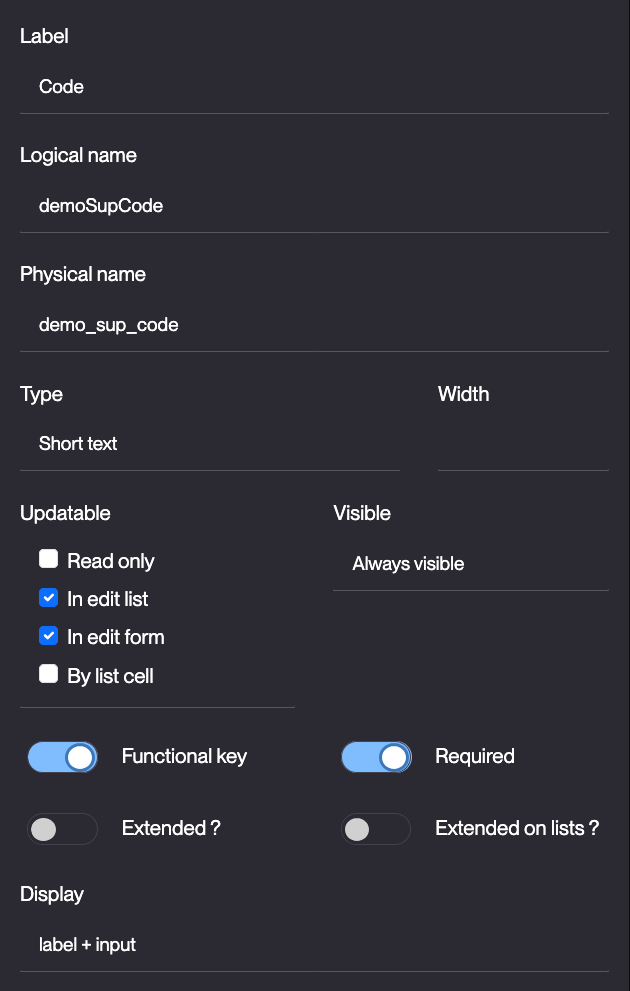
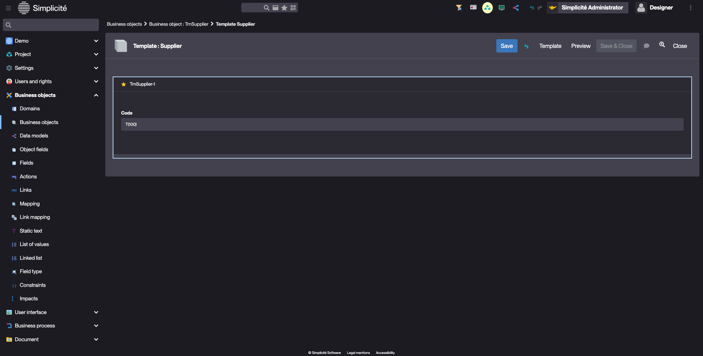

# Building the "Order Management" Training App : Creating a Field

> Prerequisite : [A business object (TrnSupplier) must be created before starting this tutorial](/docs/tutorial/getting-started/object)

## What is a Field ?

In Simplicité, fields are configurable attributes of business objects (mandatory, type, etc.). They have a logical name (used in code) and a physical name (for database columns). When linked to an object, it creates a database column and allows parameter overrides... [Learn more](/docs/platform/businessobjects/fields)

## Creating a Field

To create a field, follow the steps below :

1. Click **Edit form** on the Business object's form (this will open the **template editor**)  
    
	> The template editor is also available via the Modeler, for more information see the [Accessing the template editor via the Modeler](/docs/platform/businessobjects/business-objects#creation-assistant-via-the-modeler)
2. Select the first **Template**    
    
3. Hover over the empty **Field Area** and click on the `+`
    > For more information about Field Areas, see [Field Area](/docs/platform/userinterface/templating/fields-areas)

    
    
4. Click **Field**  
    
5. Click **+ Create field**, and select **Short text**  
    
6. Fill in the Field fields like so :
    - Label : **Code**
    - Logical name : **trnSupCode** *should be auto-completed* 
    - Physical name : **trn_sup_code** *should be auto-completed*
    - Functional key : **Toggled**
    - Required : **Toggled**  
        
7. Click **Save**

:::tip[Success]
  
The <b>trnSupName</b> Field has been added to the <b>TrnSupplier</b> Business object and the template has a <b>Name</b> input visible on it

    
:::