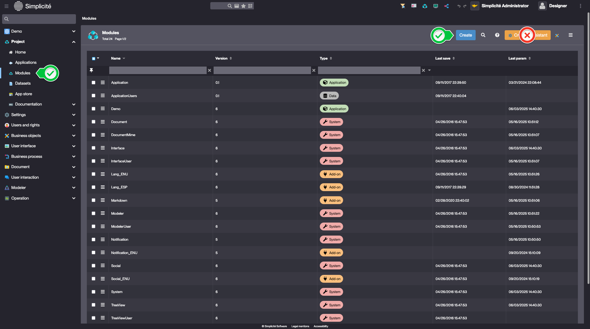
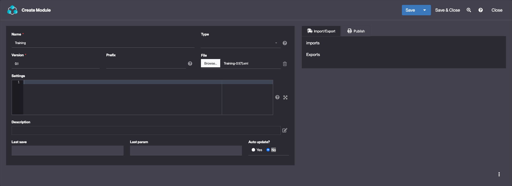
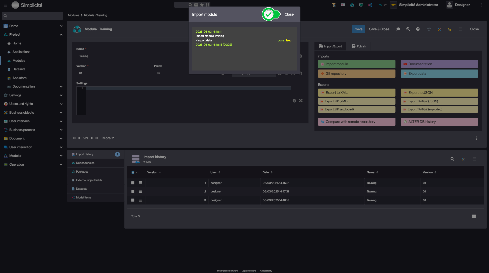
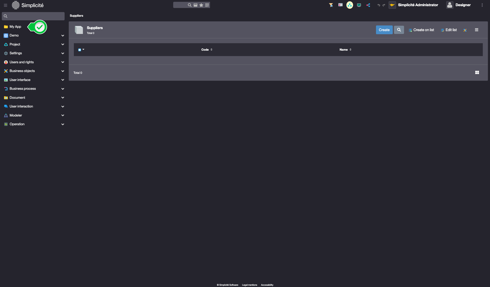

# Building the "Order Management" Training App : Exporting a Module

> Prerequisite : You have successfully completed the previous steps

## What is Module Export ?

Module export allows you to save your application configuration as a package that can be imported into another instance. This is essential for version control, backup, and deployment purposes... [Learn more](/make/project/module)

## Exporting your Module

To export your Training module, follow the steps below :

1. In the **Project > Modules** menu, open **Training**
2. Click **Export to XML** in the "Import/Export" panel  
    
3. In the confirmation dialog, click **Yes**
4. Once the export is done, close the modal
    
5. Download the XML file with the **download** button
    
 
:::tip[Success]
  
The module is exported as an XML file containing the configuration

    
:::

## Testing the Export

To verify that your export worked correctly we will start by deleting the module from the instance before re-importing it.

### Deleting the module

:::danger
Make sure you have downloaded the generated file
:::

1. Delete the Training module via the **Delete** button in the Module's *plus* menu
    
2. Click **Yes** in the Confirmation dialog
3. Wait for the module scan, review the elements that will be deleted and click **Confirm**
    
4. Once the process is complete, click **Clear cache**

### Importing the Module

1. Log in using *designer*
2. In the **Project > Module** menu, click **Create**
    
3. Fill in the Module fields like so :
    - Name : **Training**
    - File : *the previously downloaded file*
    
4. Click **Save**
5. In the "Import/Export" tab, click **Import module**
6. Click **Yes** in the Confirmation dialog
7. Close the import modal displaying the import progression
    

### Granting **TRN_SUPERADMIN** to `usertest` and `designer` 

Follow the steps in [1.4. Creating a User > Adding designer to TRN_SUPERADMIN](/tutorial/getting-started/user#designer-superadmin) to re-create the Responsibilities for `designer` and `usertest` 

Clear the platform's cache and log in with `deisgner`

:::tip[Success]
  
Your application configuration is now safely exported and can be imported into another instance

  
Your instance is back in the same state it was at the beginning of this tutorial

  
:::

## Troubleshooting 

In case you encounter an error while importing the Module, you can download it [here](https://github.com/simplicitesoftware/documentation/tree/master/static/ressources/Training.xml) and import it manually.
:::warning
Make sure you delete the previous module before importing the new one.
:::

## Read more
- [Exporting a module as a Git repository](/docs/integration/webservices/git-repositories/#export)
