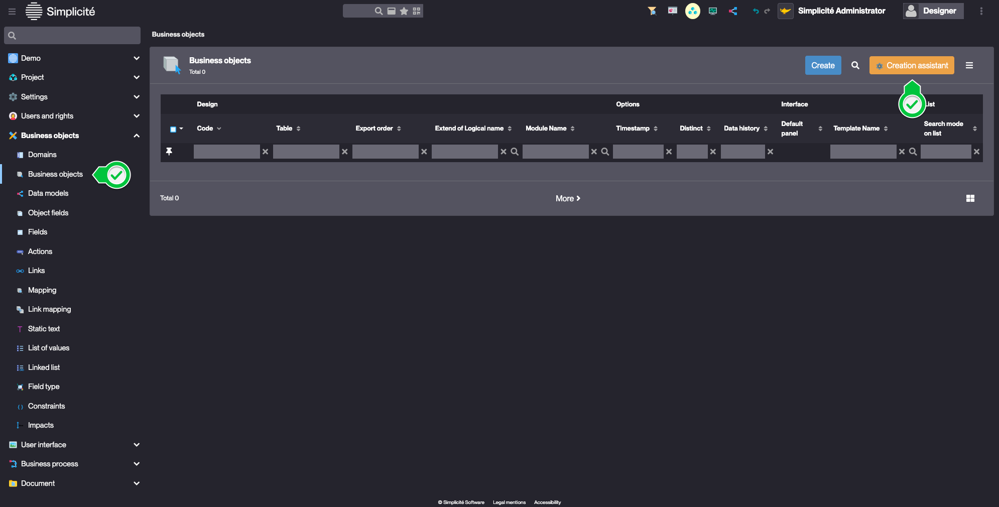
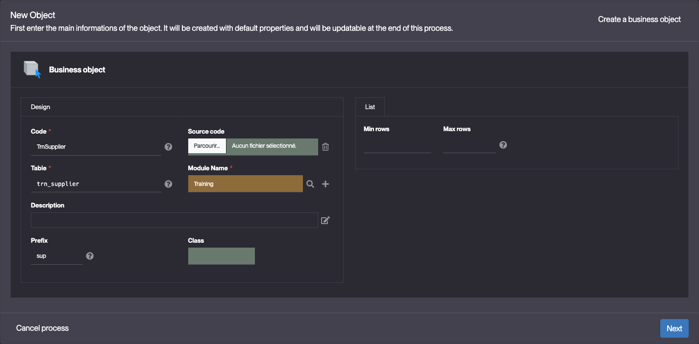
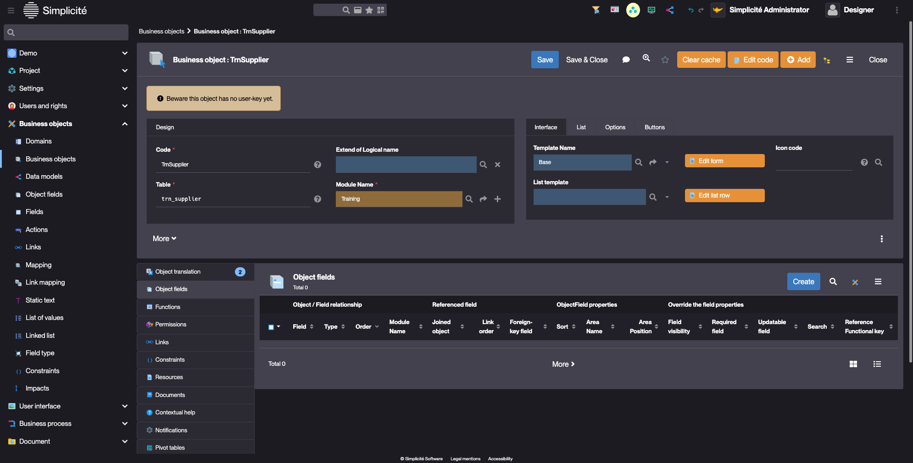

# Building the "Order Management" Training App : Creating a Business object

> Prerequisite : [A module, domain and group must be created before starting this tutorial]/docs/tutorial/getting-started/module

## What is a Business object ?

Business objects are the cornerstone of the platform, structuring data, enforcing rules, and driving key features.... [Learn more]/docs/platform/businessobjects/business-objects

## Creating a Business object

To create a Business object, follow the steps below :

1. Click **Creation assistant** in Business objects > Business objects    
	

	> This assistant is also available via the Modeler, for more information see the [How to create an object using the modeler]/docs/platform/businessobjects/business-objects#creation-assistant-via-the-modeler
2. Fill in the Object information like so :
	- Code : **TrnSupplier**
	- Table : **trn_supplier**
	- Module Name : **Training**
	- Prefix : **sup**  
	
3. Click **Next**
4. Fill in the Translation for your Object :
	- English : **Supplier|Suppliers** *NB: using "|" allows the use of the plural form (label used for lists)*
	
5. Click **Next**
6. Select a Function for the [previously]/docs/tutorial/getting-started/module created Group :
	- **Read, create, update, delete**  
	
7. Click **Next**
8. Add the Object to the [previously]/docs/tutorial/getting-started/module created Domain
	- Should be selected by default  
	
9. Click **Next**

:::tip[Success]
  
The <b>TrnSupplier</b> Object is created and opened.

	
:::
