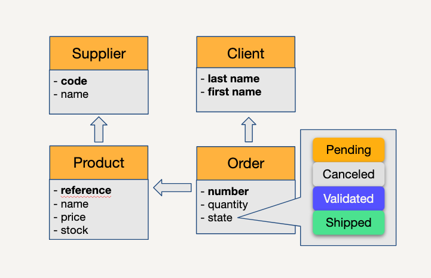

# Welcome

Start by filtering on level 1 (bookmark button at the top right). This version is designed for (future) Simplicité designers. 
We recommend following level 2 after a few months of practice on the platform or if you have specific configuration needs, in order to expand your knowledge and skills to an intermediate level.

## Level 1 Tutorial: Introduction to the Simplicité Platform

During this level 1 tutorial, you will discover the fundamentals of the Simplicité platform. We will design an order management application.

After completing this course, you will be able to take the **Fundamentals** certification exam.

### Key Steps to Design the Order management Application

#### 1. Familiarization with the Simplicité interface
- Discover the configuration and development environment.
- Learn to navigate through the different menus and tools.

#### 2. Creating the data model
- Define the necessary objects (e.g., Customers, Products, Orders).
- Establish relationships between the objects.  

#### 3. Designing the user interface
- Create input forms for business objects.
- Design home pages.

#### 4. Implementing business logic
- Implement business rules.
- Add automatic calculation of the order total.

#### 5. Managing state diagrams
- Configure the order validation flow.
- Set up automatic notifications.

#### 6. Testing and debugging
- Verify the proper functioning of all features.
- Fix any issues.

#### 7. Deploying the application
- Prepare the application for production.
- Learn how to deploy an application on the platform.

---

By following these steps, you will acquire the fundamental skills necessary to create a simple order management application on Simplicité. This will also prepare you for the **Fundamentals** certification.

