Version 3.0 prior to maintenance 17 release note
================================================

**Starting with maintenance 17 release the changes and fixes are published in individual release notes.**

Table of Contents
-----------------

* [Pre/post validate search hooks](/lesson/docs/versions/releasenote#prepost)
* [External objects as Java classes](/lesson/docs/versions/releasenote#external)
* [Public grant in session](/lesson/docs/versions/releasenote#public)
* [SAX parser XML adapters](/lesson/docs/versions/releasenote#sax)
* [JSON adapter](/lesson/docs/versions/releasenote#json)
* [Native Microsoft Excel&reg; adapter](/lesson/docs/versions/releasenote#native)
* [Configurable dispositions](/lesson/docs/versions/releasenote#configurable)
* [Scope / Multi-apps](/lesson/docs/versions/releasenote#scope)
* [TreeView as a WebService](/lesson/docs/versions/releasenote#treeview)
* [Merge objects](/lesson/docs/versions/releasenote#merge)
* [JSON adapter](/lesson/docs/versions/releasenote#json)
* [Target object](/lesson/docs/versions/releasenote#target)  
* [Job Workers](/lesson/docs/versions/releasenote#job)
* [Disposition](/lesson/docs/versions/releasenote#dispo)
* [FeedBack](/lesson/docs/versions/releasenote#feedback)
* [Monitoring](/lesson/docs/versions/releasenote#monitoring)
* [Long process & dashboard](/lesson/docs/versions/releasenote#process)
* [Script inheritance](/lesson/docs/versions/releasenote#script)
* [Inlined object](/lesson/docs/versions/releasenote#inlined)
* [Group profile](/lesson/docs/versions/releasenote#group)
* [ScriptedGrantHooks](/lesson/docs/versions/releasenote#granthooks)
* [User preferences](/lesson/docs/versions/releasenote#user)
* [New field rendering](/lesson/docs/versions/releasenote#field)
* [Field shorthands](/lesson/docs/versions/releasenote#access)  
* [Search by](/lesson/docs/versions/releasenote#searchby)
* [Field completion](/lesson/docs/versions/releasenote#completion)
* [Edit a list of values](/lesson/docs/versions/releasenote#lov)
* [Definition access](/lesson/docs/versions/releasenote#def)
* [Image thumbnail](/lesson/docs/versions/releasenote#image)
* [Hide referenced fields](/lesson/docs/versions/releasenote#hide)
* [Number rendering](/lesson/docs/versions/releasenote#render)
* [Field total](/lesson/docs/versions/releasenote#total)
* [Date search](/lesson/docs/versions/releasenote#date)
* [Object resources](/lesson/docs/versions/releasenote#resources)
* [jqPlot](/lesson/docs/versions/releasenote#jqplot)
* [JOBLOG](/lesson/docs/versions/releasenote#joblog)  
* [Module audit](/lesson/docs/versions/releasenote#module)
* [Deep links](/lesson/docs/versions/releasenote#deep)
* [New included third party Java libs](/lesson/docs/versions/releasenote#third)
* [New included third party JavaScript libs](/lesson/docs/versions/releasenote#thirdinc)
* [Included Ajax JavaScript lib](/lesson/docs/versions/releasenote#ajax)
* [Updated Google Maps API support](/lesson/docs/versions/releasenote#gmap)
* [Packaging improvements](/lesson/docs/versions/releasenote#package)
* [Color type fields](/lesson/docs/versions/releasenote#color)
* [Geo-coordinate type fields](/lesson/docs/versions/releasenote#geo)
* [Current opened tab / collapsed panels](/lesson/docs/versions/releasenote#tab)
* [Table synchronisation with object definition](/lesson/docs/versions/releasenote#table)
* [Constraints matrix and targets](/lesson/docs/versions/releasenote#constraint)  
* [canReference](/lesson/docs/versions/releasenote#canref)  
* [Gantt hierarchy and filters](/lesson/docs/versions/releasenote#gantt)
* [Field labels on list ](/lesson/docs/versions/releasenote#labels)
* [Domain home inhibition](/lesson/docs/versions/releasenote#domainhome)
* [Change object access by code](/lesson/docs/versions/releasenote#changeobject)  
* [Force a message on form or list](/lesson/docs/versions/releasenote#mlist)
* [Copy document](/lesson/docs/versions/releasenote#copydoc)
* [Default user key label](/lesson/docs/versions/releasenote#userkey)
* [Hidden elements](/lesson/docs/versions/releasenote#helements)
* [Panel and Area icons](/lesson/docs/versions/releasenote#icons)
* [Object view mode](/lesson/docs/versions/releasenote#viewmode)
* [CSV import](/lesson/docs/versions/releasenote#csvimport)
* [Default value](/lesson/docs/versions/releasenote#default)
* [Applet permission](/lesson/docs/versions/releasenote#applet)
* [Text field precision](/lesson/docs/versions/releasenote#precision)
* [Active list](/lesson/docs/versions/releasenote#activel)
* [User preferences](/lesson/docs/versions/releasenote#upref)  
* [Disable a menu item](/lesson/docs/versions/releasenote#menuitem)
* [Generic Action generation](/lesson/docs/versions/releasenote#genaction)
* [Edit list property](/lesson/docs/versions/releasenote#editlist)
* [Filtering: Is null / Is not null](/lesson/docs/versions/releasenote#isnull)
* [Markdown and PDF resources](/lesson/docs/versions/releasenote#pdf)
* [URLs in helps](/lesson/docs/versions/releasenote#urls)
* [External scope](/lesson/docs/versions/releasenote#escope)
* [Modeler](/lesson/docs/versions/releasenote#modeler)
* [HTML source vulnerability](/lesson/docs/versions/releasenote#html)
* [Enum and status validation](/lesson/docs/versions/releasenote#enum)
* [Table synchronisation with object definition](/lesson/docs/versions/releasenote#table)
* [Multi-panels / instance name](/lesson/docs/versions/releasenote#multip)  
* [Excel sizing](/lesson/docs/versions/releasenote#excel)  
* [Map deletion](/lesson/docs/versions/releasenote#map)
* [Filters on crosstab](/lesson/docs/versions/releasenote#filterscross)
* [Document copy on cascade copy](/lesson/docs/versions/releasenote#cascade)  

Changes
-------

<div id='prepost'/>

### Pre/post validate search hooks ###

There are now two extra business objects hooks called before and after generic object search filters validation : `preValidateSearch` and `postValidateSearch`.
NB : current standard filter validation only checks that search required fields filters are correctly set.

<div id='external'/>

### External objects as Java classes ###

In order to avoid specific JSPs pages, it is now possible to associate Java classes to external objects.

This Java class is, by default, located in the `com.simplicite.extobjects.<module name>` package. It extends the `com.simplicite.util.ExternalObject` class.

The only method to implement is the `display` method.

```java
package com.simplicite.extobjects.Application;

import com.simplicite.util.ExternalObject;
import com.simplicite.util.tool.HTMLTool;
import com.simplicite.util.tool.Parameters;

/**
 * <p>Text external object</p>
 */
public class Test extends ExternalObject
{
	private static final long serialVersionUID = 1L;

	@Override
	public String display(Parameters params)
	{
		StringBuffer html = new StringBuffer("<p>Hello " + getGrant().getFullName() + " !</p>");
		
		html.append("<pre>" + params.toString() + "</pre>");
		
		String form = "test";
		int tab = 1;
		html.append(HTMLTool.openSimpleForm(form, params.getLocation(), "POST"));
		html.append("<p>");
		html.append(HTMLTool.textInput(form, "text1", 50, "Text 2", tab++) + "<br/>");
		html.append(HTMLTool.textInput(form, "text2", 50, "Text 1", tab++) + "<br/>");
		html.append(HTMLTool.textareaInput(form, "textarea", 100, 10, "Hello\nWorld!", tab++) + "<br/>");
		html.append(HTMLTool.checkBoxInput(form, "checkbox", true, "val1", tab++) + " Val1<br/>");
		html.append(HTMLTool.checkBoxInput(form, "checkbox", false, "val2", tab++) + " Val2<br/>");
		html.append(HTMLTool.checkBoxInput(form, "checkbox", true, "val3", tab++) + " Val3<br/>");
		html.append("</p>");
		html.append(HTMLTool.submit(form, "submit", "OK", tab++));
		html.append(HTMLTool.closeForm(form, "text1", "submit"));
		
		return html.toString();
	}
}
```

Note the `getGrant()` and `params.getLocation()` usage.

Here is the resulting page in the above example :


It is of course possible to generate other thing than HTML, `setMimeType(HTTPTool.MIME_TYPE_*)` have to be called in such a case

NB:

1. Backward compatibility with URL external objects is guaranteed
2. As for business objects, external objects are handled in cache
3. Java class based external objects can be used in public zone.

<div id='public'/>

### Public grant in session ###

Due to the extension of the usage of the public profile (user `public`), it has been decided to set the `thePublicGrant` session bean of the generic web webapp in session scope (till version 2.7 it was in application scope).

Make sure to update all your specific JSPs that uses this public profile as follows (or, better, reconsider using external objects instead :-)

```jsp
<jsp:useBean id="thePublicGrant" class="com.simplicite.webapp.GrantWeb" scope="application"/>
```

to

```jsp
<jsp:useBean id="thePublicGrant" class="com.simplicite.webapp.GrantWeb" scope="session"/>
```

<div id='sax'/>

### SAX parser XML adapters ###

SAX parser XML adapters have been improved, your adapters still extends the helper adapter class `com.simplicite.util.integration.SimpleSAXParserAdapter`. Lower level class exists for advanced implementations.

For example, for parsing a XML stream like :

```xml
<?xml version="1.0" encoding="ISO-8859-1"?>
<tests>
	<test>
		<num>1</num>
		<val>true</val>
	</test>
	<test>
		<num>2</num>
		<val>false</val>
	</test>
</tests>
```

Adapter implementation could be something like:

```java
import com.simplicite.util.integration.*;

public class TestXML extends com.simplicite.util.integration.SimpleSAXParserAdapter {
	private ObjectXML obj;
	private DataXML data;

	@Override
	public void startProcess() throws Exception, InterruptedException {
		obj = new ObjectXML("Test", ObjectXML.ACTION_UPSERT);
	}
	
	private String currrentTag;

	@Override
	public void startTagProcess(String uri, String localName, String qName, String path) throws Exception, InterruptedException {
		if (localName.equals("test")) data = new DataXML();
		currrentTag = localName;
	}
	
	@Override
	public void processAttribute(String uri, String localName, String qName, String value) throws Exception, InterruptedException {
		// Nothing to do (no attributes to parse)
	}

	@Override
	public void processValue(String value) throws Exception, InterruptedException {
		if (currrentTag!=null && currrentTag.equals("num"))
			data.add("tstNumber", value);
		else if (currrentTag!=null && currrentTag.equals("val"))
			data.add("tstBoolean", Boolean.parseBoolean(value));
	}
	
	@Override
	public void endTagProcess(String uri, String localName, String qName, String path) throws Exception, InterruptedException {
		if (localName.equals("test"))
			obj.addData(data);
		currrentTag = null;
	}
	
	@Override
	public void endProcess() throws Exception, InterruptedException {
		out.println(obj.toString());
	}
}
```

Two sample implementations are also provided : RSS adapter `com.simplicite.adapters.WebContent.RSSAdapter` and Atom adapter `com.simplicite.adapters.WebContent.AtomAdapter`.

<div id='json'/>

### JSON adapter ###

New helper adapter class has been added : `com.simplicite.util.integration.SimpleJSONAdapter` that uses the org.json JSON Java library.

For example to process a JSON stream like:

```json
[
	{
		"num": 1,
		"val": true
	},
	{
		"num": 2,
		"val": false
	}
]
```

The adapter implementation could be something like:

```java
import org.json.JSONTokener;
import com.simplicite.util.integration.*;

public class TestJSON extends com.simplicite.util.integration.SimpleJSONAdapter {
	private static final long serialVersionUID = 1L;

	@Override
	public String process(JSONTokener t) {
		// TODO
		return null;
	}
}
```

<div id='native'/>

### Native Microsoft Excel&reg; adapter ###

New helper adapter classes has been added : `com.simplicite.util.integration.SimpleExcelAdapter` and `com.simplicite.util.integration.CellBasedExcelAdapter` that uses the Apache POI library.

The second one brings an abstraction level on top of Apache POI libs that makes it transparent and thus is easy to use. Typical usage would be something like :

```java
import java.util.Date;
import com.simplicite.util.integration.*;

public class TestXLS extends com.simplicite.util.integration.CellBasedExcelAdapter {
	private ObjectXML obj;
	private DataXML data;
	
	@Override
	public String preProcess() {
		obj = new ObjectXML("Test", ObjectXML.ACTION_UPSERT);
		return super.preProcess();
	}
	
	@Override
	public void startProcessRow(int rowNumber) {
		data = new DataXML();
	}
	
	@Override
	public String processCell(int sheetNumber, int rowNumber, int cellNumber, Object value) throws Exception, InterruptedException {
		if (sheetNumber == 0 && rowNumber > 0) {
			switch (cellNumber) {
			case 0:
				data.add("tstCode", (int)((Double)value).doubleValue());
				break;
			case 1:
				data.add("tstValue", (String)value);
				break;
			case 2:
				data.add("tstDate", (Date)value);
				break;
			default:
				break;
			}
		}
		return null;
	}
	
	@Override
	public void endProcessRow(int rowNumber) {
		obj.addData(data);
	}
	
	@Override
	public void postProcess() {
		out.println(obj.toString());
		super.postProcess();
	}
}
```

This adapter is dedicated to XLS format (Excel OLE2 formats from Excel 97 to 2003).

<div id='configurable'/>

### Configurable dispositions ###

The value of the usual `DISPOSITION` system parameter can now correspond to the name of a configured disposition item (available in the "Interface" menu).

A disposition can be either a standard disposition or a fully specific disposition. 

Resources (images, CSS, JS) can be attached to a configurable disposition. The resources for a standard dispositions are:

- `LOGO` : the main logo image resource
- `STYLES` : the main CSS stylesheet resource
- Etc.

Other resources can be added and used, for instance, in other resources (e.g. a CSS resources that refers to an image resource)
or in object templates, … or in the case of a specific disposition.

If no configured Disposition item matches the value of the `DISPOSITION` system parameter, the traditional static disposition management
is still valid using static resources bundled in the webapp archive). However this approach is not recommended anymore.

NB: As it is now possible to set system parameters at user level, the `DISPOSITION` can be set on a **per user** basis.

A specific disposition (e.g.: `mydisp`) requires a traditional JSP for main page to be bundled in the webapp archive in `web/jsp/` : `<disposition name>_main.jsp` (e.g. `mydisp_main.jsp`).
But this traditional approach is not recommended as the disposition main page can be scripted at the corresponding Disposition object level :


<div id='scope'/>

### Scope / Multi-apps ###

It is now very simple to create many end-user "applications" in only one instance of Simplicit&eacute;.

Groups can now be assigned to Views (home pages)

- The user with only one home page in its Groups will be directly assigned to this home.
- The user with many responsibilities may also have several home pages:
	- In this case, a new button "Apps" appears in the header, it displays the set of the granted scopes / home pages.
	- A view can now have a resource icon, a disposition and Groups to activate.
	- When the user choose one home page among the granted ones, the disposition and the corresponding groups are activated.
	- If the user have other groups, they are temporarily deactivated.
	- A new `GrantHooks.changeScope(view)` has been added when the user change its current home page.

View may also define a `Scope` and a `Order`. So when the user have several views with the same Scope, Simplicit&eacute; will choose the first granted one.

This behavior allow direct access from portal:

- `jsp/index.jsp?scope=MYSCOPE1` : access to a set of views with this scope name MYSCOPE1, the first granted one will be activated
- `jsp/index.jsp?scope=MYHOME` : access to a named view name MYHOME1
- `jsp/index.jsp?scope=all` : access to the homes chooser

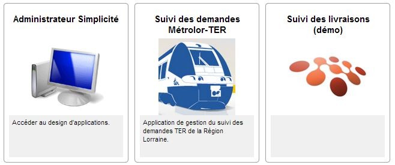

<div id='treeview'/>

### TreeView as a WebService ###

The tree view has been exposed as a WebService thru HTTP/SOAP within 2 actions:

- `get`: serialize all the tree from the root entity
- `save`: to save the full or part of the requested tree, it is now possible to save a hierarchy of object.

<div id='merge'/>

### Merge objects ###

A new object property has been added to allow entity to be merged, see `Object.can/setMerge`.
When the object can be merged, the user can select up to 5 lines and configure the merger:

- choose the fields to keep on the main entity (the first column)
- choose the referenced objects to move on the main entity
- after processing, the main object will be conserved the other will be deleted.

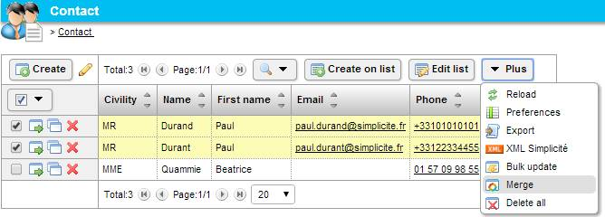

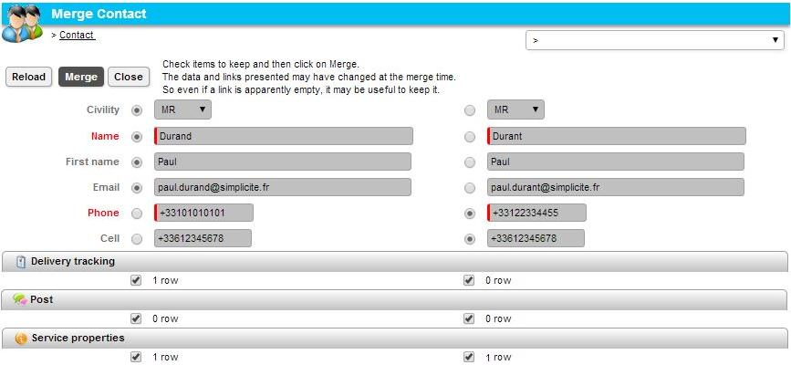

<div id='target'/>

### Target object ###

A new hook `ObjectDB.getTargetObject(id,row)` has been added to override the target object to open on UI: follow links, list anchors, open buttons, print, deletion...
For example it can be used when the model contains inheritance:
- user needs to list the parents objects 
- and need a redirection on child object when he open a row

```javascript
MyObject.getTargetObject = function(rowId, row) {
	// no redirection on creation
	if (rowId.equals(ObjectField.DEFAULT_ROW_ID)) return null;
	// Select the record if not already set
	if (!row && this.select(rowId)) row = this.getValues();
	var target = null;
	// Solve the target object
	if (row) {
		var type = row[this.getFieldIndex("someType")];
		if (type=="X") target = "ObjectX";
		else if (type=="Y") target = "ObjectY";
		
	}
	if (!target) return null; // no redirection
	var t = ScriptInterpreter.getStringArray(3);
	t[0] = target; // target object
	t[1] = "the_"+target; // main target instance
	t[2] = rowId; // target id
	return t;
};
```

<div id='meta'/>

### Meta-object field ###

A new field type has been added to managed a record reference.

- ObjectField.TYPE_OBJECT is a meta-object
- The DB will contains record reference with the syntax: `<objectname>:<row_id>`
- To limit the scope of references, the field must contains a set of objects, otherwise the field can reference any object.


<div id='job'/>

### Job Workers ###

A pool worker has been implemented to limit the number of threads in memory.
By default the pool size is 10, see the system parameter `ASYNC_POOL_SIZE`.

- `Simplicit&eacute;CronThread-<appname>` : cron job singleton per application
- `Simplicit&eacute;PoolWorker-<index>-<appname>` : a job queue where index < `ASYNC_POOL_SIZE`

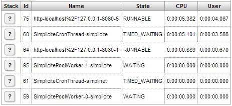

<div id='dispo'/>

### Disposition ###

A disposition is a new feature to configure the full web site rendering:

- it contains all needed web resources: images, icons, css style, javascript, html...
- its own system parameters to override global UI properties

Disposition loading:

- the disposition `default` is first loaded and contains all object icons
- then the `DISPOSITION` set in the user rights is loaded (from global system parameter, home view or user parameter if any) 
- so users and groups have the ability to use specific disposition

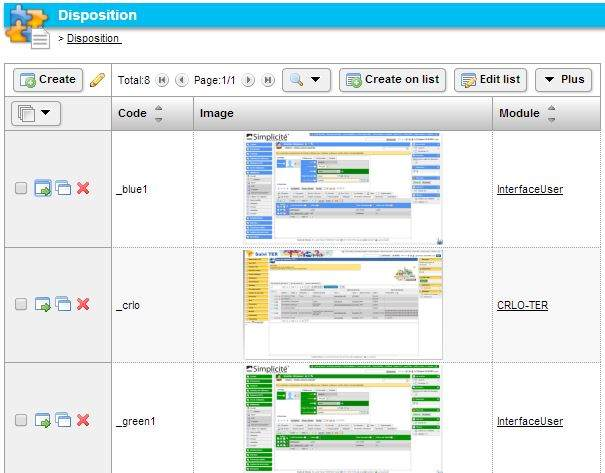

<div id='feedback'/>

### FeedBack ###

End users can send feed-back to a back-end, to activate this feature:

- the ALM modules must be installed
- the system parameter `USE_FEEDBACK` must be set to yes
- the Java plugin must be installed on the client browser to make a screen-shot
- and the end-user must authorized the Simplicit&eacute;-Feedback applet to run.

A feedback contains:

- the usage context: user rights, browser info and application info/version
- the user message to describe the question or the problem
- and a screenshot: user can crop, mask or highlight some parts

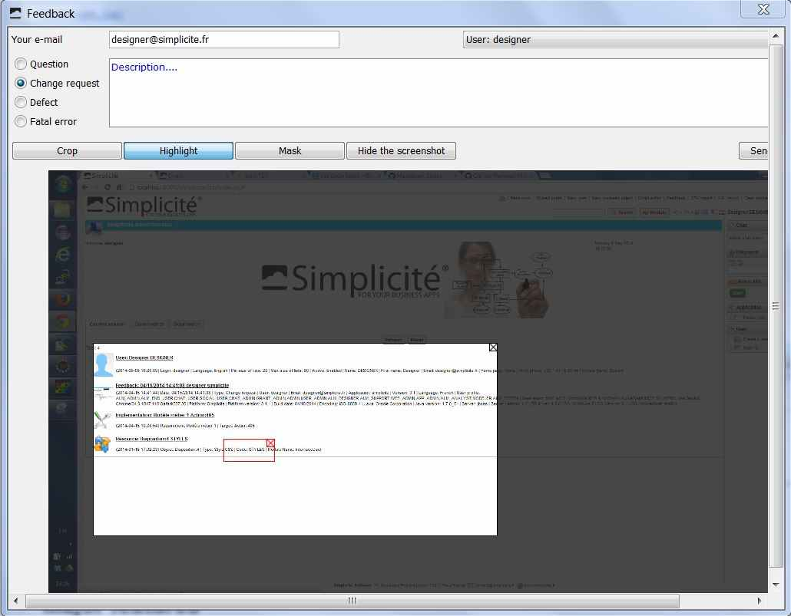

<div id='monitoring'/>

### Monitoring ###

The flash metrics has been replaced with a new HTML dashboard based on jqPlot charts.

- All metrics are managed thru separate cron tasks (tasks depth set to -3 means "save metrics for the last 3 days")
- Logger history is activated with a global stop/start button
- Operator can change the polling delay and the period to display within charts
- The monitoring display 5 main panels:
	- Snapshot: give current metrics/gauges of the platform
	- History: heap size, sessions, classes loader, object garbage
	- Data: local disk usage, dbdoc size and SQL times
	- Thread: moitor number and thread status
	- Page: server side performance, page construction times

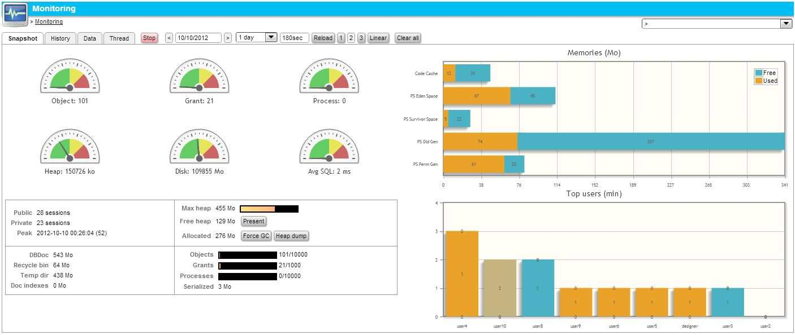
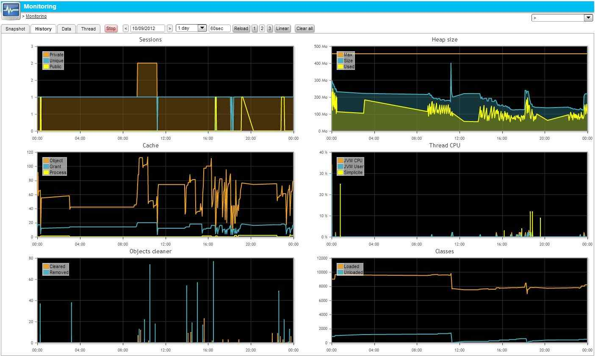
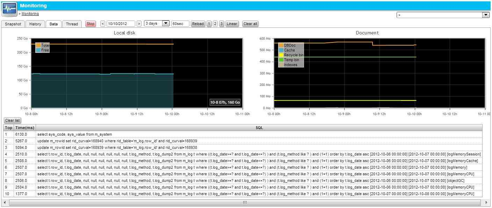
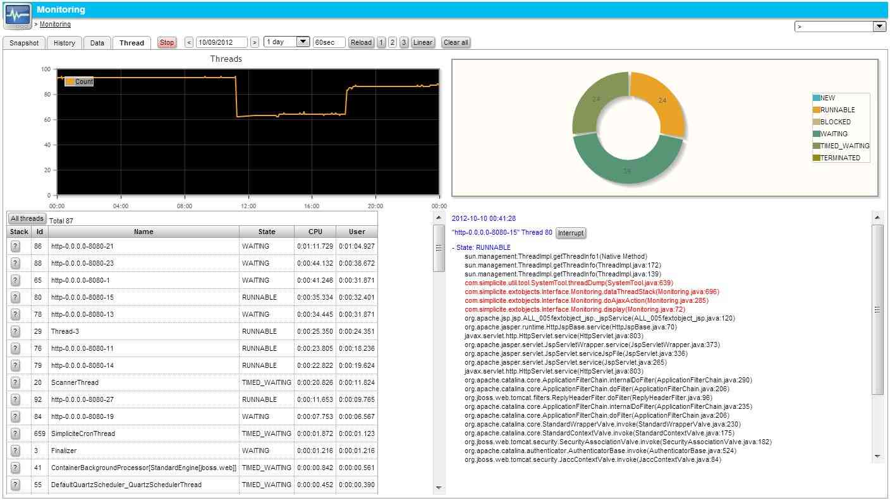
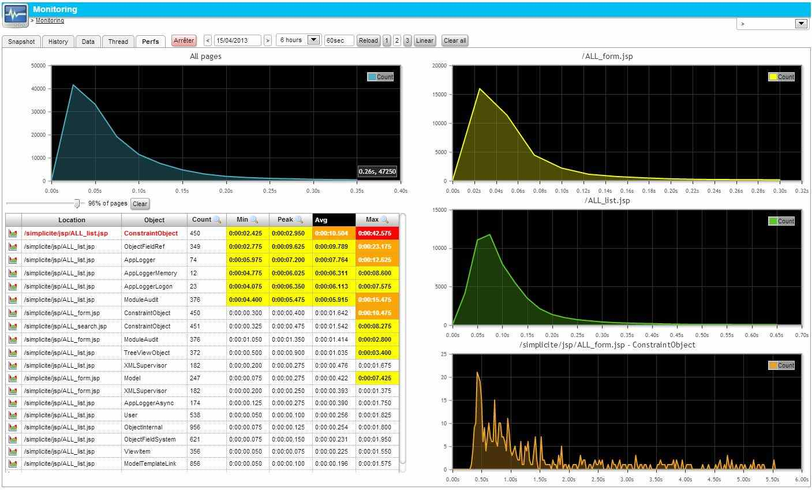

<div id='process'/>

### Long process & dashboard ###

The process has been released to add 2 optional properties:

- the main object: the principal activity of the process that contain the main object
- delete cascade: specify the behavior when the main object is deleted
	- restrict: object can not be destroyed if a long process contains the main object
	- cascade: all process instances are also deleted
	- clear reference: the process link to the object is removed
	- ignore to bypass this behavior

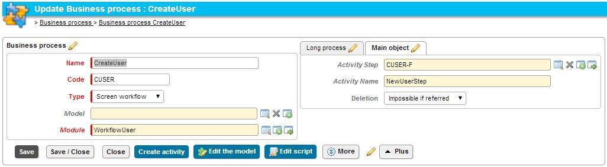

A new view has been added to display simple metrics:

- on long process instances
- on state models: only when status field is historized

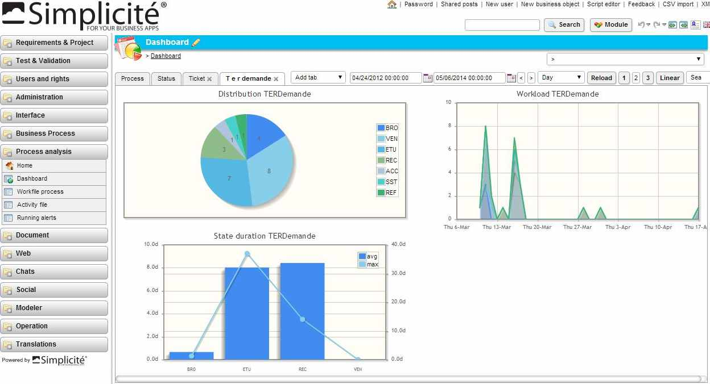

- A state has 2 new properties:
	- Terminal: used by the metrics to calculate the process duration
	- Read-only fields: simplify the way to set the fields in a read-only mode
- Transition permission must now specify the group and the object (to support inheritance distinction between objects).

<div id='script'/>

### Script inheritance ###

Objects inheritance has been reproduced during the script execution.
`getInheritedObjects` returns all the object hierarchy and is used to execute the existing parent hooks.

<div id='inlined'/>

### Inlined object ##

The `Link` definition has been released to change the UI rendering when the cardinality is `0,1` or `1,1`.
In this case, the single referenced object can be displayed as a embedded form (not a list) as usual with the `[PANEL]` syntax.

<div id='group'/>

### Group profile ##

A group has now the ability to contains a set of sub-groups. It is possible to define group as a "user profile".
The rights loading has been updated to read recursively this groups hierarchy.

For instance, `ADMIN` has been updated to be a set of groups including ALM, chat, user, social administration...

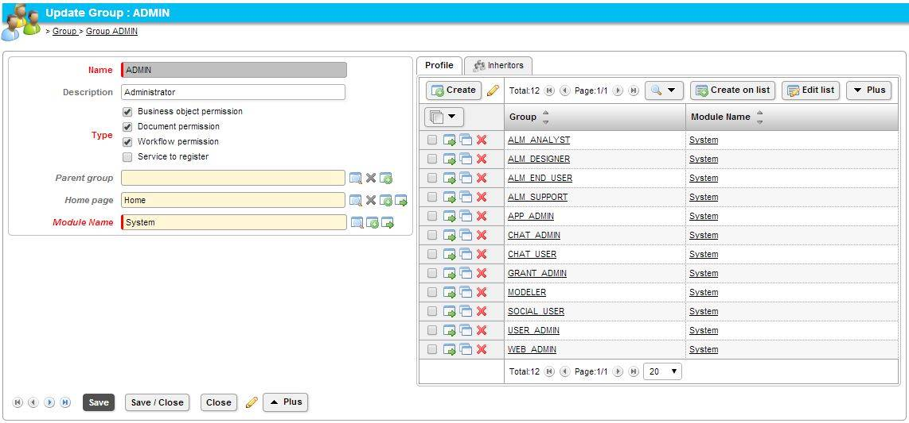

<div id='granthooks'/>

### ScriptedGrantHooks ##

The static GrantHooks class has been implemented as a script.
- designer must declare a Administration/Script named `GrantHooks`
- Grant hooks object can override all hooks
- support ACE snippet

Example:

```javascript
GrantHooks.postLoadGrant = function(g) {
	if (g.hasResponsibility("MANAGER"))
		g.setParameter("XXX","YYY");
};

GrantHooks.changeScope = function(g,home) {
	var isApp1 = (home.getName()=="HomeApp1");
	g.setRespEnable(g.getLogin(), "Group1", isApp1, false);
	g.setUserSystemParam(g.getLogin(), "DISPOSITION", isApp1 ? "_blue1" : "_white1", false);
	return true;
};
```

<div id='user'/>

### User preferences ###

System parameter `USE_LISTPREFS` can activate the user preferences for each list. Preferences are saved into the user parameters `LIST_PREFS` `ACTION_PREFS` `SEARCH_PREFS`.

- the end-user must click on the Plus/Preference icon
- a popup display 3 tabs: 
	- List: fields visibility on list and areas/fields ordering
	- Search: fields to display or to move in extended ones
	- Visible Actions or moved into Plus button

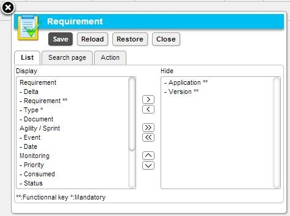

<div id='field'/>

### New field rendering ###

Boolean:

- RADIO: display 2 radio buttons
- CHECK: display a single check box
- COMBO: display a simple list with 2 values Yes/No

Enumeration:

- Rendering horizontal or vertical
- precision = horizontal boxes per line, unused if vertical
- LIST: multi-selection list
- RADIO: mono-valued, when the field is not required an "Empty" radio is added
- CHECK: multi-valued

long-text, notepad, HTML editor:

- precision is used to specify columns and lines of characters
- example: `w=80 h=15` sets the editor size for both form and list to 80x15
- example: `wf=80 hf=15 wl=20 hl=3` sets different editor sizes for form 80x15 and list 20x3

<div id='access'/>

### Field shorthands ###

New simple accessors have been added:

- `ObjectDB.get/setFieldValue(name, value)`
- `ObjectDB.get/setFieldFilter(name, value)`
- `ObjectDB.get/setFieldOrder(name, value)`

<div id='searchby'/>

### Search by ###

- On list the search tools have been grouped in a single drop-down button
- Button style img.lfon/off = indicates when list is filtered + style lfshow/hide = toggled
- Object uses a new instance parameter `_UILF_` = 0|1 to hide/show the search top line

<div id='completion'/>

### Field completion ###

New hooks to override the completion behavior:

- Server side : `ObjectDB.fieldCompletion(input, query, context)` returns an `ArrayList<String>` or null for a column search (the default)
- Client side : `<field>_completed(value)` or `field_completed(field, value)` call back when the field has been completed

<div id='lov'/>

### Edit a list of values ###

Designer can edit a list of values thru a new external object.
Open the enum field and click on "Edit list" button to display the simple editor:


The script of the external object `FieldEditList` is accessible.

<div id='def'/>

### Definition access ###

New design features have been added:

- Designer can now access to the definition of any external object: pencil in the title bar).
- When the script is updated, he can now clear the object cache directly (button Clear cache).
- Go to field area definition: pencil in the tab.
- Go to field definition: simple anchor on label

<div id='image'/>

### Image thumbnail ##

A system parameter has been added to force a `DEFAULT_THUMB_SIZE` to 50px.
If the value is set to 0, no thumbnail will be created on image upload.

<div id='hide'/>

### Hide referenced fields ###

Referenced fields are now automatically hidden in a child list (panel instance).

<div id='render'/>

### Number rendering ##

Two rendering has been added to a field definition: Percentage, Progress bar, Euro, USD dollar...
- `FIELD_RENDERING_INT`
- `FIELD_RENDERING_FLOAT`

<div id='total'/>

### Field total ###

The following methods have been added to sum a field on a list:

- Integer and Float: Sum, Average, Min, Max and calculated
- Date and text: Min, Max and calculated

Example based on a number with a progress bar rendering + average in total line:


<div id='date'/>

### Date search ###

A date field can now be searched by period or a single date.

<div id='resources'/>

### Object resources ###

Resource named `SCRIPT` and `STYLES` can be attached to one object to add JavaScript and specific CSS.

<div id='jqplot'/>

### jqPlot ###

jqPlot based on jQuery has been added to the runtime to display charts.
- To use this rendering activate the `HTML_CHARTS` parameter.
- chart.js contains simple method to draw charts (pie, stacked, lines, areas)
- this lib can be used directly in external objects to display specific charts
- different palettes of colors can be used, see the system param `CHART_PALETTE`
- Stacked area has been implemented

<div id='joblog'/>

### JOBLOG ###

Event JOBLOG has been added to trace asynchronous logs in `CronJob.checkForInterruptAndStop(this)`.

<div id='module'/>

### Module audit ###

- `mdl_log` field is now deprecated,
- ModuleAudit will contain all audit results for a Module
- Each audit has a level `0` = OK `1` = warn `2`= error `3`= fatal and a message

<div id='deep'/>

### Deep links ###

The way session initializations are now done allows to reach any authenticated zone page without having to redirect
from index page which may be convenient in some particular cases.

The usual URL scheme for deep links `/<application>/jsp/?direct=<page url>`
is still valid for having target page embedded in the work area iframe.

<div id='third'/>

### New included third party Java libs ###

Some new third party Java libs have been included by default :

- `json.jar` : org.json implementation of JSON for Java
- `commons-lang-2.4.jar` : Apache core Java language commons
- `qrcode/*.jar` : ZXing implementation of `QRCodes` and `QRGen` wrapper (NB : to be included, the build property `include.qrcode` must be set to true)

Sample usages for QRCode libs could be to generate a QRCode image at a object’s save :

```java
@Override
public String preSave() {
	String baseUrl = getGrant().getContextURL() + "/website/index.jsp";
	String url = baseUrl + "?code=" + getField("myCode").getValue();
	getField("myQRCode").setDocument(this, "qrcode.png", QRCodeTool.qrCodeImage(url));
	return super.preSave();
}
```

<div id='thirdinc'/>

### New included third party JavaScript libs ###

Some new third party JavaScript libs have been included by default:

- jQuery core (minified) available in generic webapp root in `<application>/scripts/jquery/jquery.js`
- jQplot jQuery charting plugin (minified) available in generic webapp root in `<application>/scripts/jquery/jqplot.js|css` and `/<application>/scripts/jquery/jqplot.plugins/*.js`
- jQuery mobile framework (minified) available in generic webapp root in `<application>/scripts/jquerymobile/jquery.mobile.js|css`
- XML to/from JSON converter : `<application>/scripts/xml2json.js`

<div id='ajax'/>

### Included Ajax JavaScript lib ###

Simplicit&eacute;&reg; Ajax libs are included by default in `<application>/scripts/ajax`.

These libs are fully Ajax libs that are supposed to be used for Ajax based UI components 
uch as specific pages (e.g. as external objects) or fully specific front UIs. This libs corresponds
to `Simplicit&eacute;Ajax` name space.

Internal json.js synchronous Ajax lib is still available for usage within generic web UI pages
(it is included by default in most standard pages). It correspond to the `Simplicit&eacute;` name space.

<div id='gmap'/>

### Updated Google Maps API support ###

Google Maps wrapper `gmap.js` library now uses Google Maps V3 API (vs V2 previously).
This causes the system parameter GMAP_KEY to be deprecated (V3 API does not require a key)

Usage from Java and JavaScript APIs remains the same.

<div id='package'/>

### Packaging improvements ###

The standard ANT scripts have been improved, it is now possible to:

- Indicate the optional languages to install using the `include.languages` property (in `build.properties`)
- Fine grain choose the libs to include using the `include.*` properties (in `build.properties`)
- Manually apply one single system patch using the `applysinglesystempatch` (which asks for the patch code to apply e.g. `01-02`)
- Etc.

<div id='color'/>

### Color type fields ###

A new field type has been added to handle color data. The format is the one used by CSS `#xxxxxx`.
A color picker popup is provided in the generic web UI.

<div id='geo'/>

### Geo-coordinate type fields ###

A new field type has been added to handle geo coordonates. The format is `<latitude>;<longitude>`.
A preview Google map is provided for such fields on the generic web UI.

<div id='license'/>

### License reminder ###

A new cron job has been added to send one alert when the license key is going to expire (1 month before)
The designer must configure the alert `LicenseReminder` and its Cron to activate.

<div id='tab'/>

### Current opened tab / collapsed panels ###

- Selected tab: the displayed tab is stored in object session in the parameter `_UITAB_<tabid>` 
- Panel collapsed : the flag is stored in session in the object parameter `_UITOG_<areaid>`

It is now possible to change with code those parameters to bring tab area to top.

<div id='table'/>

### Table synchronisation with object definition ###

When the designer save one internal object, Simplicit&eacute; checks all the fields and alters the related columns.

<div id='constraint'/>

### Constraints matrix and targets ###

A matrix has been added to edit all constraints of internal object:
- columns are the ordered contraints whith the conditional expression
- rows are the targets: object properties, field properties and newly action/panel/view visiblities
- cells are the values to apply to the targets
- bottom line manage the Groups permissions
- Access: object definition / panel `Constraints` / click on button `Edit the matrix`

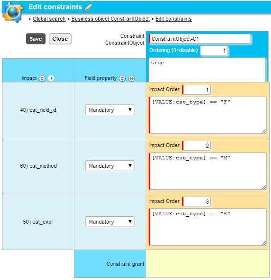

<div id='canref'/>

### canReference ###

The default canReference implementation has been changed to test both of Link and View visibilities.
- the Link is the database relationship between the object and one referenced object
- the View is the panel that contains items
- it is now possible to use new accessors: `Link.is/setVisible` and `View.is/setVisible`

<div id='gantt'/>

### Gantt hierarchy and filters ###

The Gantt view has been updated to use the full object functional key
- diplay filters based on hierarchy values to limit the Gantt scope
- display the tree based on object hierarchy

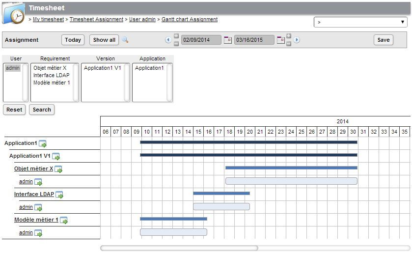

<div id='labels'/>

### Field labels on list ###

To limit the list width, field translation has been released to support short label.
When the short label is not set, the long one is used on list.

<div id='domainhome'/>

### Domain home inhibition ###

The domain definition has been changed to be able to ignore the Home view.
Set the field `No home` to false to hide the `Home` item in the domain menu.

<div id='changeobject'/>

### Change object access by code ###

`changeAccess` method has been added to simplify the local rights usage.

```javascript
var oldCRUD = this.getGrant().changeAccess("MyObject", true, true, true, false); // CRUD flags
try {
	// do something with the object
}
finally {
	// restore original rights
	this.getGrant().changeAccess("MyObject", oldCRUD);
}
```

<div id='mlist'/>

### Force a message on form or list ###

- A new request parameter can be added to the ALL_form.jsp and the ALL_list.jsp to display a user message: `_msg`
- A new request parameter can be added to the ALL_view.jsp to display a user message: `_msgview`

<div id='copydoc'/>

### Copy document ###

Now when user makes a copy; the attached documents are also copied.

<div id='userkey'/>

### Default user key label ###

The user key label is valued to the object extended title, and to the functional fields when title is empty.

<div id='helements'/>

### Hidden elements ###

- `ObjectField.VIT_NOT` is deprecated, and moved to `VIS_HIDDEN` = sent but simply hidden with a `display:none` on UI (still visible in html source).
- The new field visibility `ObjectField.VIS_FORBIDDEN` has been added = the field will never be sent to the common UI (list, form, title).
- Non visible `LABEL` `VALUE` `INPUT` `LABELINPUT` `PANEL` and "empty tab" are now sent to UI with a `display:none` to allow show/hide scripting
- Use the javascript `setFieldVisible(name,show,form)` to show/hide dynamically a field
- Use the javascript `setAreaVisible(name,show,form)` to show/hide dynamically an area (single or in tabs)
- Use the javascript `setPanelVisible(name,show,form)` to show/hide dynamically a panel (single or in tabs)

<div id='icons'/>

### Panel and Area icons ###

- View panel and FieldArea have been released to display a simple icon (from disposition resource).
- API `View.setIcon(code)` and `FieldArea.setIcon(code)` : Tab/Area can display icon

<div id='viewmode'/>

### Object view mode ###

The current rendering has been updated with 4 values:
- `VIEW_MODE_TABS`: default rendering where panels are grouped in a single horizontal tab
- `VIEW_MODE_COLLAPSED`: panels are first collapsed in sequence, user must click on the titles to open the panels
- `VIEW_MODE_EXTENDED`: panels are first extended in sequence, user must click on the titles to close the panels
- `VIEW_MODE_ACCORDION`: panels are in sequence, the panel that opens close others

View mode can be changed by script: `ObjectDB.setViewMode(ObjectDB.VIEW_MODE_*)`

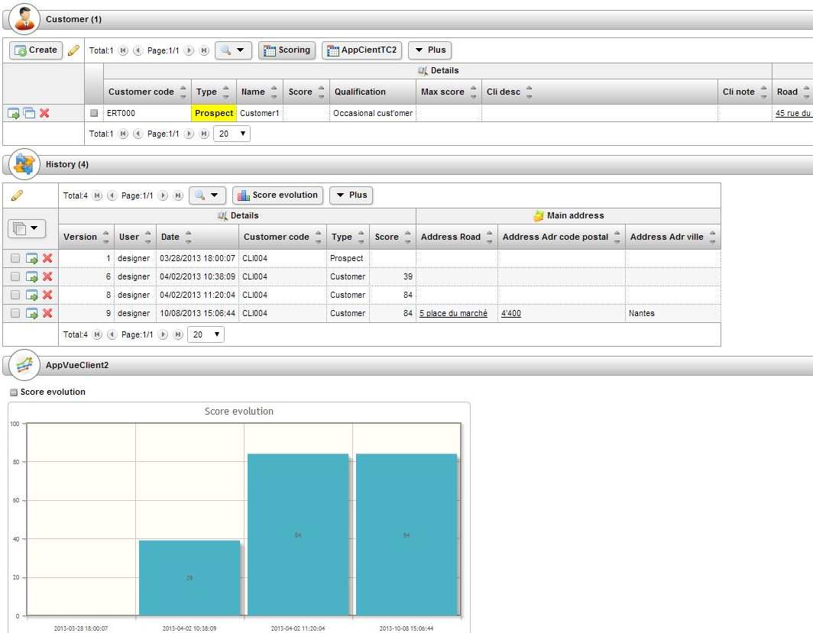

<div id='csvimport'/>

### CSV import ###

It is now possible to use translated columns and enum values directly.
- Simplicit&eacute; will now search the fields input names and labels in the user language.
- Enum translated values must be unique

<div id='default'/>

### Default value ###

The default value of field can be overridden in the Object field.

<div id='applet'/>

### Applet permission ###

Because of JM7 security changes, the feedback manifest (in applet) has been released with a Codebase and Permissions.
The codebase URI must be defined in the new build files:
- `build-dev.properties` : example `targeturl=http://localhost:8080` the applet can run on the server only
- `build-prd.properties` : example `targeturl=http://myapp.domain.com` the applet ca be loaded from a specific domain
- project.properties: `project.target=dev|rec|prd`

<div id='precision'/>

### Text field precision ###

Precision has been updates with a new syntax for long-text, notepad, HTML editor:
- `w=80 h=15` to specify columns and lines of characters.
- a single value is still interpreted as a width

```java
ObjectField.setPrecision("w=20 h=5");
ObjectField.setPrecision(20);
ObjectField.setPrecisionHeight(5);
```

<div id='activel'/>

### Active list ###

A new system parameter `ACTIVE_LISTS` has been created to specify the list activation:
- `cell`: click on simple fields opens the row
- `key`: click on the functional key fields opens the row
- `row`: click on the full row
- `no`: no list activation

References on list are now colored on mouse over.
And the reference/datamap can be selected by clicking the row, the old select button has been dropped.

<div id='upref'/>

### User preferences ###

Set the system parameter `USE_OBJECT_PREFS` to allow users to access to their own objects preferences.
Each one is saved in a user's parameter:

- `LIST_PREFS`: gives all visible fields on list for a given object
- `SEARCH_PREFS`: gives the visible fields on search form
- `ACTION_PREFS`: gives the visible actions, the others are accessible in the "Plus" button

<div id='menuitem'/>

### Disable a menu item ###

Designer can script a new hook: `ScriptedGrantHooks.isMenuEnable(g, domain, item)` to limit Menu even if domain/item is granted.

<div id='genaction'/>

### Generic Action generation ###

Some object behaviors have been implemented as common Actions:
- `editlist` | `addlist` | `associate`
- `tsheet_<name>` | `gantt_<name>` | `agenda_<name>` | `graph_<name>`
- `crosstab_<name>` | `placemap_<name>` | `mailing_<name>` | `printlist_<name>`

It is now possible to use them in common hooks (`isActionEnable`) and in user's preferences (`ACTION_PREFS`).

<div id='editlist'/>

### Edit list property ###

Edit list has been replaced by a enum-multi field : `N`=new form | `L`=add list | `E`=list edit.

<div id='isnull'/>

### Filtering: Is null / Is not null ###

- New filter UI TEXT `NULL` and `NOTNULL` can be used to replace `is null` and `is not null`
- Checkboxes replace old "select-multi" on enum fields

<div id='pdf'/>

### Markdown and PDF resources ###

It is possible to attach markdown and PDF resources to disposition and internal/external objects.
Same principle applies as for other types of resources.

<div id='urls'/>

### URLs in helps ###

It is now possible to add `[<url token>]` in global and contextual helps:

```html
<div>This is a help.</div>
<div>This global <a href="[HTMLRESOURCEURL:GLOBALHELP]" target="_blank">document</a> helps !</div>
<div>This other specific <a href="[PDFRESOURCEURL:HELP:OBJECT:DemoSupplier]" target="_blank">document</a> helps also !</div>
```

This is particularly useful for linking to detailled HTML and/or PDF documents.

<div id='escope'/>

### External scope ###

The home view allows to specify a complete URL to open an external application/scope.

- scope = a local name in the current platform myapp1
- scope = `http://.../myapp2/jsp/index.jsp?scope=X` to access the scope X of myapp2

<div id='modeler'/>

### Modeler ###

- insert node/content with multiple selection
- template with resizable nodes

Fixes
-----

<div id='html'/>

### HTML source vulnerability ###

Dual-controls on fields when receiving data from browser (visible and update)

<div id='enum'/>

### Enum and status validation ###

Enum codes are now checked during object validation. When a code does not exist, the `ERR_ENUM` is displayed.
- single enum / enum multiple / available status.
- Be careful: ObjectField.setValue(value) is not enougth to set the available status.
- to set correctly the linked lists and the available status, use a setValues or a select.

```javascript
var v = obj.search();
for (var i=0; i<v.size(); i++) {
	obj.setValues(v.get(i)); // set also linked lists and status field
	// or obj.select(v.get(i)[0]); idem but reload from DB
	// ...
	// validate / save
}
```

<div id='multip'/>

### Multi-panels / instance name ###

The values and filters was mixed randomly when multi-panels was based on a same referenced object in a form.
Panel instance has been renamed to `panel_<object>_<refname>` to allow this thread-safe behavior.
The API to retrive this instance has been released to `Grant.getPanelObject(String name, String refField)`.

<div id='excel'/>

### Excel sizing ###

Export excel : cols size + date format have been fixed.

<div id='map'/>

### Map deletion ###

Fixed delete cascade on Map not working for ObjectInternal + ObjectExternal

<div id='filterscross'/>

### Filters on crosstab ###

Fixed: reset filter in crosstab

<div id='cascade'/>

### Document copy on cascade copy ###

Fixed when child object contains copiable documents: before only the doc path was copied, now the full document is copied in a new path.