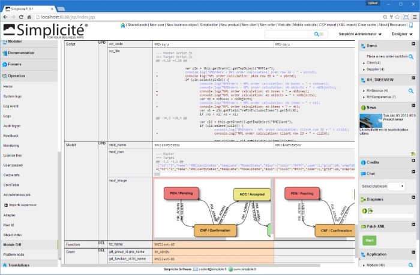

Version 3.1 maintenance 07 release note
=======================================

Changes
-------

- Added `ObjectDB.count()` as alias to `ObjectDB.getCount()`
- Improved module diff: image fields compare and unified diff on long string, HTML content, notepad and document fields (server scripts, JS/CSS/HTML resources, ...) 
- Updated Rhino&reg; engine to 1.7.8
- Added `LOGIN` field type (accepting both simple login and email addresses) and used for the user login field `usr_login`
- Added `_indexsearch` action to business object REST services  and `indexsarch` function is AJAX API in order to be able to search using the object's indexed fields
- Increased default websocket logs length from 256 to 1024
- Added raw data services for public `/raw/*` and for UI `/jsp/raw/*`
- Added SAML authentication (see [this document](/lesson/docs/authentication/tomcat-saml) for details)
- Added session info (usable for keep alive requests) on REST APIs: `/api/rest?session=true`
- Added OAuth2 "password grant" style response from API login when using `?_oauth2=true`
- Persistent API user tokens when system parameter `USE_USER_TOKENS` is set to `yes`
- Export all object with a row_module_id column when exported a module
- Use only one system parameter for HTML editor TinyMCE: `HTML_EDITOR_PARAMS`. So all TinyMCE configuration may be overridden
- Added static Google maps API in `GMapTool` 

Fixes
-----

- Fixed "server" clear cache error from UI
- Panel lists now opens main instance form. Note that this may impact misusages of the `getParentObject()` or inapropriate instance checking (e.g. using `isPanelInstance()`) in such contexts.
- Disposition default display if `display` function is not implemented on custom scripted disposition