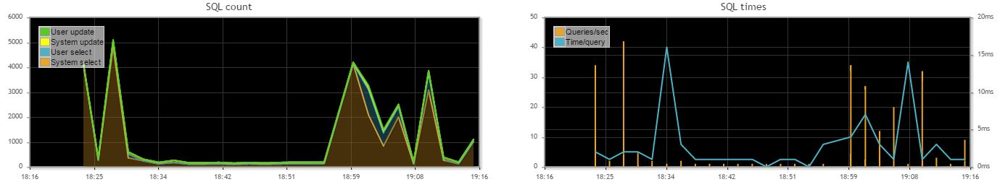
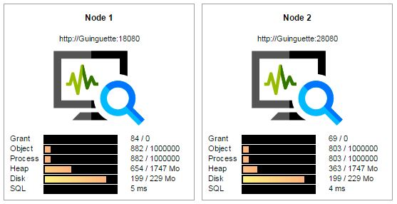
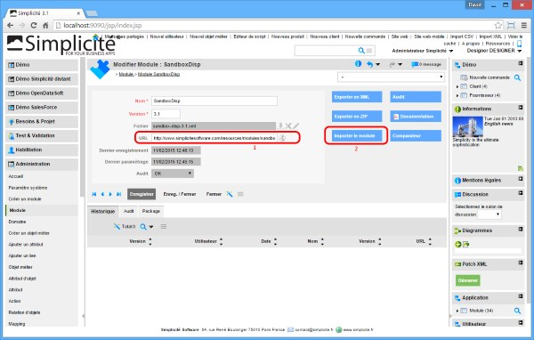
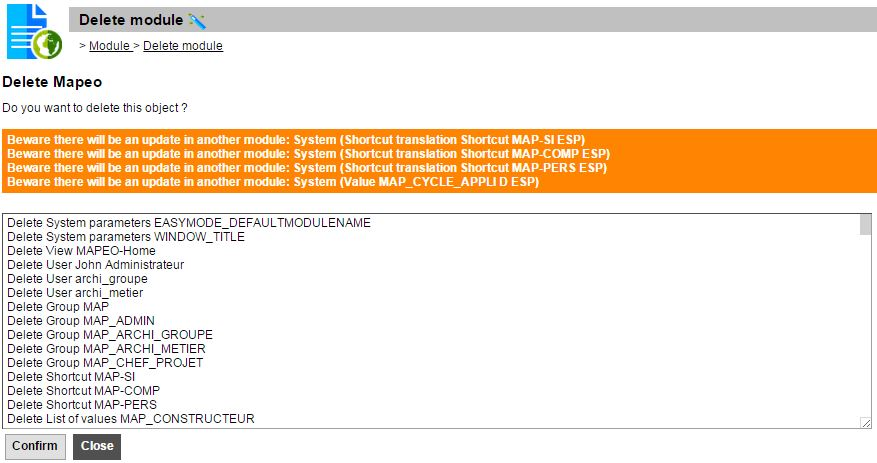

Version 3.1 patchlevel 09 release note
======================================

Table of Contents
-----------------

* [Password encoding defaults to MD5/HEX for Tomcat](/lesson/docs/versions/releasenote-patchlevel-09#password)
* [Enhanced meta object data in JSON webservices](/lesson/docs/versions/releasenote-patchlevel-09#json)
* [Additional publication template MIME types](/lesson/docs/versions/releasenote-patchlevel-09#mime)
* [Test case publication as markdown archive](/lesson/docs/versions/releasenote-patchlevel-09#test)
* [Enhanced Bootstrap® web page template](/lesson/docs/versions/releasenote-patchlevel-09#bootstrap)
* [Support for HTTP method override for REST services](/lesson/docs/versions/releasenote-patchlevel-09#rest)
* [Refactored mobile web UI](/lesson/docs/versions/releasenote-patchlevel-09#mobile)
* [Timeout on AJAX API](/lesson/docs/versions/releasenote-patchlevel-09#timeout)
* [SQL monitoring](/lesson/docs/versions/releasenote-patchlevel-09#monitoring)
* [Clustering](/lesson/docs/versions/releasenote-patchlevel-09#clustering)
* [Debug hook calls and SQL queries](/lesson/docs/versions/releasenote-patchlevel-09#debug)
* [Prune DB logs](/lesson/docs/versions/releasenote-patchlevel-09#prune)
* [Lucene tools deprecated](/lesson/docs/versions/releasenote-patchlevel-09#lucene)
* [New HTTPS call APIs](/lesson/docs/versions/releasenote-patchlevel-09#apicall)
* [New API web services endpoints](/lesson/docs/versions/releasenote-patchlevel-09#endpoints)
* [Remote data sources](/lesson/docs/versions/releasenote-patchlevel-09#remote)
* [Description of configuration items as Markdown](/lesson/docs/versions/releasenote-patchlevel-09#markdown)
* [Refactored content and resources JSPs as servlets](/lesson/docs/versions/releasenote-patchlevel-09#servlet)
* [Module from URL](/lesson/docs/versions/releasenote-patchlevel-09#moduleurl)
* [Module deletion](/lesson/docs/versions/releasenote-patchlevel-09#moduledeletion)
* [System objects protection](/lesson/docs/versions/releasenote-patchlevel-09#protection)
* [PDF publication header and footer as resource](/lesson/docs/versions/releasenote-patchlevel-09#pdf)
* [Fixes](/lesson/docs/versions/releasenote-patchlevel-09#fixes)

Changes
-------

<div id='password'/>

### Password encoding defaults to MD5/HEX for Tomcat

It is highly recommended to have passwords encoded as MD5/HEX when using Tomcat.

This is still an manual configuration but this will become the default shortly.

_Note: this feature has been back ported to the 3.0 maintenance branch._

<div id='json'/>

### Enhanced meta object data in JSON webservices

The meta object fields data have now two extra attributes (in addition to the existing `object` and `row_id`) :

- `label` which contains the referenced object label
- `userkeylabel` which contains the user key label of the referenced record

In addition you can now precise that you want the full referenced record data to be inlined.
To do so you can :

- add the `inlineObjs` option to the AJAX lib `get`, `populate` and `search` methods
- add the `_inline_objects` URL parameter to the GET REST webservices

When this inline option is set the meta oject field will have an additional `item` attribute with the full referenced record data in it.

_Note that if documents and images are inlined at the top level this will also be the case for these referenced data,
and at the potential sub-level referenced data (for which the inline option will be also active)._

_Note: this feature has been back ported to the 3.0 maintenance branch._

<div id='mime'/>

### Additional publication template MIME types

The following forced MIME types are now available for print templates:

- Markdown `md`
- ZIP archive `zip`

_Note: this feature has been back ported to the 3.0 maintenance branch._

<div id='test'/>

### Test case publication as markdown archive

A new publication template has been added on ALM test case so as to publish the test case as a Markdown archive.

The publication result is a ZIP archive containing a main `index.md` file referencing screen shots images files of the test case steps.

_Note: this feature has been back ported to the 3.0 maintenance branch._

<div id='bootstrap'/>

### Enhanced Bootstrap&reg; web page template

The `com.simplicite.webapp.web.BootstrapWebPage` has been enhanced (DOM IDs on main area `bs-main`,
and main menu `bs-menu`, side menu zone, ...).

Check the associated Java doc for details.

_Note: this feature has been back ported to the 3.0 maintenance branch._

<div id='rest'/>

### Support for HTTP method override for REST services

REST services using HTTP `PUT` (update) and `DELETE` (delete) methods can now use HTTP `POST` and the
standard `X-HTTP-Method-Override` HTTP header (in addition to legacy `_method` HTTP parameter approach).

_Note: this feature has been back ported to the 3.0 maintenance branch._

<div id='mobile'/>

### Refactored mobile web UI

The old jQueryMobile-based mobile web UI has been refactored as a Bootstrap&reg; responsive UI.


It is still a very light subset of the desktop web UI dedicated to be used in mobility situations where only basic features are required.

_Note: this feature has been back ported to the 3.0 maintenance branch._

<div id='timeout'/>
 
### Timeout on AJAX API

It is now possible to set a global timeout on Ajax API calls using the `setTimeout` function.

_Note: this feature has been back ported to the 3.0 maintenance branch._
 
<div id='monitoring'/>

### SQL monitoring ###

2 charts have been added to the Monitoring in the Data panel:

- Chart 1 : volume of queries (select and update) per polling interval
- Chart 2 : displays the number of queries per second and the time per query



<div id='clustering'/>

### Clustering ###

- Logs are stored with the platform node in DB
- The monitoring has been released to inspect each cluster node
- The cron jobs have a new boolean property `Unique` to define if the job must be launched by only one server in the same time
- The crontab is always running on each node (to ensure the fail-over, to launch non unique jobs...)
- For the DBDOC 2 solutions:
	- turn the DOC_DIR to BLOB to store documents in database
	- or share a unique file system to be addressed by each nodes
- A new object `Platform node` has been added to the Operation to list all the running nodes



Some notifications are sent to the running nodes:
- Request a full clear-cache / full logout of sessions
- Logout a user when the responsibilities have changed
- Reload the crontab when job definitions have changed

Those notifications use the Simplicité IO interface:
- with the end-points stored by each server during start-up
- with the system parameter `EAI designer` as simple credentials

If the IO interface is not accessible, a job `CheckClearCache` ensures to launch those actions periodically.

#### Simple cluster with a front Apache and 2 tomcats

```
ProxyRequests Off
ProxyTimeout 300
ProxyPreserveHost On
ProxyVia On

<Proxy balancer://cluster>
	BalancerMember ajp://hostname1:8009 [secret=<AJP secret if applicable>] route=node1
	BalancerMember ajp://hostname2:8009 [secret=<AJP secret if applicable>] route=node2
	ProxySet lbmethod=byrequests
</Proxy>

ProxyPass /myapp balancer://cluster/myapp stickysession=JSESSIONID|jsessionid scolonpathdelim=On
```

<div id='debug'/>

### Debug hook calls and SQL queries

Designer can activate the hooks tracer during the development phase. 
At the top of the object script add the following code:

```javascript
// Trace object hooks
// - Tracks the calls hierarchy
// - Tracks the call frequency and the durations
var trace = true;     // to active the hooks tracer
var traceAll = true;  // trace all hooks to display the calls hierarchy or only the implemented ones
var traceArgs = true; // trace all hooks arguments or only simple ones
console.traceHooks(trace, traceAll, traceArgs);

// Trace object CRUD 
// - Tracks object accesses
// - Explains the SQL statements
console.traceObject(trace);
```

<div id='prune'/>

### Prune DB logs

A new cron task `PruneLogDB` has been added to prune periodically the table m_log.
The task uses a new system parameter `PRUNE_LOG_DEPTH`:
- negative value : max period in days
- positive value : max rows in table m_log

By default this job runs every night (`every 01:00 = 0 0 1 * * ?`) with 30 days retention (`PRUNE_LOG_DEPTH=-30`).

<div id='lucene'/>

### Lucene tools deprecated

Because Lucene can't support DB storage, it has been removed. Indexation is now supported by the database.
Remove lucene libraries from your project:
- platform/lib/lucene-analyzers-3.3.0.jar
- platform/lib/lucene-core-3.3.0.jar

<div id='apicall'/>

### New HTTPS call APIs

New APIs have been added to `HTTPTool` to help calling HTTPS URLs, the first one takes username and password parameters for HTTP basic authentication,
the other takes a Java keystore (as stream) for SSL client authentication using certificates.

_Note: this feature has been back ported to the 3.0 maintenance branch._

<div id='endpoints'/>

### New API web services endpoints

New API endpoints for REST/SOAP/RAW and JSON web services are now available in the generic web UI webapp:

```plaintext
/api/rest/*
/api/soap/*
/api/raw/*
/api/json/*
```

Unlike the I/O endpoint (`/io`) that uses integration credentials and unlike the other web services endpoints that use server's authentication,
these API endpoints are using token-based authentication with explicit login and logout.

The AJAX lib has been updated to be able to use these endpoints (as the new `"api"` webservices gateway type).

These endpoints makes the webservices gateway webapp useless unless you need advanced, server-managed, authentication mechanisms.

_Note: this feature has been back ported to the 3.0 maintenance branch._

<div id='remote'/>

### Remote data sources

It is now possible to easily configure business objects pointing on remote datasources:

- Simplicit&eacute;&reg; (refactored to use the new API endpoint)
- OpenDataSoft&reg; open data datasets (refactored to align the configuration principles of other remote datasources)
- SalesForce&reg; business objects.

_Note: this feature has been **partly** back ported to the 3.0 maintenance branch._

<div id='markdown'/>

### Description of configuration items as Markdown

The _Description_ fields present on configuration items objects have been updated to long string with markdown
rendering. This will allow to generate formatted functional documentation.

It has been done on the following objects:

- `SystemParam`, note that the value field rendering has been set to `TEXT` to allow better text formatting (using ACE editor in plain text mode).

In next versions the principle will be applied to other configuration objects.

_Note: this feature has been **partly** back ported to the 3.0 maintenance branch._

<div id='servlet'/>

### Refactored content and resources JSPs as servlets

The `PUB_content.jsp` and `PUB_resource.jsp` JSPs have been refactored as `/content` and `/resource` servlets for better compatibility.

The JSPs have been left for backward compatibility but they now just forward the request to the servlets.

_Note: this feature has been back ported to the 3.0 maintenance branch._

<div id='moduleurl'/>

### Module from URL

It is now possible to get a module package (either as ZIP or as XML) from an URL.

As long as the URL field is set the file is downloaded and stored locally as the local module file **each time** the module is saved.

This is, for instance, the case when clicking on the _Import module_ action button, which triggers a save prior to its execution.



_Note: this feature has been back ported to the 3.0 maintenance branch._

<div id='moduledeletion'/>

### Module deletion

Module deletion has been updated to check depedencies between modules.
It is no more possible to delete a core-system module.

Before deletion a validation screen explains:

- All objects to remove
- Warnings when objets are outside the module to delete



<div id='protection'/>

### System objects protection

A new system parameter `ADMIN_SYSTEM` allows or not a user (with ADMIN rights) to change the core-system.
Logins `system` and `designer` have this right and it can't be removed.

It is strongly recommended:

- to set this value to `no` by default, and add some preferences to super-designers (certified)
- to use independant users with ADMIN rights because `designer` can still change the core-system

<div id='pdf'/>

### PDF publication header and footer as resource

It is now possible to use disposition-level image resources for header and footer images used in PDF pubications:

- `MODULE_HEADER` and `MODULE_FOOTER` for module documentations
- `CROSSTAB_HEADER` and `CROSSTAB_FOOTER` for pivot tables publications
- `TIMESHEET_HEADER` and `TIMESHEET_FOOTER` for time sheet publications

If these resources do not exists the legacy content resources are used instead.

_Note: this feature has been back ported to the 3.0 maintenance branch._

<div id='fixes'/>

Fixes
-----

- Fix Ant on IO calls: only one session is now used during a patch/full install
- Fixed encoding problems when calling URLs that does not use the same encoding as the platform
- Fixed various encoding-related problems with UTF-8