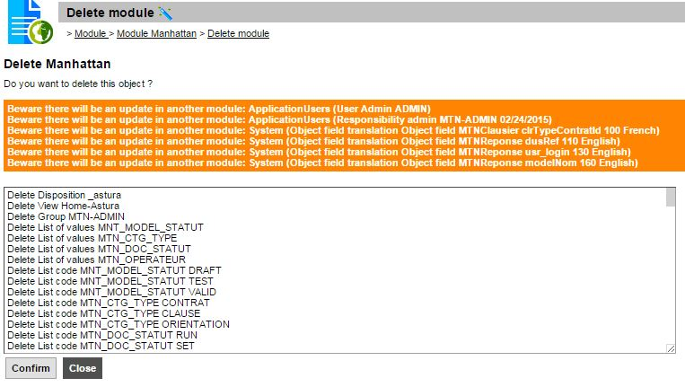
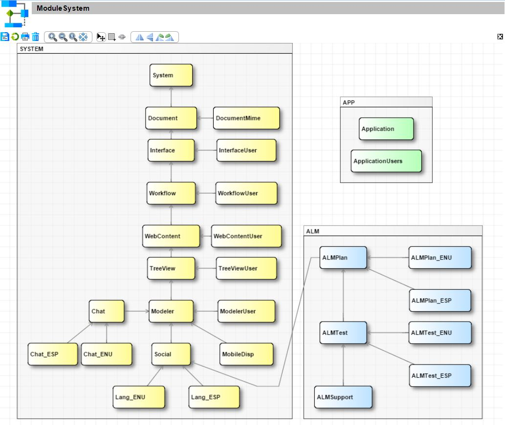
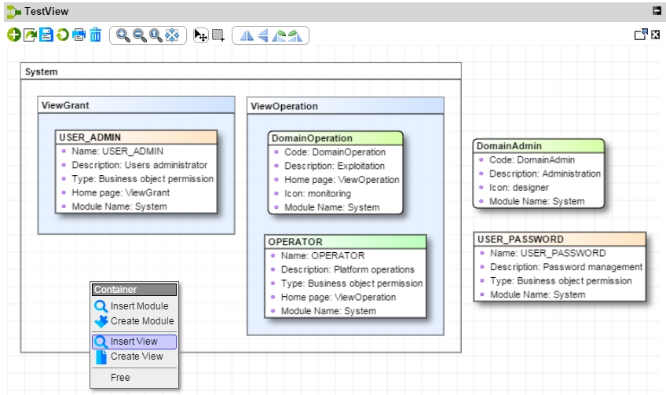

Version 3.1 patchlevel 10 release note
======================================

Changes
-------

### System protection

The core modules (System, Interface, Workflow...) can not be removed to reinforce the security of the platform.

Only designers with parameter `ADMIN_SYSTEM=yes` can change the core modules:
- By default, only the user `designer` has this feature in order to patch the system (patch from editor, local settings customization)
- A user with ADMIN responsibility have no longer the right to change the system
	- create, update, delete a core definition
	- or move/override a system setting in its modules

### Module deletion

The default `delete` function has been removed to force the designer to check all impacts in a specific screen (thru a new delete action in "plus" button).
This confirmation screen displays:
- a list of warnings on updated children in other modules
	- in case of packaging mistake, designer has to fix object's module before deletion,
	- otherwise child objects will probably malfunction after deletion (ex: child object can loose a 'script usage' because the 'script' belongs to the deleted module)
- a list of objects to delete: designer can validate all the objects to delete
- buttons to confirm (even if there are warnings) or close (cancel)
 

### Modules hierarchy

It is now possible to define the modules hierarchy in order to check in a short future the definitions dependencies.
For example a root module may contain some common scripts, dispositions, groups... that may be used in children modules.

A new object `ModuleLink` allows the designer to configure this hierarchy, and a new modeler template has been created to manage the dependence tree.
It is not permitted to define a cycle between modules, because they would not be installable after each other.

In a next release the runtine will be able to:
- detect cycle: check if a definition references a child object
- manage cascade deletion has a link between objects: 
	- cascade: parent module will remove automatically its children
	- restrict: parent module can not be deleted if a child references it
	- set to null: reset the parent references in children objects (current behavior)

### Model containers

New modeler features:
- Designer can import/create/open the object symbolized by the UI container,
- The containers/nodes hierarchy is forced on UI (auto-resizing),
- A node can be detached from its container on UI but not in DB,
- The old container is still supported to group nodes on screen but not in DB,
- A node or a container can belong to only one parent container.

Elements of a model template have a new type: Object or Container. The default is object.
- Container: contains objects and containers (to be also defined as a template element and may contains children...),
- Object: contents are unchanged and can only support objects. It's not possible to attach a container in a content.

Example : Containers based on Module > View > Group and Domain objects.

Fixes
-----

- Function visibility in hook `isOpenEnable` and during object loading.
- No more dead foreign keys in database after a module deletion with dependencies

