Version 3.1 prior to patchlevel 07 release note
===============================================

**Starting with patchlevel 07 the changes and fixes are published in individual release notes.**

Table of Contents
-----------------

* [OAuth2 authentication](/lesson/docs/versions/releasenote#OAuth2)
* [Command line interface](/lesson/docs/versions/releasenote#curl)
* [URL import](/lesson/docs/versions/releasenote#urlimport)
* [Auto-completion](/lesson/docs/versions/releasenote#autocompletion)
* [Scripts editor](/lesson/docs/versions/releasenote#scripteditor)
* [CronJob meta-object](/lesson/docs/versions/releasenote#cron)
* [Merge object](/lesson/docs/versions/releasenote#merge)
* [Module diff](/lesson/docs/versions/releasenote#modulediff)
* [New icons](/lesson/docs/versions/releasenote#icons)
* [Common UI wrapper](/lesson/docs/versions/releasenote#uiwrapper)
* [Simple document search](/lesson/docs/versions/releasenote#simpledocumentsearch)
* [PDFTool](/lesson/docs/versions/releasenote#pdftool)
* [Content max-age](/lesson/docs/versions/releasenote#contentmaxage)
* [Core cache](/lesson/docs/versions/releasenote#corecache)
* [User profile access](/lesson/docs/versions/releasenote#profileaccess)
* [Script SQL type](/lesson/docs/versions/releasenote#scriptsql)
* [Social feature](/lesson/docs/versions/releasenote#social)
* [Markdown rendering and preview (also for HTML rendering)](/lesson/docs/versions/releasenote#markdown)
* [extInput and fieldChanged](/lesson/docs/versions/releasenote#extinput)
* [Access to User unique Id](/lesson/docs/versions/releasenote#uniqueid)
* [Deletion on Meta-object](/lesson/docs/versions/releasenote#deletion)
* [Resources cascade copy](/lesson/docs/versions/releasenote#cascade)
* [Fixes](/lesson/docs/versions/releasenote#fixes)

Changes
-------

<div id='OAuth2'/>

### OAuth2 authentication ###

When using Apache Tomcat, it is now possible to authenticate using Google OAuth2. The configuration is described in [this document](/lesson/docs/authentication/tomcat-oauth2).

The principles applies also to other OAuth2 based services.

_Note: this feature has been back ported to the 3.0 maintenance branch._

<div id='curl'/>

### Command line interface ###

It is now possible to use the `curl` tool (or any other similar HTTP client command line tool) to process administrative tasks. The usage of `curl` is describe in [this document](/lesson/docs/integration/io-commandline).

_Note: this feature has been back ported to the 3.0 maintenance branch._

<div id='urlimport'/>

### URL import ###

The import UI now allows to upload files from URL.

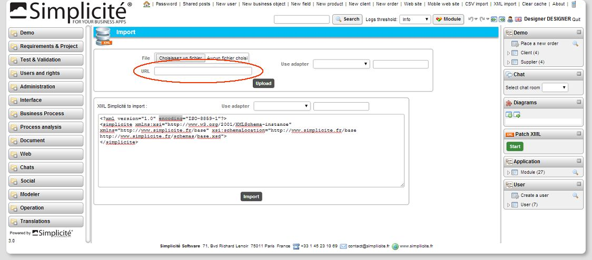

_Note: this feature has been back ported to the 3.0 maintenance branch._

<div id='autocompletion'/>

### Auto-completion ###

The UI auto-completion can be activated on each object field by configuration. 

- By default the completion is based on the field DB column (SQL like statement).
- This ability can be changed with code `ObjectField.setAutoComplete(true/false)`, also use `canAutoComplete` to know if a field can be completed.

To manipulate the completion data, designer must implement 2 hooks

- on server side: the hook `fieldCompletion(field, query, context)` will be called to retrieve specific data (not based on the field column).
	- context supported values: form | list | search | reference (useful to change data in specific context)
	- returns: null to use default behavior (look in DB column) or a list of strings.
	- sample:

```javascript
MyObject.fieldCompletion = function(field, query, context) {
	var g = this.getGrant();
	if (field=="myField" && query && context=="form") {
		var v = g.query("select xxx from yyy where upper(zzz) like '%"+Tool.toSQL(query.toUpperCase())+"%' and ...");
		var list = new java.util.ArrayList();
		for (var i=0; i<v.size(); i++) list.add(v.get(i)[0]);
		return list;
	}
	return null;
};
```

- on client side: the hook `field_completed` will be called to change the UI usage when one item is selected.

```javascript
// global callback
field_completed = function(field, value) {
	if (field=="myField") setFieldValue("myField", value);
}
// or field callback
myField_completed = function(value) {
	setFieldValue("myField", value);
	if (value=="X") setFieldValue("myField2", "Y");
}
```

- the minimal number of characters to launch the completion is 3, to change this value:

```javascript
onload_functions.push(function() { 
	Simplicit&eacute;.FieldCompletion.fcomp.minLength = 1;
});
```

- the reference lookup use now the field completion on "starts with".

<div id='scripteditor'/>

### Scripts editor ###

It is now possible to edit more than one script in a session.

The view allows you to edit multiple scripts at the same time, and a top shortcut has been added to return quickly to the editors.
All opened scripts are persistent in a designer's parameter: `CODE_EDITOR_PREFS`.

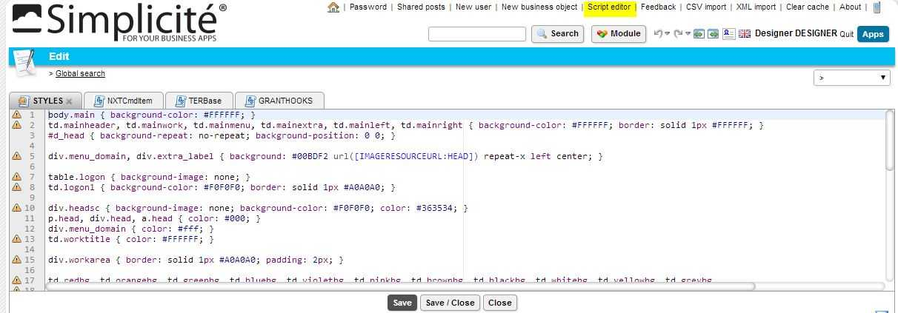

<div id='cron'/>

### CronJob meta-object ###

Asynchronous script are now supported.

The CronJob instance is now associated to its original object when the action has been launch by a specific record.
It is know possible to display the link between a business entity and its instanced asynchronous jobs.

Use `obj.addLinkMetaObject` to add dynamically the CronJob panel to the object (in case of asynchronous form action):

```javascript
MyObject.postLoad = function() {
	var g = this.getGrant();
	if (g.accessObject("AsyncJob")) {
		var job = g.getMainObject("AsyncJob");
		var link = this.addLinkMetaObject(job, 1000);
	}
};
```

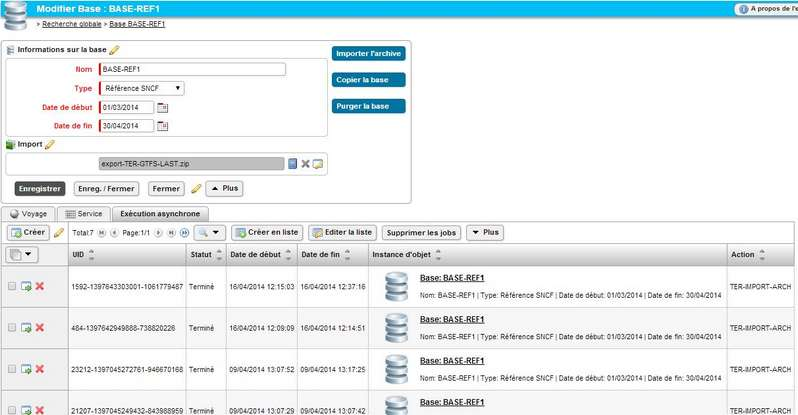

<div id='merge'/>

### Merge object ###

A new object property has been added to allow entity to be merged, see `Object.is/setMergeable`.
When the object can be merged, the user can select up to 5 lines and configure the merger:

- choose the fields to keep on the main entity (the first column)
- choose the referenced objects to move on the main entity
- after processing, the main object will be conserved the other will be deleted.

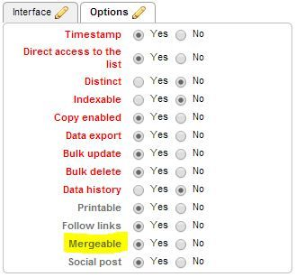

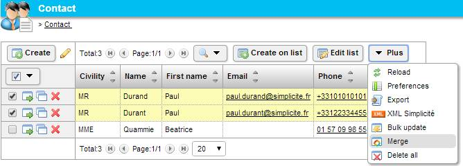

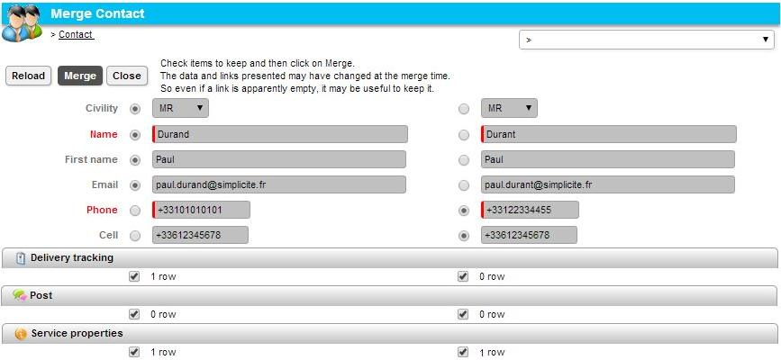

<div id='modulediff'/>

### Module diff ###

Designer can now compare 2 XML files or Modules.
- Access thru menu Operation/Module Diff
- or open the module and click on the "Compare" button to display this screen:

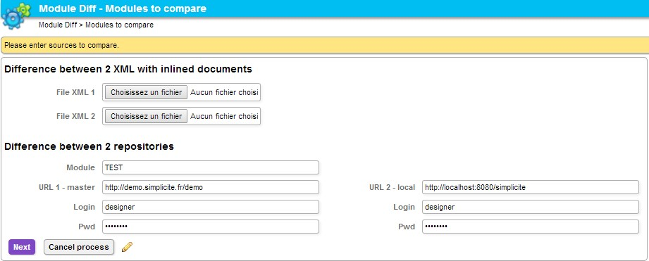

- Choose 2 XML files with inlined documents
- Or set the module name and the 2 repositories location

The comparator displays the differences per object (NEW, UPD, DEL), unchanged or empty data are not listed to limit the page size:

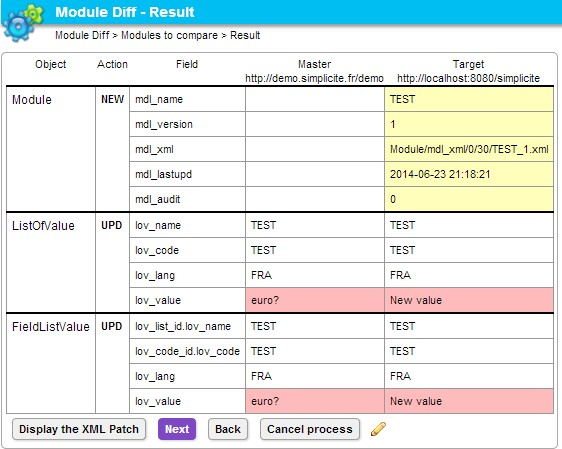

The comparator can build the XML patch to upgrade the module:

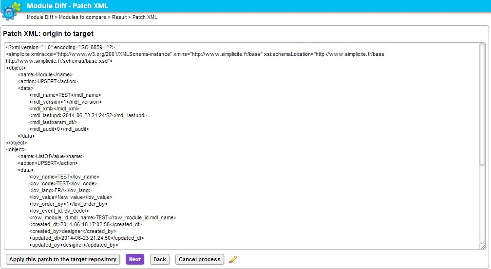

User can launch the import in the master repository.

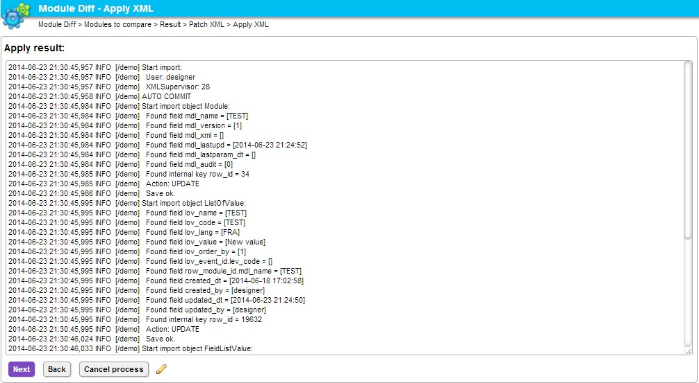


<div id='icons'/>

### New icons ###

The disposition contains now all the application icons in its resources.
It allows to change dynamically the set of icons when user changes the scope/disposition.

A new icons set has been created:

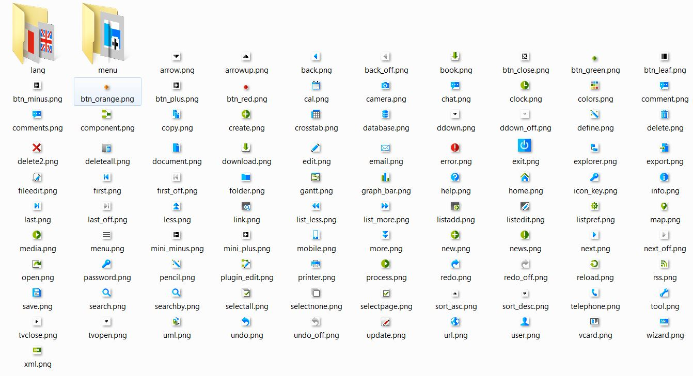

They are included in the disposition _white1 as a `Icon set` resource:

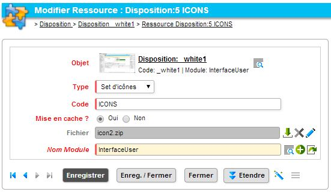

- Default icons (2010 version) have been added to the `default` disposition, but are still accessible as static icons in /images/icons (gif and png for backward compatibility)
- New icons (2014 version) have been added to the `_white1` disposition (no more accessible as static icons in /images/icons)
- The designer can now upload the icons file (a simple ZIP file), change icons and define the ICONS in its own disposition.

In scripts, designer has to change the way to load icons thru APIs.
The static reference are deprecated (ex ../images/icon/open.gif).

Server side:
- script: `HTMLTool.getIconURL(Grant g, String code)`
- example : `var img = "";`
- example : `var img = "";`

Client side:
- javascript: Simplicite.getIconURL(code)
- example : `var img = "";`
- example : `var img = "";`

Notes:
- The icons are now identified in APIs by names ant not by format: png or gif to support both without static reference
- Sub-directories in ZIP are respected in the icon code
- In definition of Action, Field-style and Web-zone, designer can now use the icon code (ex "open") instead of a static reference (ex "../images/icon/open.gif")

<div id='uiwrapper'/>

### Common UI wrapper ###

Wrappers have been added to override some object's common displaying:

```java
public String displayForm(ServletParameters params, Navigator nav, HTMLPage page) throws Exception;
public String displayList(ObjectList list, ServletParameters params, Navigator nav, ObjectDB parent) throws Exception;
public String displaySearch(ObjectSearch search, ServletParameters params, Navigator nav) throws Exception;
public String displayRefSelect(ObjectSelect selector, ServletParameters params, Navigator nav) throws Exception;
public String displayDataMap(ObjectDataMap selector, ServletParameters params, Navigator nav) throws Exception;
```

And in scripted object:

```javascript
MyObject.displayForm = function(params, nav, page)
MyObject.displayList = function(list, params, nav, parent)
MyObject.displaySearch = function(search, params, nav)
MyObject.displayRefSelect = function(selector, params, nav)
MyObject.displayDataMap = function(selector, params, nav)
```

<div id='simpledocumentsearch'/>

### Simple document search ###

The full-text search has been released to parse `Document` fields. This behavior is only available in those conditions:

- System parameter `USE_SEARCH_INDEX` must be set to `sql` (lucene is not supported)
- Object and document field must be indexable
- Index of Document/MIMEtype must be correctly configured
	- textual document (txt, js, sql...) is directly copied in the index
	- rich content (doc, pdf...) is first scanned by TIKA (Apache project) to remove formatting
	- when parsing fault on binary document, the content is not indexed
	- the non-formatted-content is stored in the table m_index, so beware to size the table properly

This has been done on the objects to allow the designer to search in scripts (adapter, disposition, internal/external object, process, script, model template).

<div id='pdftool'/>

### PDFTool ###

New APIs to insert quickly image, object, area or list in a PDF print template.

- all areas: `PDFTool.insertForm`
- a single area: `PDFTool.insertFieldArea` 
- current list: `PDFTool.insertList`
- resource image: `PDFTool.insertImage`

Code sample:

```javascript
importPackage(Packages.com.lowagie.text);
function buildPDF() {
	var g = this.getGrant(), out = null, bytes = null;
	try {
		var o = this; //g.getTmpObject("MyObject");

		out = new java.io.ByteArrayOutputStream();
		var d = new Document(PageSize.A4, 35, 35, 35, 35);
		com.lowagie.text.pdf.PdfWriter.getInstance(d, out);	
		d.open();

		// IMAGE
		var img = PDFTool.getImageFromResource(g, "MY_PRINT_HEADER");
		PDFTool.insertImage(d, img, false, Image.MIDDLE);

		// TITLE
		var p = new Paragraph("Title...", PDFTool.TITLE1); 
		p.setAlignment(Paragraph.ALIGN_CENTER);
		d.add(p);

		// FORM
		var color = new java.awt.Color(1.0, 1.0, 0.9);
		PDFTool.insertForm(d, o, color, false);
		d.newPage();

		// AREAS
		PDFTool.insertFieldArea(d, o, o.getFieldArea("MyObject-Area1"), color, false, false);
		PDFTool.insertFieldArea(d, o, o.getFieldArea("MyObject-Area2"), color, false, false);
		PDFTool.insertFieldArea(d, o, o.getFieldArea("MyObject-Area3"), color, false, false);

		// REFERENCE
		var child = g.getObject("print_MyChild", "MyChild");
		child.resetFilters();
		child.setFieldFilter("MyObjectFK", id);
		var v = child.search();
		if (v.size()>0) {
			d.add(new Paragraph("Child list", PDFTool.TITLE2));
			PDFTool.insertList(d, child, false, false, false, false, color, false);
		}

		d.close();
		bytes = out.toByteArray();
	}
	catch(e) {
		console.log("Build PDF error: "+e.message);
	}
	finally {
		if (out) out.close();
	}
	return bytes;
}
```

<div id='contentmaxage'/>

### Content max-age ###

A new parameter has been added to force the maxage of a content, override system `CACHE_MAXAGE` or 3600s:
`PUB_content.jsp?file=<path>&maxage=<sec>` 

<div id='corecache'/>

### Core cache ###

Dispositions + Resources + Shared scripts are now managed in the `CoreCache`.

<div id='profileaccess'/>

### User profile access ###

Use the system parameter `OBJECT_MANAGEMENT_USER` to specify which object is used to manage the user profile.
`User` is the default value and a new icon has been added in the header for quick access.

<div id='scriptsql'/>

### Script SQL type ###

- Server side Scripts are know typed: `JS|SQL|OTHER`
- When the type is SQL a new action has been added: "Apply SQL"
- The module PDF export has been released to export scripts.

<div id='social'/>

### Social feature ###

The social post can be deactivated by object thru a new configurable option and code `Object.setSocial(true/false)`.

<div id='markdown'/>

### Markdown rendering and preview (also for HTML rendering) ###

The long string type can now have a rendering for Markdown content.
The editor is a code editor (like for HTML rendering) and a preview button allow to see the formatted version of the text in a popup:

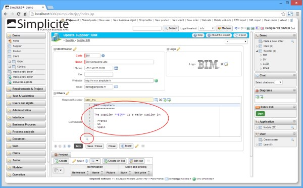

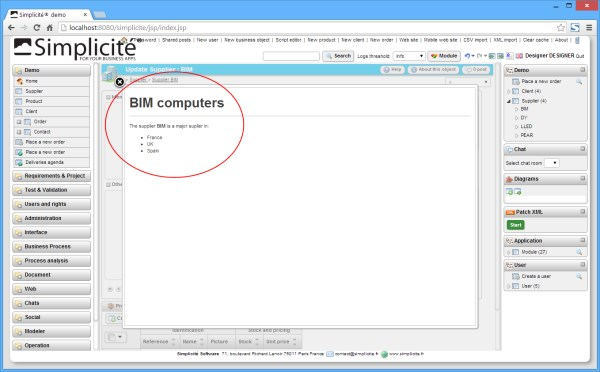

This formatted preview is also available for HTML rendering.

_Note: this feature has been back ported to the 3.0 maintenance branch._

<div id='extinput'/>

### extInput and fieldChanged ###

`function fieldChanged(input, obj, formName, extInput)`

The client API `fieldChanged` has been released to support the "edit list" mode.
The html element is identified with:
- the field input: when the field is displayed on a form
- input+extInput: when the field is edited in a list

The extInput is empty when the field belongs to the form.
And equals to `.objectName.rowId` to identify the edited record in a list (ex: clientName.AppClient.123)

<div id='uniqueid'/>

### Access to User unique Id ###

the API to access the user ID hs been changed to manipulate String directly.
`Grant.getUserId()` is now deprecated. Use `Grant.getUserUniqueId() to use directly a String.

```javascript
// For example the old code to test if a field is the current user:
var bool = this.getFieldValue("myUserId").equals(""+this.getGrant().getUserId())
// New code:
var bool = this.getFieldValue("myUserId").equals(this.getGrant().getUserUniqueId())
```

<div id='deletion'/>

### Deletion on Meta-object ###

In case of a meta-object field, the property "Deletion" has been added to the object field definition.
It allows to specify the same behavior as a foreign key:

- Restricted: the object can not be deleted if meta-object still exists (an error is returned to UI)
- Set to null: the meta-object field is updated to null (only if not required otherwise an error is returned to UI)
- Cascade: the meta-object is deleted (ex: the related social-posts are deleted)

<div id='cascade'/>

### Resources cascade copy ###

When a disposition is copied, all its Resources are also copied in the new one.


<div id='fixes'/>

Fixes
-----

- Fix save buttons in form: save now the object data + all embedded and edited lists
- Fix PIE chart when `ztable=no` on a home page
- Fix submit to show the loading div (except on test case recording)
- Fix cascade deletion on SocialPost

