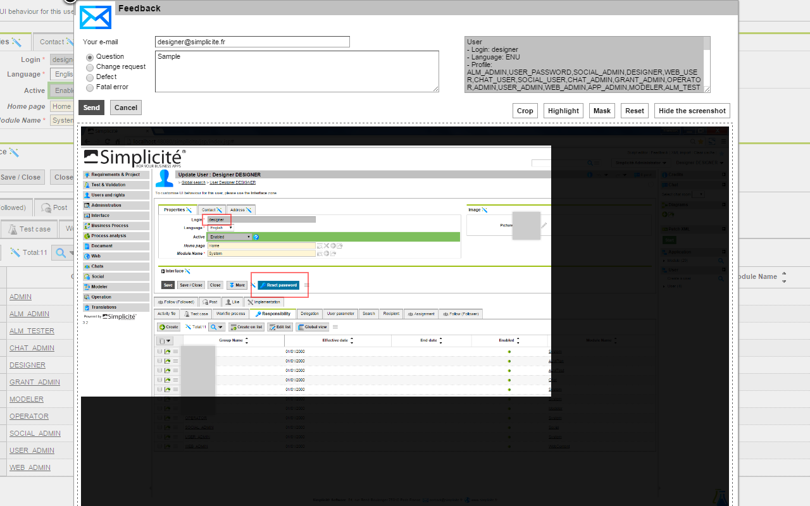

Version 3.2 patchlevel 02 release note
======================================

Changes
-------

### TinyMCE as HTML Rich editor

We switch to <a href="http://www.tinymce.com" target="_blank">TinyMCE</a> as editor for HTML field. It provides HTML5 support, better copy-paste features and generates compliant HTML code.

2 system parameters are available to customize the available plugins and toolbar of the editor.
* HTML_EDITOR_PLUGINS
* HTML_EDITOR_TOOLBAR

Default values can be seen on the <a href="http://www.tinymce.com/tryit/basic.php" target="_blank">basic example page</a>.
You can also find <a href="http://www.tinymce.com/wiki.php/Plugins" target="_blank">a list of available plugins</a> to use.

_Note: this feature has been back ported to the 3.1 maintenance branch._

### End-user feedback

For security reasons, the Feedback applet has been refactored in HTML (Java applet won't be supported by recent browsers in a short future).
The swing applet has been refactored to HTML5 canvas with crop/highlight/mask features.

2 solutions are proposed to insert a screenshot in the feedback:

* Add a plugin to your browser:
	- Chrome: install the <a href="https://chrome.google.com/webstore/detail/simplicite-feedback/kibnjmnmejgbgahlfbelaibnacdfplik" target="_blank">Simplicite Feedback</a> extension
	- Firefox: install the <a href="http://getfireshot.com/" target="_blank">Fireshot</a> plugin
	- IE: not supported yet
* Otherwise just copy/paste the screenshot into the popup area




### API JSON/REST and Treeview

Treeview definition is now used by API to manage one object hierarchy.

1) <b>GET</b> API is the same as a `get` action with the new parameter `treeview` name.

Examples to retrieve a user, group and responsibilities:
* JSON request: myapp/api/json/obj?object=User&row_id=4&<b>action=get&treeview=TreeUser</b>
* REST request: GET myapp/api/rest/User/4<b>?_treeview=TreeUser</b>

Note:
- The server response will contain the full tree and IDs
- All node actions are set to "get"

2) <b>PUT</b> API is the same as a `update` action with the new parameter `treeview` name.

Each node can specify or not one action:
* get or no action : doesn't change the item
* insert : create if not exists
* update : update if exists
* upsert : create if unknown, update if known
* delete : delete if exists

Note:
- Only the root object is required, then it is possible to use a part of the definition tree
- To update a functional-key: use the row IDs field or use the `olditem` to send the old values.
- Otherwise IDs are not required because it works as a XML import.
- The server response will contain 2 parts:
	- `response`: the up-to-date tree is a GET on the root object
	- `msg`: XML import logs

Examples to create a user, group and responsibilities :
* JSON request: myapp/api/json/obj?object=User&<b>action=update&treeview=TreeUser</b>
* REST request: PUT myapp/api/rest/User/<b>?_treeview=TreeUser</b>

with JSON data:
```json
{
	"object" : "User",
	"action" : "upsert",
	"item" : {
		"usr_login" : "logintest2",
		"usr_lang" : "FRA",
		"usr_image_id" : {
			"name" : "designer.png",
			"content" : // image base64 encoded...
		},
		"usr_active" : "1",
		"usr_email" : "test@simplicite.fr",
		"usr_home_id__viw_name" : "Home",
		"usr_work_num" : "0123456789",
		"row_module_id__mdl_name" : "ApplicationUsers"
		// etc
	},
	"links" : [
		{
			"object" : "UserSysParam",
			"list" : [ {
				"object" : "UserSysParam",
				"action" : "upsert",
				"item" : {
					"usp_user_id__usr_login" : "logintest",
					"usp_param_id__sys_code" : "MENU_STYLE",
					"usp_value" : "_accordion",
					"row_module_id__mdl_name" : "ApplicationUsers"
				}
			} ]
		},
		{
			"object" : "Responsability",
			"list" : [ {
				"object" : "Responsability",
				"action" : "upsert",
				"item" : {
					"rsp_login_id__usr_login" : "logintest",
					"rsp_group_id__grp_name" : "GROUP_TEST",
					"rsp_start_dt" : "2011-01-01",
					"rsp_end_dt" : "2099-01-01",
					"rsp_activ" : true,
					"row_module_id__mdl_name" : "ApplicationUsers"
				},
				"links" : [ {
					"object" : "Group",
					"list" : [ {
						"object" : "Group",
						"action" : "upsert",
						"item" : {
							"grp_name" : "GROUP_TEST",
							"grp_comment" : "Test group",
							"grp_type" : [ "G", "D", "W" ],
							"grp_parent_id__grp_name" : "",
							"grp_home_id__viw_name" : "Home",
							"row_module_id__mdl_name" : "ApplicationUsers"
						}
					} ]
				} ]
			} ]
		} ]
};
```

Example to update a functional key with no row_id:

```json
{
	"object" : "User",
	"action" : "update",
	"item" : {
		// Specify the new value of the object functional key:
		"usr_login" : "logintest2",
		// Update other fields:
		"usr_lang" : "ENU"
	},
	"olditem" : {
		// Specify the old value of the functional key:
		"usr_login" : "logintest"
	},
	// Update links...
};
```
