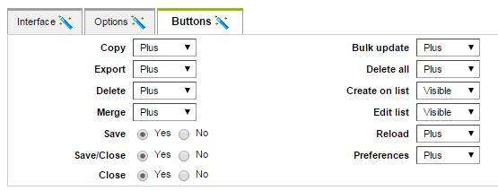
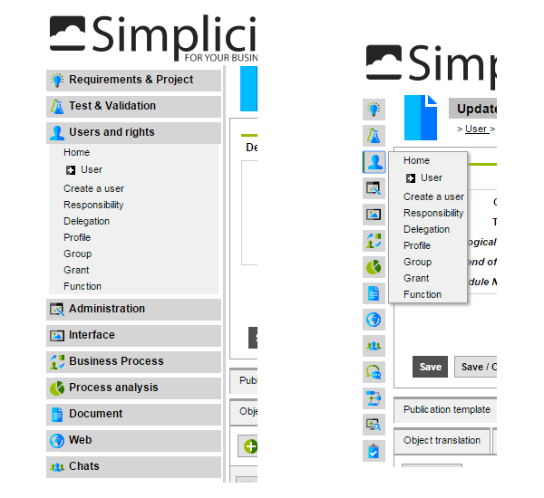
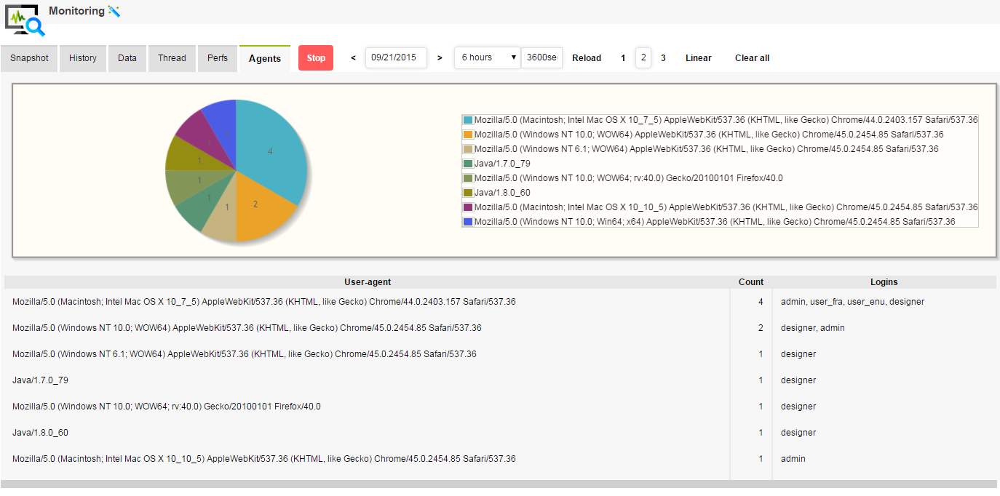

Version 3.2 patchlevel 03 release note
======================================

Changes
-------

### Easy mode

Designer screenflows has been released to support easy mode.
They will bypass some optional steps with default values.

* Object creation
* Field creation
* Link creation
* User creation

> Note: this feature has been back ported to the 3.1 maintenance branch.

### DB sequences for Oracle and PostgreSQL

The native sequences are now used on Oracle and PostgreSQL when the dedicated system parameter is set.
* USE_ORACLE_SEQUENCE = yes
* USE_POSTGRESQL_SEQUENCE = yes

Runtime:
- Each table will have a sequence (<tablename>_seq) to process auto-commited nextval on the row_id (m_rowid table is not used).
- On insert error, the runtime will create/synchronize automatically the sequence. DBAs have nothing to do.

> Note: The older behavior using m_rowid table is still available when parameter = no

### Save | Save/Close | Close

Now Designer can easily disable per object the object buttons:



### Generated actions

Depending on user rights, the common actions are loaded as java `Action` in the user session `GrantWeb`.

When they are granted, designer can use code to change the Action on the fly, for examples:

```javascript
// To move the Preferences button in the "plus" menu
getGrant().getAction("prefs").setPlus(true);
// To hide the Export button on UI
getGrant().getAction("export").setVisible(false);
```

#### List of generated actions

<table>
<tr><th>Action name</th><th>Button "Plus" design</th><th>Description</th></tr>
<tr><td>reload</td><td>UI and code</td><td>Reload the form or the list</td></tr>
<tr><td>prefs</td><td>UI and Code</td><td>Access to the object preferences</td></tr>
<tr><td>delete</td><td>UI and Code</td><td>Delete the current item</td></tr>
<tr><td>copy</td><td>UI and Code</td><td>Copy the current item</td></tr>
<tr><td>export</td><td>UI and Code</td><td>Export the item or the list</td></tr>
<tr><td>exportxml</td><td>Code</td><td>Export as XML</td></tr>
<tr><td>listedit</td><td>UI and Code</td><td>Edit the list</td></tr>
<tr><td>addlist</td><td>UI and Code</td><td>Add item on list</td></tr>
<tr><td>delall</td><td>UI and Code</td><td>Delete selected records</td></tr>
<tr><td>updall</td><td>UI and Code</td><td>Update selected record</td></tr>
<tr><td>merge</td><td>UI and Code</td><td>Merge selected records</td></tr>
<tr><td>associate-[name]</td><td>UI and Code</td><td>Associate items to parent</td></tr>
<tr><td>crosstab_[name]</td><td>UI and Code</td><td>Display the crosstab</td></tr>
<tr><td>print_[name]</td><td>UI and Code</td><td>Use a print template on item</td></tr>
<tr><td>printlist_[name]</td><td>UI and Code</td><td>Use a print template on list</td></tr>
<tr><td>mailing_[name]</td><td>UI and Code</td><td>Use a print template on emails</td></tr>
<tr><td>agenda_[name]</td><td>Code</td><td>Display the agenda</td></tr>
<tr><td>placemap_[name]</td><td>Code</td><td>Display the placemap</td></tr>
<tr><td>graph_[name]</td><td>Code</td><td>Display the chart</td></tr>
<tr><td>tsheet_[name]</td><td>Code</td><td>Display the timesheet</td></tr>
<tr><td>gantt_[name]</td><td>Code</td><td>Display the gantt diagram</td></tr>
</table>

### Modeler Ajax calls

For a better user experience, the modeler calls now asynchronously the server.
The UI doesn't freeze anymore when models are complex.

### Model definition

New properties have been added to the Model definition, they give default values to the model scripted hooks:
- canUseContainer
- canUseGrid
- canUseTree
- canUseNote
- canUseTitle
- canUseBackground

### Minimized menu

When the user minimizes the left menu, only domains icons are displayed and items are accessible thru a popup menu.

Responsive design: menu and extra zones are minimized when the screen width are lesser than 1024px (by default or set with parameter MINIMIZE_SIZE).



### Tree on list

Reflexive object can display lists with a simple tree view. In this version this behavior has been changed:
- by default the Tree on List is disabled to optimize searches
- it can be design in the object definition `Interface` panel
- or scripted thru `setListTree(true/false)` in object hooks

### User-agent metrics

This new metric has been added to the monitoring:

- Pie chart counts users per browser user-agent
- List users including those whose agent could be problematic



### Runtime optimization

- Now the core-cache contains all common definitions (objects, processes, groups, crontab, lists of values...) and is serialized
- On platform start-up all definitions are read directly (unserialized) in 1 second without any SQL
- A full compilation takes around 10 seconds (during a clear cache)
- Less access to the database during objects instantiation
- The script compilation and runtime processes have been improved using java reflection
- The time to display lists with many rules has also been improved (when object is not in debug mode)
- Constraints are now loaded once and compiled in one shared script in the object
- Logon is 2 times faster


