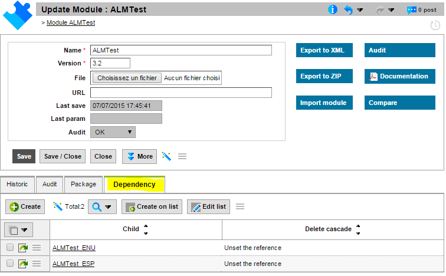
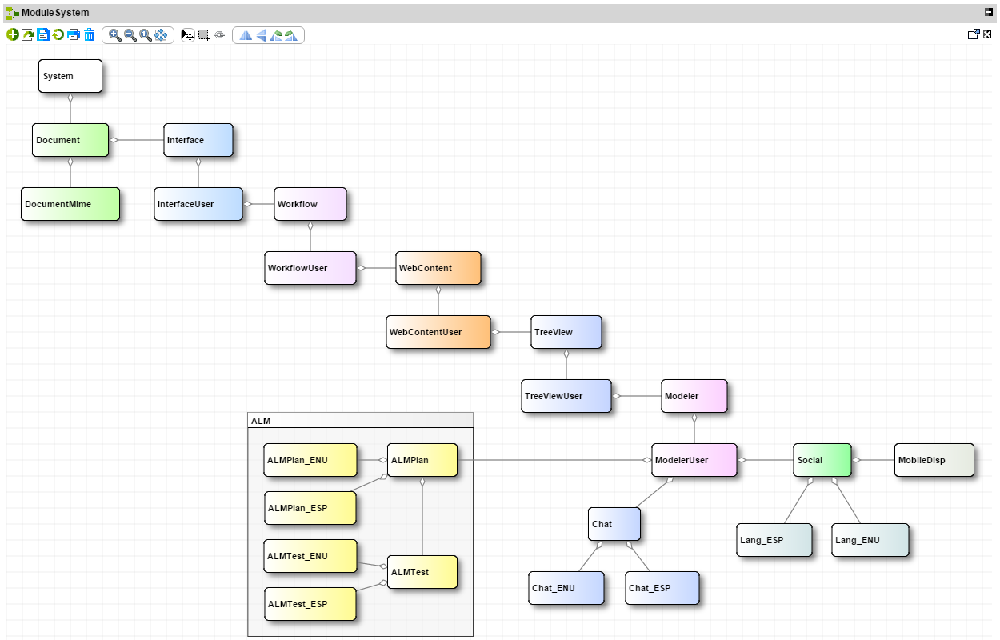
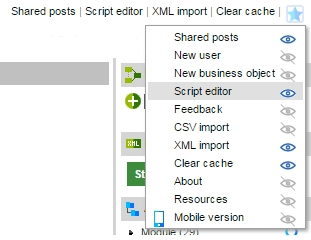
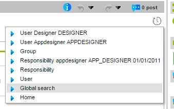
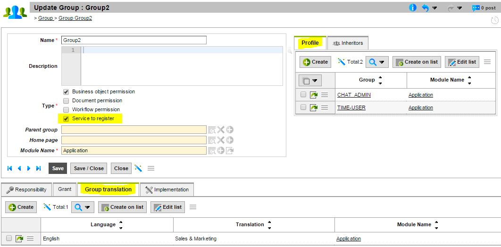
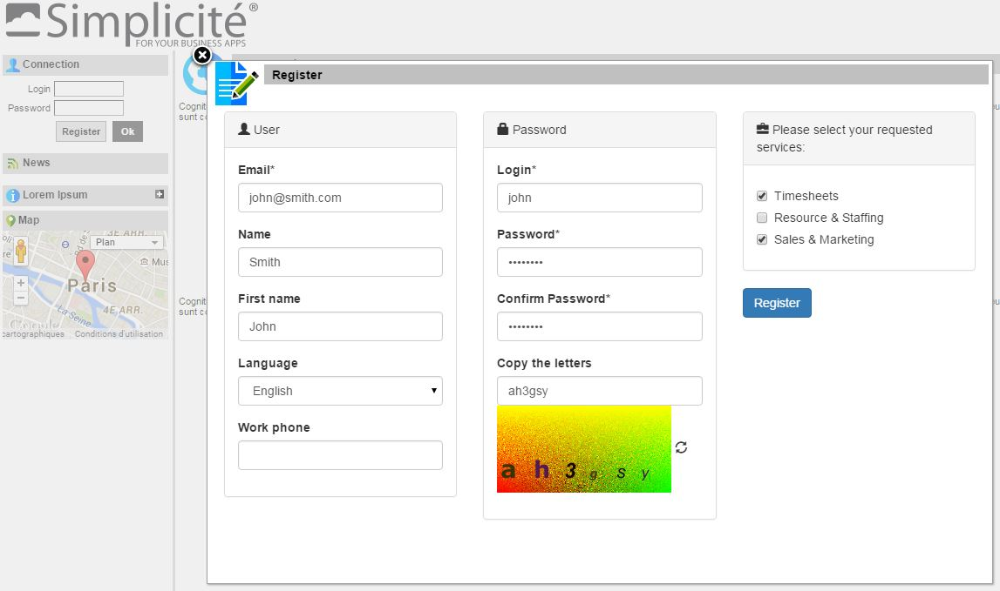
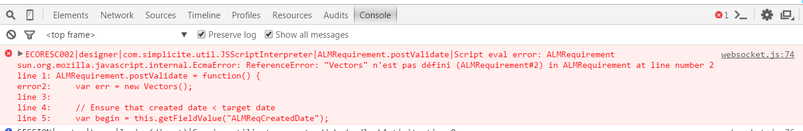
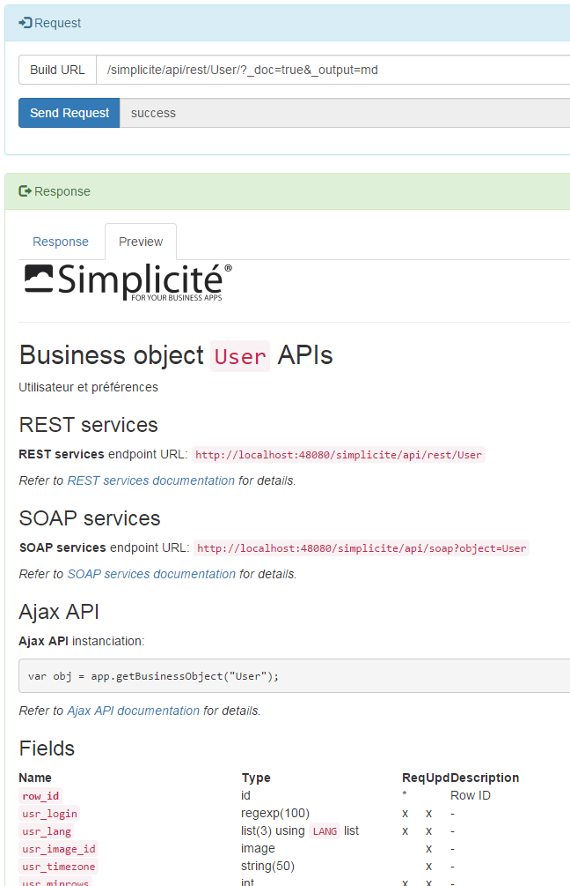

Version 3.2 patchlevel 04 release note
======================================

Changes
-------

### Module definition

#### ModuleLink

The object `ModuleLink` has been added to the project configuration. It explains 2 modules dependency:
- Cascade delete: all children modules are deleted
- Restricted / Impossible if referred: the parent module can't be removed when the child module has references to it
- Null / Unset references: child references to the parent are set to NULL 

For example the ALMTest module has dependencies with the translations modules:

#### Design and controls

- Cycles are detected during the design: now it is impossible to save a definition introducing a cycle of dependences in the business model.
- When modules links are set, it is impossible to reference an object which belongs to a child module.
- The core-system modules are in a read-only mode, a designer with ADMIN responsibility must also have the parameter `ADMIN_SYSTEM=yes` to update the core modules.

#### Modeler

A new Model template `ModelModule` can design the modules dependencies. For instance, the system hierarchy looks like this:

#### Example

Let's have 2 modules
- Module _Customer_ with one object _Client_
- Module _Billing_ with one object _Invoice_ which references the _Client_

If the module link is set to:
- Restricted: the designer will not be able to delete the _Customer_ module
- Cascade: if the designer deletes the _Customer_ module, the _Billing_ will be also deleted
- Null: _Customer_ module can be removed, but the _Invoice_ will loose the reference to the _Client_

And the designer can not add a reference to the _Invoice_ in the _Client_.

### Field operations on list

The field operations (sum, avg, min, max) are now made during the object search (in the getCount method).
So the displayed total on the list bottom is no more restricted to the paginated lines, but calculated with the filters.

### Placeholder

The field translation has been released to set optionally a HTML placeholder.
This placeholder is used by the runtime only on textual fields.

### Shortcuts

- Designer can now set an icon to a shortcut
- Each user can choose its always visible shortcuts (click on the eyes)
- The others are hidden behind a dropdown _star_ button (on top/right)

### History button

The old list has been replaced with a dropdown _clock_ button.

### Group translation and Service to register

* In this release, Groups support translations
* And can be set to a service to register
* This service is often a profile with sub-groups with objects rights

Example:

### User registration

The registration has been release to support the Group translation.

* Logon page displays a "Register" button when the `public` user has services in its responsibilities
* The registration form will create a pending user to be activated, changed or rejected by an administrator
* A simple captcha controls the human access

Example:

* with 3 groups displayed as services
* the user john will be created with 2 responsibilities (the selected groups)

### Script errors - Logger

Debugging scripts is often hard when lots of scripts are loaded.

To help designers, the internal logger can now join the script name and the code part that contains compilation errors (javascript syntax...)
 or runtime faults (null pointer, unknown function...).

If the websocket is open, the error is also displayed in the browser console:

### Vector/Hashtable deprecated

Vector and Hashtable have been replaced by ArrayList and HashMap in the runtime and hooks
And all java method signature have been replaced by List and Map.

It is strongly recommanded to change the application scripts.

Vector and Hashtable implement the same interface as ArrayList and HashMap, so it should work if scripts use them (get, add, put...)
but it will generate runtime errors if they use specific ones (elementAt, insertElementAt...)

### ANT tasks

#### dbdrop

The new target `dbdrop` drops everything in the database.
It is called during a `fulluninstall` on Oracle, MySQL and PostgreSQL.

#### fullupgrade

The new target `fullupgrade` allows to upgrade the platform from any version 3.x.y to the current one.
It works like a `fullinstall` except deletions:
- alter the core DB, import all core modules and system patches
- keep all business data (documents, users and rights, users data...)
- but reinit the designer password to the default one (designer)

Before processing:
- backup the platform
	- stop the server
	- ant saveall (checks the db properties to use your SQL utilities)
	- save the full project directory 
	- save the ear/war archives
- replace all platform libs
- replace the build-core.xml and its properties
- checks the properties (server host/port, database credentials..)
- restart the server

During task:
- for technical reasons logs may contain errors and warnings (ex: column already exists, object unknown...)
- it depends on the current version and they are not fatal errors
- at the end the repository will be properly synchronized

After processing:
- the designer password has to be changed
- custom/business modules have to be re-imported especially if they change the definition of system components

#### upgrade and applysystempatches

The task `applysystempatches` has been reworked to pass automatically new patches.
All patches already passed patches are saved on a new property files `patches.properties`.

So you don't have to worry anymore about which maintenance patches has been passed or not.

When a new minor version is available just launch the `upgrade` ant task. Stop and start your server when asked by the task.

To pass a specific patch twice, remove it from `patches.properties` files (db and conf properties) and launch `applysinglesystempatch`.

### API tester

A new standalone servlet has been created to test the APIs.
- Access thru URL http://\<host>/\<context>/<b>api/tester</b>
- Credentials, method and options are on the left side
- The full URL is automatically build with all parameters
- The response on the right side contains:
	- the response status and call time
	- the full response / header and body

A simple preview can be displayed when content-type is supported:
- JSON in a tree
- HTML in a popup
- Markdown in HTML

_nota: in this version only REST services are implemented in the tester._

### GrantHooks.logout

This new hook is called before a user logout to add specific code/script:
- release specific locks on object
- store specific user's preferences
- specific statistics, etc.

