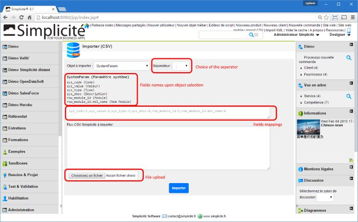

Version 4.0 patchlevel 02 release note
======================================

Changes
-------

### Packaging

- Removed WS webapp
- Removed EJB2 interface type (no more J2EE 1.4 support), direct (webapp) and EJB3 (JEE7) interfaces only
- Removed JBoss and Tomcat 7 packaging
- Added WildFly and Tomcat 9 packaging
- I/O client over HTTP only (no more legacy remote EJB clients)
- Removed BSH lib
- Removed legacy `UpdateJAR` external object
- Removed legacy `ObjectHook` configuration object
- Updated jQuery&reg; and Bootstrap&reg; and removed jQueryUI&reg; and jQueryMobile&reg;
- Updated ACEeditor&reg; and added new system parameter `ACE_KEYBINDINGS` to use alternative key bindings
- Removed system parameters `LOGIN_PAGE` and `LOGOUT_PAGE` used to point to custom login/logout pages
  (useless because of new disposition-level methods introduced in the previous release)
- OAuth2 and SAML authentication now relies on a standard filter (it used to rely on a specific Tomcat valve)
- Dropped all legacy IE6/IE7 compatibility stuff
- Moved listeners to new package `com.simplicite.webapp.listeners`, this should be transparent as platform's listeners are declared using annotations
  (if you still have explicit listener declarations in your `web.xml` you **must** remove them)

### Functional

- Added `displayHome`, `displayPublic`, `displayPublicHome`, `displayLogon` and `displayLogout` to disposition to override home page, public main page, public home page, logon page and logout page when needed
- Improved CSV import (added `MAPPINGS=<field>:<col #>[:date|datetime|time|float|boolean][,(...)]` parameter to add column mapping and basic transformation when needed), upgraded CSV import UI to reflect these changes:  
- Added `PRV` (private) system parameter type filtered for public grant
- Simplified OAuth2 configuration
- Made call to Google+ API non mandatory during Google OAuth2 identification/authentication sequence
- Added business object hook `isMergeMaster` to tell whether a record is the "master" in a multi-record merge
- Substituted new lines in long strings fields for CSV export
- Removed BSH backward compatibility on script execution
- Removed BSH adapter type
- Removed legacy `JBossTools` class and the corresponding legacy `UpdateJAR` external object
- Removed `JQueryMobileWebPage` and `JQueryMobileExternalObject`
- Custom zones/pages inclusions are now made on client side using `jQuery.load`
- Added `org.json` package to default server script includes
- Added optional (and experimental) GIT endpoint for modules on `[/<root>]/git/<module name>`
- Forced `rhino` as server side script engine to avoid ambiguities of default `javascript` engine (which is Rhino in JVM versions 1.6 and 1.7 and NashHorn in JVM versions 1.8+)
- Object _Module_ now inherits from `ScriptedObjectDB` so as it is now possible to add scripted behaviors in (very) particular cases
- Changed default link type to _Restricted_ when using create link wizard

Fixes
-----

- Fixed length and type of `usr_login_read`that was breaking long usernames at password change
- Fixed CSV import with tab separator
- Fixed usage of `EMAIL_DEFAULT_SENDER` system parameter on alerts when `BPMALERT_FROM` is not set
- Fixed Module Diff for object with empty "object" field type
- Fixed Search preference on referenced fields
- Added missing `super` calls on inheritors of `ConfigurationObject`
- A negative value for `RAILWAY` system parameter now means no railway
- HTML Editor (TinyMCE): fixed `hasChange` and save
- Inhibited change password features in case of OAuth2 authentication
- Fixed UI deadlock between extra gadgets and grant hooks
- Fixed UI/Disposition initialization on first user access
- Fixed I/O servlet's alt service names management
- Fixed double format and validation on read-only fields
- Fixed OAuth2 redirects issues when `PUBLIC_PAGE` is `yes`