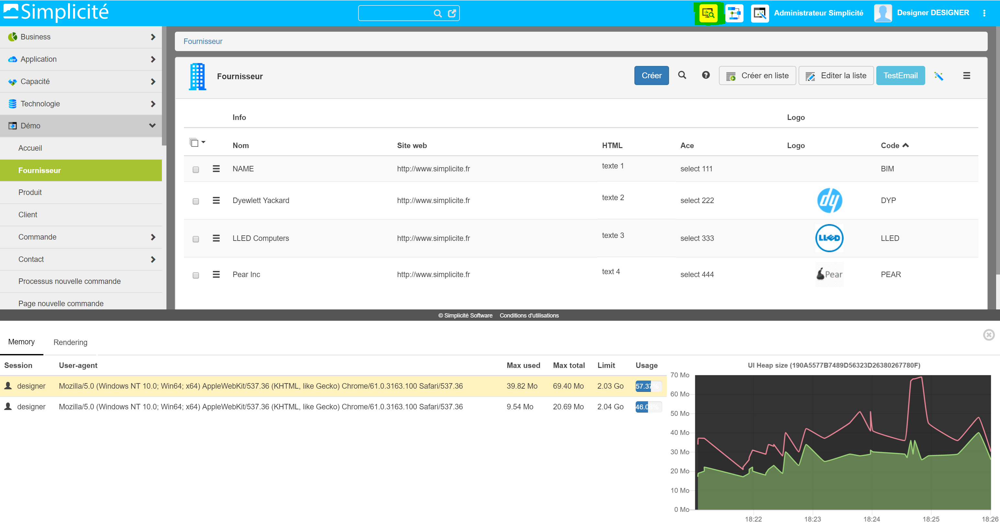

Version 4.0 patchlevel 09 release note
======================================

Core changes
------------

- Experimental: dynamic Java implementations support along with scripted implementations for business objects, business process, external objects, adapters and disposition.
  Note that mixing Java & scripted implementation is not supported, including for inheritance.
  You can import [this module](../../modules/testjava-app-4.0.xml) for testing:
   Business object
   <iframe width="630" height="394" src="https://www.useloom.com/embed/e0cefd05a70e4b14bd75dad196870519" frameborder="0" webkitallowfullscreen mozallowfullscreen allowfullscreen></iframe>
   External object
   <iframe width="630" height="394" src="https://www.useloom.com/embed/ef17cf0a00074f3a9186fc14b6003811" frameborder="0" webkitallowfullscreen mozallowfullscreen allowfullscreen></iframe>
   Remote debugging in a Java IDE (here Eclipse):
   <iframe width="630" height="355" src="https://www.useloom.com/embed/96cfa56b8a0643289178ed90f69ce8a3" frameborder="0" webkitallowfullscreen mozallowfullscreen allowfullscreen></iframe>
- Refactored server-side constraint enforcing for Java-implemented and plain non scripted object
- Optimization: Ajax service `getsysparams` returns now an object (instead an array converted by the front on each session)
- Added the hidden property on Crosstab axis (`cax_hidden` is false by default)

UI changes
----------

- Ace editor (SQL, JS...) and tinyMCE (HTML editor) are available on edit list
- Monitoring of UI memory (heap size): 
	- turn on the system parameter `LOG_UI`
	- launch chrome with precise infos: `chrome.exe --user-data-dir=c:\dev\tmp --enable-precise-memory-info`
	- maximum 20 remote sessions on the last 5 minutes

- Added `grant.accessObject(name)`, `grant.accessCreate(name)`, `grant.accessUpdate(name)` and `grant.accessDelete(name)`: for constraints to show/hide actions, navigation...
- Added a link on each field label (list and form) to open its definition (when user is granted to `Field` design)
- Added short label on list columns
- Object defined as root in treeviews can be added to the main menu to navigate in its hierarchy 
- Allows the creation upon the reference selection (when creation is granted and the "create on link" is set on the FK field)
- New clear-cache page with the 3 actions: clear user cache only, server cache only, or all sessions

Fixes
-----

- Removed confusing naming flexibility for grant hooks shared script naming (`GRANTHOOKS` name is not allowed anymore, it must now be `GrantHooks`).
  Note that the value is forced when saving a shared script with same name but different case.
- Oracle fix: table alias is now limited to 30 characters by default, use `ORACLE_ALIAS_LENGTH` to specify a larger size (version V12c)
- Fixed double call of legacy external objects in responsive UI
- Fix random message "Save before close ?" on object form
- Fix rebuild full index = force a reset before indexation
