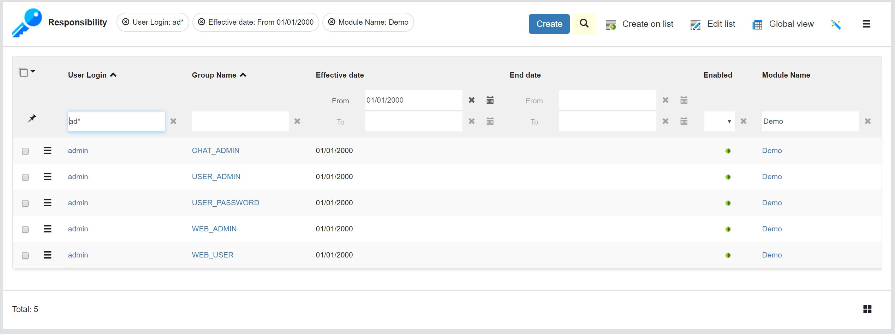
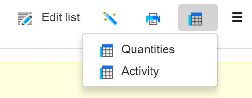

Version 4.0 patchlevel 11 release note
======================================

Core changes
------------

- Added a persistent user token strategy for UI to allow login-less reconnections
- Updated third party server libs (including the Rhino scripting engine lib) & client components to their up-to-date versions
	- Added **Docx4j** libraries
	- Added new **Apache commons** libraries (CSV, email, ...) and other utilities libraries (Guava, ...)
	- Added strikethrough, underline and anchors **Commonmark** extensions libraries
- OpenAPI 3.0.0 publication for module's REST APIs (also used for module as Git repository)
- Added `checkpoint defrag` on HSQLDB database when doing a global clear cache
- Added Google Translation API method to `GoogleAPITool`
- Added business object helper methods `getStatus(row)` and `getFieldValue(name, row)`
- Changed Ace editor system parameters to a single `ACE_OPTIONS` JSON system parameter
- Refactored forced change password at filter level
- Added binding for `row` variable in object expressions and added substitution tag `[DISPLAYVALUE:xxx]`
  to get displayed value instead of plain value (e.g. for enumeration fields)

UI changes
----------

- Show user filters on list when `PANEL_FILTER=yes`

- Errors on hidden fields are now visible on form
- **Undo/Redo** with documents quarantine (stored in recycle bin)
- **Toast** with optional Undo button and push-pin (ex: deletion). Information message are displayed as toast, Warning message are displayed as alert.

- Actions are grouped per type: print, crosstab, treeview, placemap, associate

- Module deletion has been refactored
- Added 3 triggers on document (ui.ready, ui.beforeunload, ui.unload) to customize UI in disposition (resource SCRIPT)
- DataLinkMap implemented on reference selection + bulk association
- Edit list on selected rows (if nothing is selected all rows are edited as previous behavior)

Fixes
-----

- Fixed Ajax Search service with boolean (false) and period (min and max dates)
- Reset password is displayed within an alert instead of a toast
- Fixed splitted zone resizing with opened modeler
- Fixed multiple print buttons on responsive UI
- Fixed `dbd_row_id` and `idx_row_id type`: integer needed with postgreSQL
- Fixed CSV import issue when coming from action button on supervision list
- Fixed potential double entries in grant's object list
- Fixed place map with referenced fields on responsive UI
- Fixed LinkDataMap on legacy UI
- Allowed log events without translated text associated (fixes missing log events issue)
- Clarified error reporting if objet is not granted when using `Grant.get[Tmp|Main|...]Object`
- Fixed enum field loosing current value after saving with error message
- Fixed JSON model creation on responsive UI
