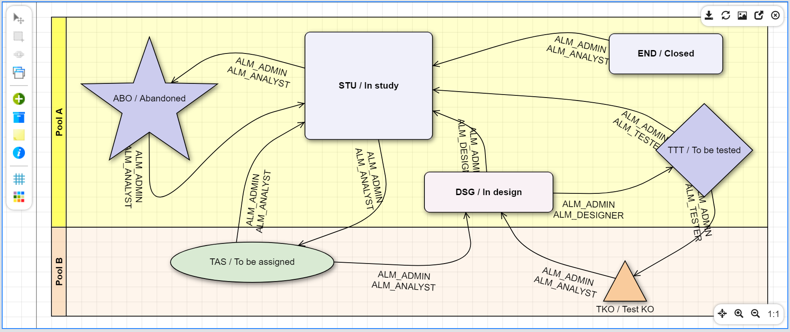

Version 4.0 patchlevel 12 release note
======================================

Core changes
------------

- Improved exceptions on module actions
- Allowed import object in any state (not only initial status)
- CROWD connector loads the multi-valued attributes in `SessionInfo`
- ObjectLoader with stronger field hierarchy and fullinput loading: `input/tag` is no more required in case of complex hierarchies to same leaf fields
- Improved module's treeview
- Added FontAwsome&reg; 5
- Improved indexation for HSQLDB

UI changes
----------

- The modeler has been refactored to display diagram in SVG
	- HTML5/Canvas model will be still supported/maintained but no more features will be added
	- SVG is really more simple and useful to add specific behaviours on templates/DOM elements
	- it supports common DOM events, CSS syntax, faster serialization, parsing thru jQuery...
	- with new functions to create specific shapes or rendering

- Treeview Action (back-end or front URL) and External URL with [EXPR] syntax + Javascriot
- Treeview template with a short preview of tree definition

Fixes
-----

- Fixed default value processing with `[ROWID]` tags on the responsive UI
- Fixed transition metadata when `isActionEnable` returns false
- Displayed translated values on placemaps
- Fixed populate to keep old values in object (do not historize object)
- Fixed multi-select activity to preserve selections thru pagination
