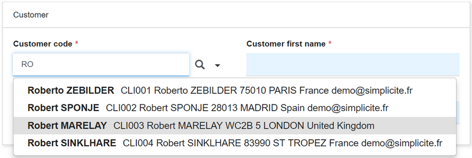

Version 4.0 patchlevel 13 release note
======================================

Core changes
------------

- Crosstab based on fullinput field to determine axis
- Invalidate cycle within object inheritances
- Auto-disable active users when license quota is insufficient
- Improved dynamic external datasource configuration capabilities using system parameter (e.g. added attribute `factory` to choose pool implementation)

UI changes
----------

- Foreign-key field rendering to choose a reference picker:
	- Popup: displays the reference picker in a dialog box, default behavior with column filters
	- Selectbox:
		- displays the field completion with matching records based on a fulltext search
		- limited to indexable object with text input field
		- does not support LinkDataMap filters
		- not available if the referenced field is updatable thru parent object
	- Both pickers

 <iframe width="630" height="394" src="https://www.useloom.com/embed/04e81da28fe74583a45d4bdd2a64237f" frameborder="0" webkitallowfullscreen mozallowfullscreen allowfullscreen></iframe>

- Range search option for numerics with single min/max interval, available for integer, decimal and big-decimal
- Social post: `@login` completion and parsing to send an email to mentioned users in post

- Create a N,N link directly in the object modeler

 <iframe width="630" height="394" src="https://www.useloom.com/embed/c18837dd96584fae82570eaaaa7feba2" frameborder="0" webkitallowfullscreen mozallowfullscreen allowfullscreen></iframe>

Fixes
-----

- Fixed cross site scripting vulnerability on error pages
- Fix Enter key = save on last editable field
- Fix trays view with distinct status
- Fix FK existence checking during save with complex LinkDataMap
