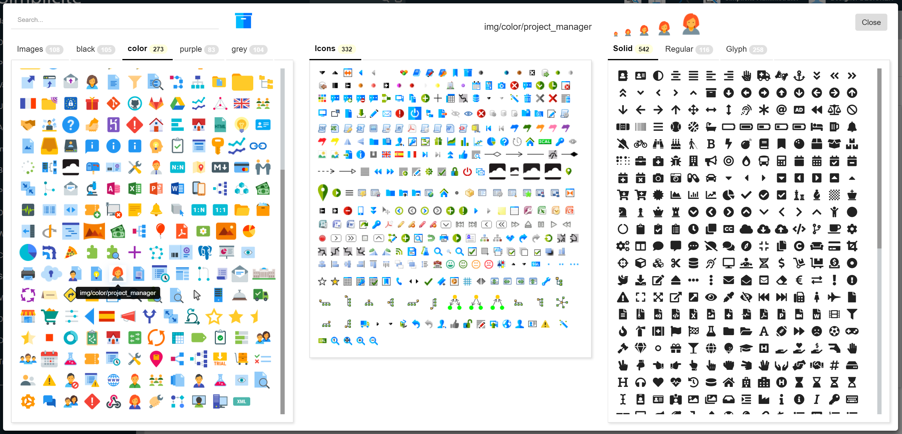
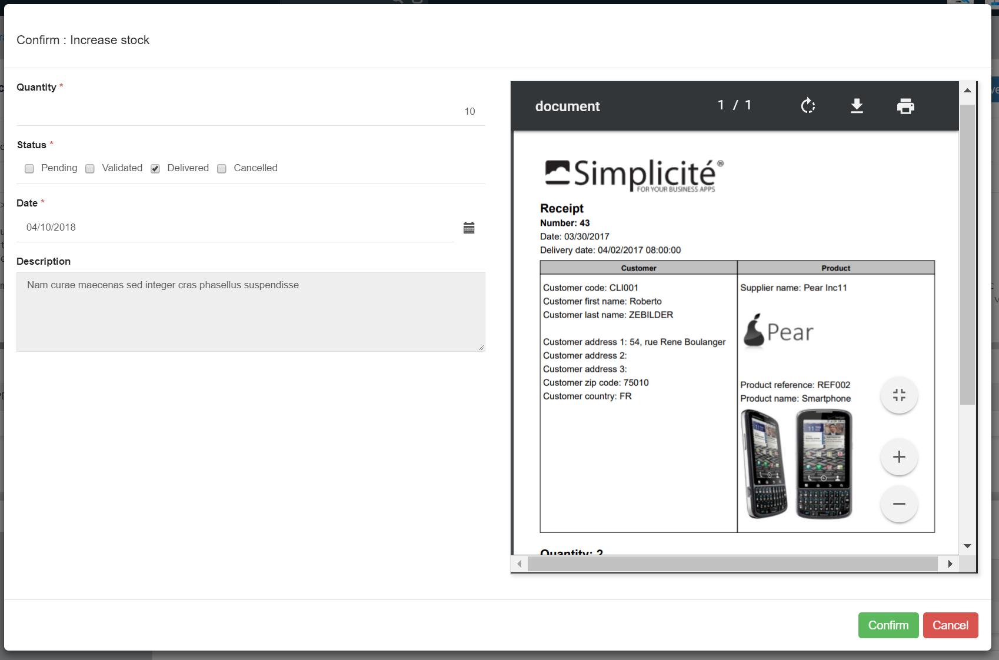

Version 4.0 patchlevel 15 release note
======================================

Core changes
------------

- Upgraded thrid party libs
- Action with parameters sent thru API or confirm dialog on responsive UI
	- Java syntax `public String myMethod(Map<String, String> params) `
	- Rhino script `myObject.myMethod = function(params)` : example 

```javascript
DemoProduct.increaseStock = function(params) {
	var qtty = params ? parseInt(params.get("demoPrdIncStock")) : 20;
	if (!isNaN(qtty)) {
		var s = this.getField("demoPrdStock");
		s.setValue(s.getInt(0) + qtty);
		this.save();
		return Message.formatSimpleInfo("DEMO_PRD_STOCK_INCREASED");
	}
};
```

- Made JUnit lib available in package
- new `DIRECT_URL` parameter to override server URL during `[DIRECTURL]` substitution
- Refactored OAuth2 token storage (now per session) to avoid issues with concurrent sessions

UI changes
----------

- Form template supports inlined preview of document `<div class="field" data-field="myDocPDF" data-display="preview"/>`
- New icon API `view.icon(name, options)` to display more icons, based on name syntax:
	- `fas/<icon>` fontawesome solid
	- `far/<icon>` fontawesome regular
	- `gly/<icon>` glyphicon from bootstrap
	- `img/<set>/<icon>` 50px image from set `color`|`black`|`grey`|`purple`
	- `icon/<icon>` 16px image from icons set of disposition (ICONS)
	- `icon/<set>/<icon>` 16px image from custom icons set of disposition (ICONS_<set>)
	- `<icon>` 48px image from images of disposition
- New icon picker with images, fontawesome and glyphicons for object, domain, view, shortcut, action



- Confirm action with UI template to display text, object fields or specific action fields (sent to backend)



- Confirm transition with fields preview
- Keyboard shortcuts with 2 new shorthands on document:
	- `Alt+X` to open the code editor
	- `Alt+C` to open the clear cache page, with a second `C` it will launch the full-clear cache
- The `responsive` disposition script now uses the `ResponsivePage` class instead of lower level `JQueryWebPage`
- JavaScript documentation with Grant and ObjectField functions

Fixes
-----

- Fixed email from/subject encoding
- Reset selectedIds on status menu
- Import object wizard in template editor
- Fixed filters on select all + update all
- Fixed concatenation method for SQLServer
- Fixed print selected Ids
- Fixed placemaps issues with filters
- Fixed current selected tab after save
- Fixed read-only JSON field on form
- Fixed process clear cache when scripted in Java
- Fixed `prepareDate/Time` in various cases on legacy UI
- Fixed reference picker on mobile

