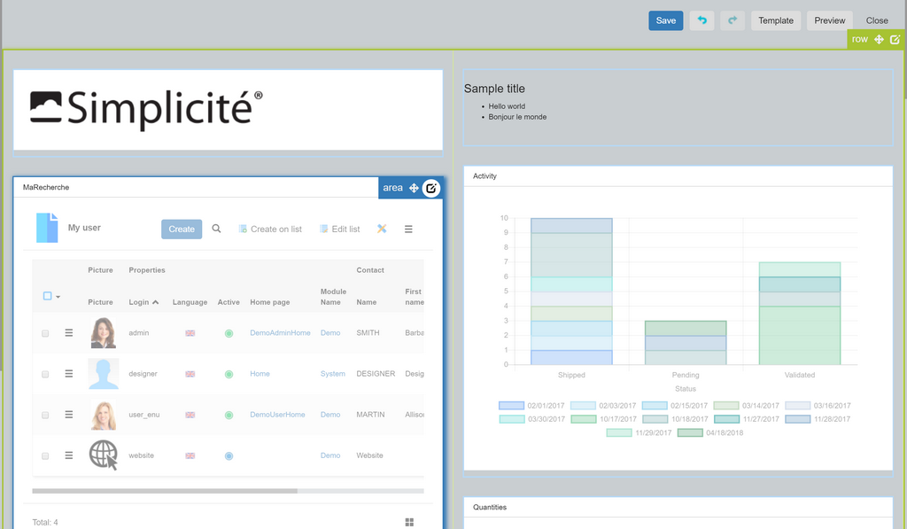
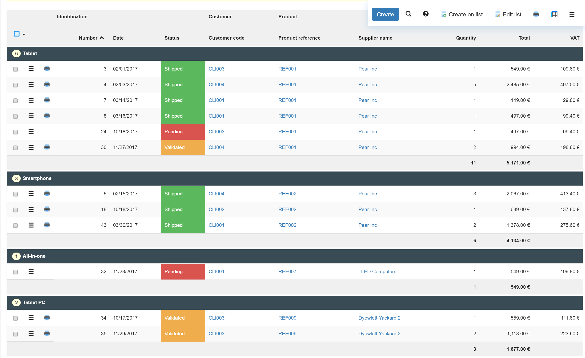

Version 4.0 patchlevel 17 release note
======================================

Core changes
------------

- New and updated third party libs
- Print template in View metadata
- Ajax service `selectRow` with multiple row IDs separated by ";"
- Object service `getCountGroupBy` / `searchGroupBy`
- Fulltext search on objet and document indexes can be inhibited by
  setting `USE_FULLTEXT_INDEXES` system parameter to `no` (default value is `yes`)

UI changes
----------

- New template editor for Views to easily edit:
	- Login / Date / Time
	- Image
	- Translated texts
	- Predefined search with field filters
	- Crosstab with table/charts options
	- External URL
	- Print template

- Take the current user picture with local media (see `User` resource `SCRIPT`)
- Extended menu configuration to display important items and hide occasional/deprecated ones
- Group by fields on list (work in progress)

Fixes
-----

- Module deletion for `APP_DESIGNER`
- Refactored `WebPage.appendLayoutHTML()` to avoid hard-coded labels
- Fixed SVG modeler to remove dead links during the synchronization
- Fixed modeler root to launch workflows properly
