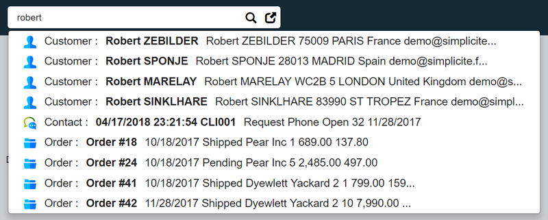

Version 4.0 patchlevel 18 release note
======================================

Core changes
------------

- Updated 3rd party libs (including HSQLDB)
- Added OpenIDConnect external authentication for API endpoint

UI changes
----------

- Top search box with the completion picker

Fixes
-----

- Fixed missing _Next_ button on _Add Link_ screenflow object selection page in some cases
- Fixed external object class compilation from editor
- Fixed issues when switching between home with and without dispositions
- Fixed backward compatibility issues on REST services
- Fixed open object template editor from SVG modeler