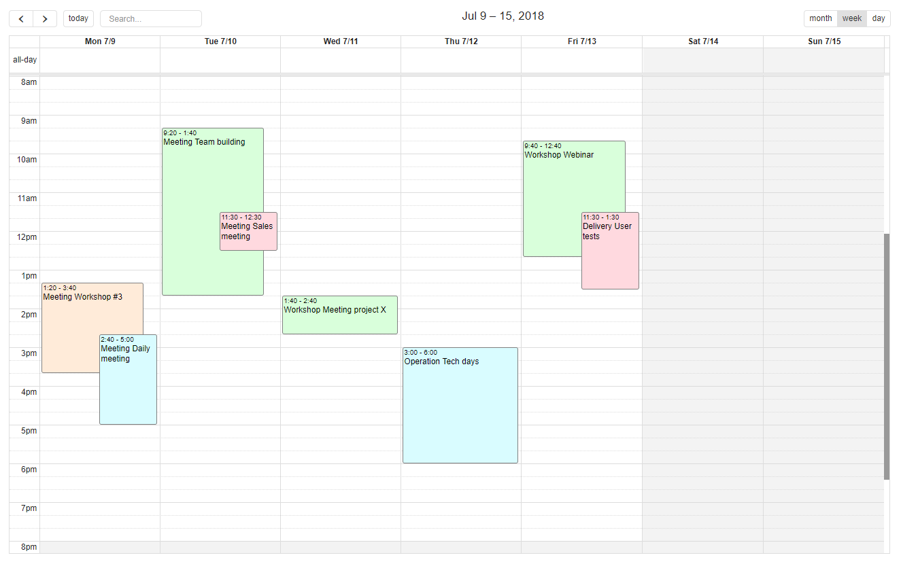

Version 4.0 patchlevel 20 release note
======================================

Core changes
------------

- Updated 3rd party libs
- Refactored `com.simplicite.util.Mail` to simplify use of document/image fields as attachments and/or inlined images
- Improved external objects for both legacy & responsive UI (**note**: this may require changes on your existing external objects
  depending on the way they are configured/implemented)
- **Cached** resources are now also cached on server side
- Agenda metadata
	- Backend hooks are deprecated (getAgendaLabel, getAgendaValue, getAgendaDay, getAgendaWeek and getAgendaSelector)
	- Front hooks can be implemented on Responsive UI in `obj.locals.ui.agenda`
- OpenData service with `refine` parameter = search specification
- CROWD users/groups synchronization

UI changes
----------

- Added HTML content, title, icon and help support for responsive UI external objects
- Configuration of **list actions** to display the selected rows **counter**
- TinyMCE (HTML editor): **paste** Word content as text and images as inlined data (base64 encoded)
- Activity: search form with extended fields + multi-rows selection with fast selectors (all|page|none)
- Import custom set of images in disposition (example resource `IMAGES_PURPLE` in disposition `default`)
- Added define and close buttons on standard (i.e. "decorated") external objects
- LESS is now used by default when creating styles resources and theme styles addons file using the _Edit_ buttons
- CSS and JavaScript resources are now automatically minified
- `engine.loadURL` now displays PDF content in an iframe and force download of other binary types
- Added configurable "save ok" toast (parameter SAVE_TOAST=yes)
- **FullCalendar** as default Agenda rendering 

- New contextual metadata to support init hooks: initAgenda / initCrosstab / initPlaceMap
- Common button UI options are now supported (preference, reload, delete, edit list, copy... to be hidden, visible or in 'plus' button)
- 2 new options on object: Dashboard + Tray to show/hide menu access

Fixes
-----

- Fixed javascript statement and redirect action results not being taken into account on responsive UI
- Fixed workflow search activity
- Fixed default isUndoable on insert/delete
- Fixed non root context path issue on REST webservices
- Fixed Modeler servlet encoding and MIME type
- Fixed meta-object picker
- Fixed current page size in case of partial clear cache
