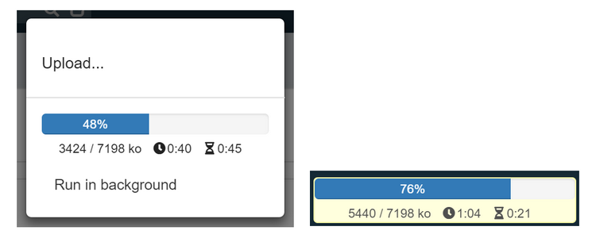

Version 4.0 patchlevel 21 release note
======================================

Core changes
------------

- Updated 3rd party libs
- Added a configurable LDAP-based authentication mechanism (along with OAuth2, SAML, ...) using a new `LDAPTool` helper class
- Added configurable service object for LDAP entries
- Populate the foreign-key during create activity data mapping
- Improved `ExcelPOITool` to be able to choose to generate either legacy `.xls` or `.xlsx` workbooks
- Improved `Tool.readUrl` to automatically set content type header when data is a `JSONObject` or `JSONArray` + improved redirect handling
- Improved & simplified `RESTTool` helper class for REST/JSON calls
- Allowed additional path elements in URI after external object name (e.g. to build custom REST services such as GET `/ui/ext/MyExtObject/123?format=json`)
- Included Stripe Java client lib
- Added GDPR-related classification to the `Field` configuration object
- Change of field name is automatically updated into related UI templates/areas (`data-field` attribute)
- Custom Java library in shared script to allow external tools integration
- Optimization based on refactored `inlineDocuments` parameter:
	- `true` : inline all files and images with contents (large objects)
	- `false` : send documents rowId only (very small but no info)
	- `'images'` : inline full images but other files info only (useful on forms)
	- `'infos'` : inline files and images infos only (no file contents, useful on lists)
	- `'field', ...` : inline all contents of specified fields only
- Optimization based on refactored `inlineThumbnails` parameter:
	- `true` : inline all image thumbnails (large objects)
	- `false` : no thumbnails
	- `'field', ...` : inline thumbnails of specified fields only
- Optimization based on refactored `inlineObjects` parameter:
	- `true` : inline all object fields
	- `false` : get only the field value `objectName:rowId`
- Management of **I forgot my password** on local OAUTH2 login form
	- Logon form asks for the user email
	- The platform sends an email (see alert `UserForgotPassword`) with an unique token (stored in `FORCE_CHANGE_PASSWORD = <key>#<timestamp>`)
	- Landing page to change the password if the token is valid (valid 24h by default or use parameter `FORGOT_PWD_DELAY` in seconds)
	- New parameter `USE_FORGOT_PWD` set to `yes` by default
- Changed object/process/field names validation to prevent using a number in first position (this caused issues in XML exports/imports)
- Stripped HTML fields export in CSV/XLS/PDF
- Added actions in business objects' OpenAPI schemas
- Git export module (with Java code) now produces a Maven `pom.xml` file with dependencies to avoid exporting 3rd party libs
- Removed legacy UI components (e.g. `ObjectList`) from **default** packages imported in Rhino scripts (if you use some of them you should add an explicit
  package import statement `importPackage(Packages.com.simplicite.webapp)` or an individual class import statement (e.g. `importClass(Packages.com.simplicite.webapp.ObjectList`)
- New methods to build direct URL to object list or form `obj.getDirectURL` and static `HTMLTool.getDirectURL`
- New tiny URL to access 
	- object form `?f=object;id` (used in post notification, `[DIRECTURL]` substitution and shared URL)
	- or list `?l=object` with optional filters (URL encoded ex: `?l=User&usr_login=a%25` to search logins starting with "a")

UI changes
----------

- All standard Excel exports moved from legacy `.xls` to `.xlsx` files
- Link translation with plural syntax "label|labels"
- Floating action bar: show custom actions in "plus" button 
- Time picker will use meridian hours (AM/PM) for english language only
- Documents are now supported in bulk update
- Theme font self-loading (Google font)
- New upload dialog when save action is too long (more than 3 seconds), and run task in background to continue working

- New share dialog on social objects, based on parameter `SOCIAL_SHARE` to list available providers (email, linkedin, facebook, twitter...)

- Changed shortkeys of UNDO = `CTRL-SHIFT-Z` and REDO = `CTRL-SHIFT-Y` (to preserve default CTRL-Z/Y behavior on input fields to cancel typing)

Fixes
-----

- Fixed state model objects' tray and dashboard availability conditions
- Fixed list item's actions row ID bindings in responsive UI
- Fixed redundant actions on list items
- Fixed scopes based on declared user responsibilities only
- Fixed broken simple Ajax action result (without metadata)
- Fixed joined field parsing in activity data syntax: `[step.Field.refObjectId__joinedField]`
- Fixed Ace editor full screen when work is expanded
- Fixed expression `[VALUE]` `[OLDVALUE]` substitution by typed value
- Fixed `copy` with a parent object (getParentObject not null)
- Fixed bulk update and export all rows on list with group-by fields
- Fixed double action confirmations and broken execution on legacy UI lists
- Fixed `BusinessObjectTool` return value for search method
- Fixed JSON body and path parsing error is some cases for REST services
- Fixed hour picker for time fields
- Fixed insert an existing field in template editor
- Fixed loading spinner on group-by
- Fixed loosing group-by on sort thru dialog + pagination
- Fixed naming of phone num wrapper class (from `PhoneNumTools` to `PhoneNumTool`)
- Fixed menu with domain in lang ANY
- Fixed access to bulk deletion on UI
- Fixed double message on empty required FK
- Fixed more fields button on list
- Fixed pivot table JSON formats in particular cases
- Fixed links on import SVG models
- Fixed delete area on template editor
- Fixed help popover on date field
- Fixed bad source name mapping in case of cross-domain business object inheritance
- Fixed social posts page for users without picture on legacy UI