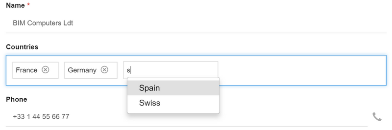

Version 4.0 patchlevel 22 release note
======================================

Core changes
------------

- Updated 3rd party libs
- I/O service is now available on 3 endpoints:
	- The I/O endpoint (`/io`) using I/O authentication
	- The API endpoint (`/api/io`) using API authentication
	- The UI endpoint (`/ui/io`) using UI authentication (the import XML & CSV pages have been refactored to use this)
- Optimizations:
	- To limit memory usage, all interfaces use now end-to-end Java Streams instead of bytes array
	- Some methods with bytes arrays are now deprecated `Adapter`, `Integration`, import Module/XML/ZIP...
	- File uploads are stored in the temporary directory before being placed in the dbdoc
	- New SAX adapter for import XML (partial reading)
	- in BLOB mode: read/write use input/output stream, but some JDBC driver does not support streaming and still use bytes array
	- XHR will post data in multi-parts mode (URL encoding as been abandoned to upload file without any base64 encoding)
	- Keep "memory free" in mind: it is now strongly recommended to refactor your code with streams/buffers reader/writer instead of huge bytes arrays
- **Social post** has now 3 options: display posts on `popup` (default), `inline` on bottom of form, and `share` object to social medias
- Improved Git export to enable Sonarqube&reg; analysis of modules (both Rhino and Java)
- Added Open Street Map tool class and included the [Leaflet](https://leafletjs.com) JavaScript client lib

UI changes
----------

- Refactored import XML, be careful result logs are not displayed by default to limit flow/memory size
- Refactored import CSV with column auto-mapping and new options
- New link rendering for simple N,N relationships as a **pillbox** control. Only basic actions (search, add, remove) are available. 

Example with a list of countries without the full list panel:

Mobile
------

- New tools based on Google Firebase to send notification to mobile devices and browsers
- Build your hybrid application for Androïd&reg; and iOS&reg; [here](/lesson/docs/misc/cordova)

Fixes
-----

- Fixed social posts page for users without picture on legacy UI
- Fixed tricky ZIP & Git export issue on object's Java coded in the context of object inheritance
- Fixed location of endpoint set in code (note that it breaks compatibility on some low level init API on `Grant` that should not be used in custom code)
- Fixed full text search on mySQL/mariaDB
- Fixed remove view from template editor
- Fixed filter expression with parentheses
- Fixed Module export when parent object is outside the module
- Fixed SAX import to ignore non `<simplicite>` flow
- Fixed creation from responsive UI in case of objects with a custom row ID
- Fixed UTF-8 encoding on SVG models
- Fixed navigation after bulk update of foreign-keys
- Fixed close button on edit constraints

Post-release critical fixes
---------------------------

- Fixed a potential stack overflow at startup happening in some particular cases (after loading broken/incomplete configuration modules for instance).
- Fixed missing inline and timestamps options on XML/ZIP object export
- Fixed document JSON structure (missing name)
- Fixed default URL of change password alert
- Fixed patch XML on UI during a module diff
