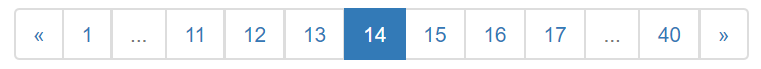
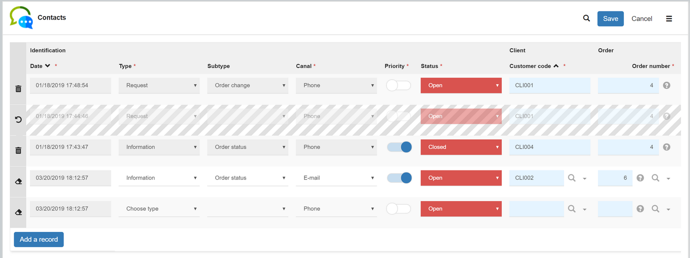
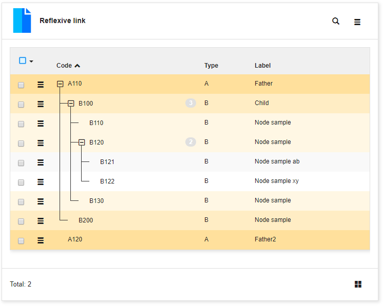

Version 4.0 patchlevel 23 release note
======================================

<h2 id="changes">Core changes</h2>

- Compatibility with JVM versions 11 and 12
- Added optional physical foreign key constraints generation, for those who need them, using the `GENERATE_SQL_CONSTRAINTS`s
  system parameter (defaults to `no`)
- Added support for OAuth2/OpenIDConnect `login_hint` argument used to suggest a login to the identity provider
- Added Apache Maven repository endpoint to expose the Simplicite API jar refered in the `pom.xml` of the modules' Git repository
  (the repository is a Snapshot repository for non released patch levels `PXXb` and a release repository for released patch levels `PXX`)
- Added support for passing the API token as the `_x_simplicite_authorization_` URL parameter when using the HTTP header is not possible
- Added support for legacy Swagger v2 format for REST API publication (previously only OpenAPI v3 was supported)
- Added errors definitions in OpenAPI and Swagger v2 schemas
- Added `RESTServiceExternalObject` subclass of `ExternalObject` dedicated to REST webservices implementation
- Added `PDFDocumentExternalObject` subclass of `ExternalObject` dedicated to PDF documentation implementation
- Added `ExcelDocumentExternalObject` subclass of `ExternalObject` dedicated to Excel&reg; documentation implementation
- Support Java hook compilation with tomcat libs (HttpSession...) not only webapp libs
- Added business object pooling mechanism for the API endpoint for better handling of massive concurrent calls
- Show errors of `LESS` compilation during compilation on screen (not only in logs)
- New object hook `getSocialShareData` to customize share data
- Added post init platform grant hook (`postPlatformInit`)
- Export list to Excel using POI: format float + rendering of currency (euro and dollar)
- `build/dynamic.jar` as been deleted for isolation reasons
- Generate one dynamic JAR per module (containing module classes and sub-classes only) in `build/module-<name>-<version>.jar`
- Added support for multiple authentication methods and multiple identify providers (e.g. 2 Oauth2 providers and 3 SAML providers)
- Added support for `SQL` shared code in editor and GIT export
- XML and CSV export/import use **fullinput** of fields (old syntax with `input tag` is still supported but deprecated)

- `DOC_DIR` can be changed dynamically
	- from `BLOB` to disk (`dbdoc` or absolute path) with documents serialization from m_document to disk
	- from  physical path to `BLOB` with full import into table m_document
	- in case of a path renaming, designer will have to move the dbdoc directory manually

- Added a field help on list column (to explain the field definition), the previous help is used on form (to explain input rules)
- Allows to override the placeholder in object field
- Non-blocking timestamp to allows update even if the timestamp has changed (previous timestamps are still optimistic)
- Actions ordering in object
- Added configurable URI-rewriting mechanism (using the `URI_MAPPING` system parameter)
- Added Syntax validation for System Objects:
	- Activated by setting `SYNTAX` system param to `true` **and** adding a prefix at module level
	- Available for Objects, Functions, Groups, Domains and Actions
- Added a `reOrderObjectFields` method on ObjectInternal for automatic ObjectField organization and ordering 
- Added module action to generate a module documentation Markdown object
- FieldArea icon codes can be evaluated as expressions, for example to refer to the icon of an object `[EXPR:[OBJECT:MyObject].getIconCode()]`
- Added a field property to link the end date field with the start date to check the period validity (example `Responsibility` between `rsp_start_dt` and `rsp_end_dt`)

<h2 id="uichanges">UI changes</h2>

- Refactored code editor for responsive UI with new features:
	- Drag and drop tabs
	- Go to object definition
	- Module/Object/Sources explorer on left side
	- Files compare when source has changed on server side
	- Save all tabs...

- SVG Modeler
	- implements bridges on links
	- remove dead links during a full reloading
	- ensure the context menu to be visible
	- context menu of enum field: list values and copy code to clipboard

- Load `moment.js` on startup (to be used in front constraints)
- Link on group-by functional key to open the reference form
- Allows creation of referenced object during a screenflow (on activity create or update)
- Added lookup on search form to help user to select a referenced object
- Forbidden fields are now supported in template editor
- Floating current page on pagination bar on list:

- **Modules filtering** on repository
	- new button on header for designers to limit modules visibility
	- some objects are not filtered for global reasons (system parameters, users, responsibilities)
	- applies on UI objects only (tmp or batch instances are not filtered)
	- stored in `MODULE_FILTER` for each user

- `HTMLTool.getCrosstabURL(obj, inst, crosstab)` is now wrapped to responsive crosstab
- Column size optimization on edit list (boolean, date... to fit the field length and not large 200px by default)
- Navigation to related object on N,N link with **pillbox** rendering
- Workflow supports now filtering on joined fields in search activity
- **Keep alive** the session on form, edit list and editor (to avoid server-side inactivity and logout during update)

- Added 2 renderings on Integer and Float:
	- `Number` : no spacing, ex '2019'
	- `Monetary` : same as default display with thousands separator, ex '1,234,567.89' (english) or '1 234 567,89' (french)

- Refresh badge counter on tab when user make searches
- Added trigger `ui.loaded` to customize UI when engine is loaded but before the home page rendering
- New field translation template
- Optimistic timestamp: propose to user to discard or override changes in case of `ERR_UPDATED` message
- 3 view modes of internal object are now supported as ui.showViews parameter:
	- `vertical` tabs (default)
	- `horizontal` tabs
	- extended panels = `split`
	- `collapsed` and `accordion` are not supported
- Template editor allows to add a joined field of referenced object
- Hack to ensure datetime and enum picker visible on edit list
- No sub-menu when domain contains only one item (home page, workflow, internal or external object)
- `USE_SEARCH_INDEX=no` is now supported to remove the search-box on header
- `LOADING_PAGE`: customizable HTML resource for the `responsive` disposition

- New edit mode on list with all CRUD features:
	- Append multiple new records
	- Update the selected rows
	- Delete records if granted
	- Save globally the changes

- **TreeView** supports now reflexive links
- New tree rendering on child list when object has a reflexive link

<h2 id="fixes">Fixes</h2>

- Fixed JSON content case in publication webservices (a JSON was encoded as a JSON string which was less convenient, now it is added as plain JSON)
- Fixed pivot table & treeviews in OpenAPI schemas
- Fixed filter `not in` and `not like` on field
- Fixed menu in case of inheritance of states model
- Fixed SAX parser with chunks concatenation
- Fixed diff module with XML file and patch generation
- Fixed createLink on copy
- Fixed names of module publications
- Fixed user-key unicity in case of warning during preValidate
- Fixed copy of object in a state with read-only fields
- Fixed sub-classes have been added to JAR modules
- Fixed group-by count on PostgreSQL
- Fixed postgreSQL checkColumn and checkTable when `DIRECT_TRANSACTION=yes`
- Fixed SVG image data URI on chrome (72.0.3626.81) and firefox (64.0.2)
- Fixed show badge filter of hidden field on list
- Fixed show field on reference picker when only visible on list  
- Fixed populate the file name on document
- Fixed reset selected ids on panel when parent object has changed
- Fixed indexsearch with context to call initRefSelect
- Fixed a potential stack overflow at startup happening in some particular cases (after loading broken/incomplete configuration modules for instance).
- Fixed missing inline and timestamps options on XML/ZIP object export
- Fixed document JSON structure (missing name)
- Fixed parent object during creation on list
- Fixed default URL of change password alert
- Fixed stackoverflow when linking list to itself
- Fixed patch XML on UI during a module diff

<h2 id="postrelease">Post-release fixes</h2>

- Added authentication provider visibility on provider choice page (using `"visible": <true|false>` in `AUTH_PROVIDERS` entries)
- Passed actual grant to `validatePassword`grant hook (when possible)
- `initRefSelect` is now called on the `pillbox` rendering
- Added Simplicité Java doc dependency to module's Maven repository
- Fixed linked list inheritance
- Fixed error 500 when rejecting externally authenticated user (OAuth2/SAML/...) if sync is not set
- Fixed some XSS vulnerabilities on responsive UI
- Fixed issue with dynamic JAR folder in case of shared JAR
- Fixed issue on POI Excel publications
- Fixed Java documentation page
- Fixed scope and deeplink preservation with SAML authentication
- Forced webapp deployment failure in case of any **fatal initialisation error**. This means that, for instance,
  if the database is not accessible at startup, the webapp will not be deployed anymore.
- Fixed CSS/JS resources after extra CSS/JS in external object metadata
- Fixed legacy UI regression on _Cancel_ buttons
- Fixed issue on one of `ZIPTool.build` method
- Backported debug setting for Simplicité service objects
- Fixed exception when no attributes are provided by SAML IdP
- Improved robustness on code editor in some unusual cases
- Fixed missing dispositions in code editor
- Fixed default print template styles
- Backported new system parameter `PUBLIC_SESSION_TIMEOUT` to adjust public session' timeout (defaults to 5 min) 
- Fixed XSS vulnerabilities on event attributes in `HTMLTool.toSafeHTML`
- Preserved line breaks and tabulations in OpenAPI/swagger descriptions

