Version 4.0 patchlevel 24 release note
======================================

<h2 id="jvm">JVM</h2>

As of this patchlevel 24 the platform is compiled with the current OpenJDK version 11 (forced in version 1.8 compatibility mode).
This is required because some of the dependencies are no longer compiled with a (Open)JDK 1.8 (e.g. Docx4J).

This means the **minimal** required JVM to run the platform is a JVM 11.

However an up-to-date JVM is always the **preferable** option.

A **fatal** exception is now thrown if you use a unsupported JVM (< 8), preventing the webapp to start.
And a **warning** message is logged if you use a non tested JVM (>= 8 and <= 11).

> **Note**: All our Docker images are now shipped with the **OpenJDK version 14+** JVM.


Light variant
-------------

A "light" variant of the platform is now provided excluding some third party libraries:

- Docx4J
- Tika
- JClouds
- Google API libraries

This "light" variant is, **for now**, still JVM version 1.8 compatible as it excludes the dependencies that are no longer JVM version 1.8 compatible.

However it is not recommended to keep using a JVM 1.8, even with this "light" variant because some other dependencies
that will certainly be upgraded in the future may not remain JVM 1.8 compatible.

<h2 id="jquery">jQuery</h2>

The jQuery&reg; version is now a version **3.4.1** (it used to be a version 2.2.4 till previous patch level).

Depending on how you have written your **custom** client-side code, there might be some changes required due to some
deprecation removals in jQuery 3, see [the jQuery 3 Upgrade Guide](https://jquery.com/upgrade-guide/3.0/) for details.

<h2 id="fullcalendar">FullCalendar</h2>

Both versions V3 and V4 are included in the platform:
- Use the parameter `FULLCALENDAR_VERSION` to set the version to use (3 or 4),
- For backward compatibility the parameter is set to 3 by default,
- See https://fullcalendar.io/docs/upgrading-from-v3 to upgrade your specific usage before migrating to FullCalendar v4.
- Set optionally the parameter `FULLCALENDAR_LIBS` for additional plugins

<h2 id="compatbreakingchanges">Compatibility breaking changes</h2>

> The following changes need your attention, and **may** require some refactoring of your custom code.

- Removed old legacy JSPs pages. Make sure to refactor **all** hard-coded URL involving these old JSP pages in your code and/or your configuration.
  (note that you should avoid any hard-coded URLs anyway).
- Refactored throws clauses. For code quality reasons the too generic `throws Exception` clauses of some Simplicit&eacute; public APIs have been
  replaced by throws clauses using sub classes of `Exception` (e.g.`PlatformException` or `IOException`).
  In some particular cases Java compiler may complain about unconsistent throws clauses on your overriden methods.

<h2 id="changes">Core changes</h2>

- Modular packaging, the templates are now available as "light" (without Docx4j, Tika, Google APIs clients, JCoulds, ...)
- Upgraded thrid party libs (including on major components: Rhino, HSQLDB, Apache POI, Docx4J, ...)
- Added authentication provider visibility on provider choice page (using `"visible": <true|false>` in `AUTH_PROVIDERS` entries)
- Improved Maven repository to add Simplicit&eacute; Java doc dependency to commited Java modules
- Linked lists inheritance
- New sessions history in operation menu
	- to persist per user the dates/duration of sessions and the user's rights
	- to replace the previous logs `SESSION` and the object `AppLoggerLogon`
	- the last session date is now stored in m_user (to search for inactive user for a long time)
	- see system parameter `LOG_SESSION`

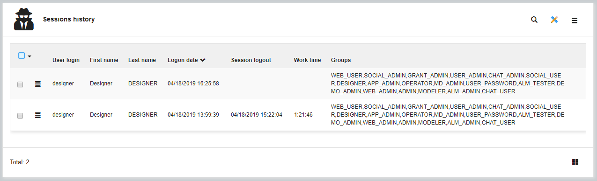

- `History` property has been changed to trace updates:
	- in object mirror table
	- thru object's social posts
	- in the new redolog storage (m_redolog and/or log4j)
- New RedoLog storage:
	- trace object actions within the sessions
	- limited to objects having the history property
	- see system parameter `LOG_ACTIVITY`

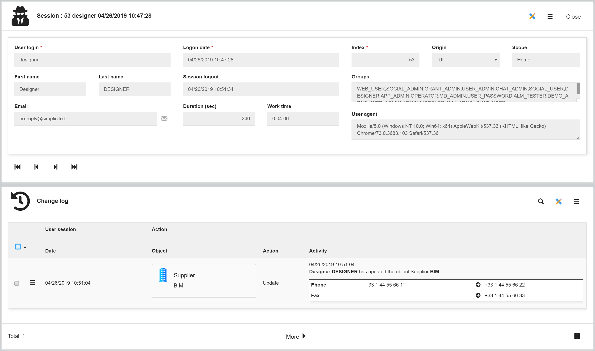

- Added unit properties on the crosstab axis:
	- Scale factor: to multiply/divide the axis values (ex: convert seconds to hours, ko to Mo...)
	- Unit function: round, scale, divide, sqrt, log10... to change the axis main scale
	- Unit label to be display on chart when scale has changed
- Allows to search document by file name and to display document name on list
- Added many system object icons
- Added attribute names autofill on template editor
- Added `[OBJECTICON:]` expression for field areas icon fields
- Added *Reorder fields* action on objects to trigger automatic reordering
- Added indexation of inherited fields belonging to indexable object
- `getParentObjectRefField` is now valued in `CONTEXT_REFSELECT`, `CONTEXT_DATAMAP` and `CONTEXT_ASSOCIATE`
- Added inheritance of datamaps
- User's preferences:
	- Added the date format to override the default format determined by the user's language
	- Added the timezone to translate all the datetimes on UI
	- Added the date format `DD.MM.YYYY` for our Swiss friends

- Support URI syntax for scope access. Ex: `/ui/scope/MyHome` is the same as `/ui?scope=MyHome` 
- Generate a front hook skeleton where creating the `SCRIPT` resource of business object

- Field with sort specification:
	- None: no ordering access on UI (new!)
	- Code: sort based on the DB value (default)
	- Value: sort by label of enum codes (in user language)
	- Order: sort by order of enum codes

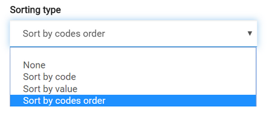

- Added support for Gradle&reg; along with Apache Maven&reg; for Java modules (so far only Apache Maven&reg; was supported)
- Added sub-domains with order into menu

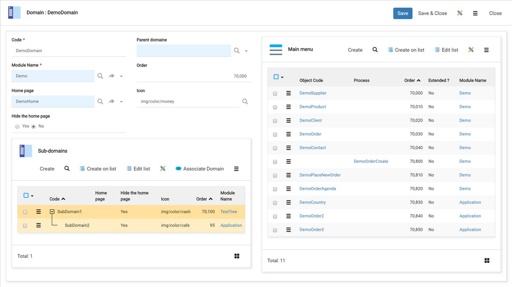

- New currency: Swiss franc `CHF` rendering and export to Excel
- Composite functional key of Internal Object with nullable field is now supported
- Short text have been increased to support 4000 characters (previously 255 due to limitation on old MySQL engine)
- Google Drive permissions with configurable notifications by email
- Export module's data action now exports a data set
- Module exports now include datasets
- Standard JSON and YAML formats exports and imports (along with standard XML format)

- Action with URL as `javascript` allows to access contextual `app`, `obj` and `grant` in scope. Example : 

```javascript
javascript:debugger; alert("param=" + app.sysparams.MY_PARAM + " value=" + obj.getFieldValue("myObjectField") + " login=" + grant.login)`
```

- Added **experimental** Trello&reg; API toolbox `TrelloTool` ("experimental" means it is likely to change in future versions)
- Added **experimental** Slack&reg; API toolbox `SlackTool` ("experimental" means it is likely to change in future versions)

<h2 id="uichanges">UI changes</h2>

- **UserFilters** allows global filtering per user to work with limited data on UI:
	- Available filters:
		- fixed value in search and creation for fields
		- fixed object reference in search and creation
		- working dates: period filtering for objects having a date range (one end-date linked to a start-date field)
	- Active/Visible filters depends on user's current scope
	- Filters are updatable or not: forced by administrator or public to users
	- Filters can be required
	- `UserFilters` is a business object to be completed by designer: 
		- to add fields and object references with object field rules (updatable, visible...)
		- customize the UI template
		- add specific actions to apply predefined filters (e.g. "next week")
		- granted to groups as usual
	- Accessors `getGrant().getUserFilters()`

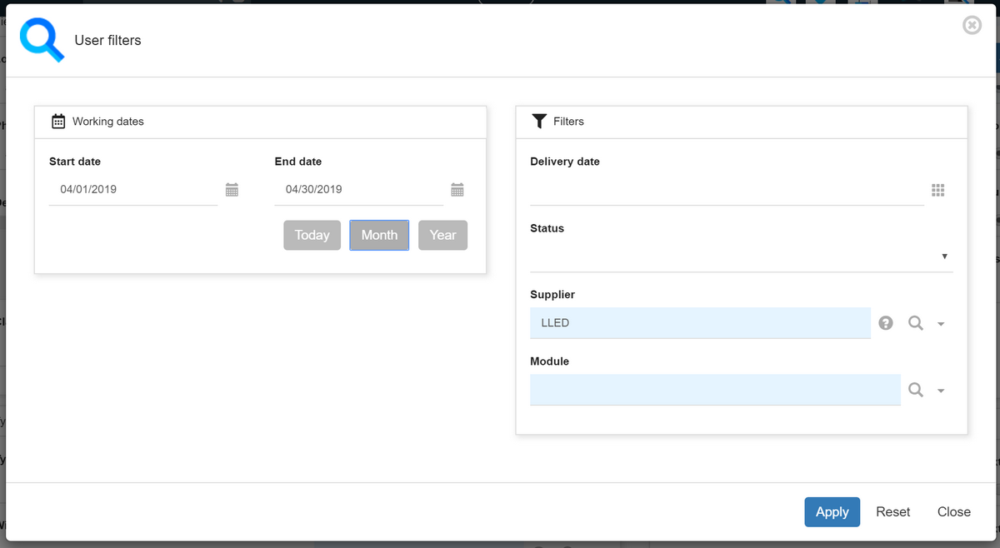

- New **date grouping** on crosstab
	- Group values per date range: year, semester, 4-months, quarter, month, week, day, hour
	- Applied only to date and datetime fields

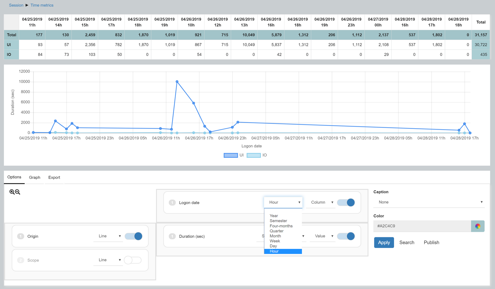

- New sessions metrics:
	- Working duration per user and scope
	- Working duration per date and scope

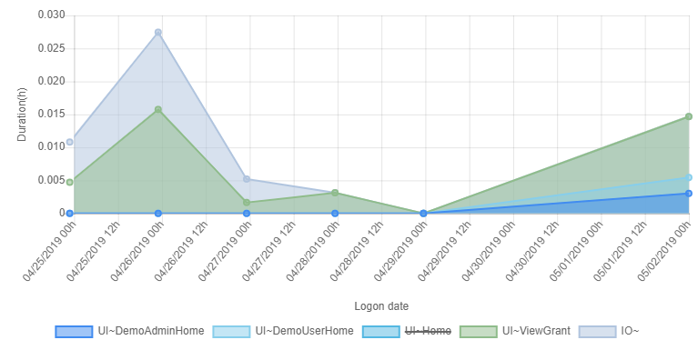

- Object list can display the document names instead of simple doc icons (see the new rendering on document field)
- `initRefSelect` is now called on the `pillbox` rendering
- New modal dialog when the service is lost (i.e. no internet, server is down...) instead of old strange alert `HTTP 0`:

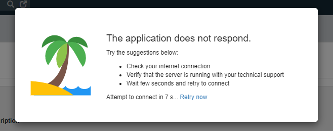

- User's menu preferences have been implemented on responsive UI (see the Interface panel on the User form):
	- Menu visible (`usr_menu`): false to remove the left menu
	- Menu collapsed by default (`usr_menu_defcollapsed`): true to minimize the menu on left side
	- Default opened domain (`usr_menu_defdomain_id`): to define the default opened accordion menu on startup
	- Menu hidden by default (`usr_menu_defhidden`) is deprecated and removed from UI

- Docked **TreeView** new features:
	- Actions: close, reload, collapse and expand tree
	- Show/hide the list levels with counters
	- Item rendering with new object hooks `getStyleTree` and `getImageTree`
	- and the hook `getUserKeyLabel` can return rich HTML content
	- Persistent history to access to previous opened trees, stored in user's parameter `TREEVIEW_PREFS`

- Virtual links are supported in trees:
	- used as reflexive object displayed in a table
	- used in a treeview hierarchy

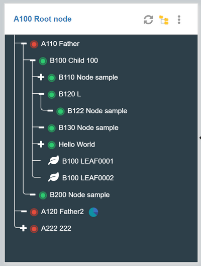

- Action with confirmation field: default value is now supported
- Optimization of navigator cache:
	- about 100ko transferred when loading the UI (excluding the home page, mainly to get the user's rights and preferences)
	- against the previous 1.6Mo which will be cached once (after each platform or module revision or `CACHE_MAXAGE` value)
	- `CACHE_MAXAGE` has been changed to 15 days by default for static resources

- `Direct access to list` has been refactored to `Search mode` to set the default search positioning:
	- Hidden: search form is hidden by default (use the search button)
	- Column: filters are displayed on each searchable columns
	- Docked: search form is docked on the left-side of list
	- Dialog: search is opened in a popup on the right-side of screen

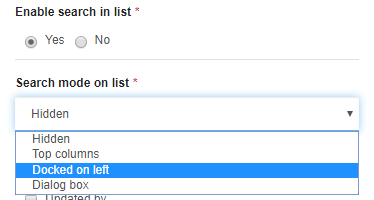

- Refactored register page
- Refactored modules's Git repository management page
- Added a date/time rendering to work with simplified date on UI (ex: month or year) or time (ex: without seconds)
- `USE_DOC_PREVIEW=no` is now available to hide the document preview (direct download on list)
- Add the counter badge when a child list is moved into a form tab
- New functions to customize the user filters rendering:
	- `$ui.view.prefs.userFiltersTitle`: to override the full header bar
	- `$ui.view.prefs.userFiltersBadge`: to override each badge rendering
- New function `$ui.detachURL(ctn,url,options)`
	- to open a new window with the UI engine 
	- with or without main parts (menu, header...)
	- to detach URL (external object...) of the main page 
	- useful on multi-screens desktop

- New minified menu features:
	- toggle button in header and object icons
	- preserve opened sub-menus and vertical scroll
	- old toggle button (at bottom) has been removed to support hover resizing

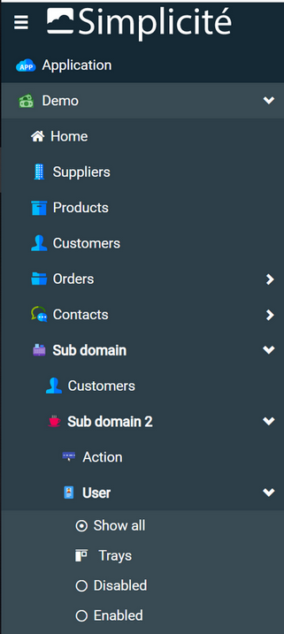

- Confirm dialog on `Action`
	- new hook `initAction` to prepare action fields before rendering
	- dialog `width` based on template size of top div
	
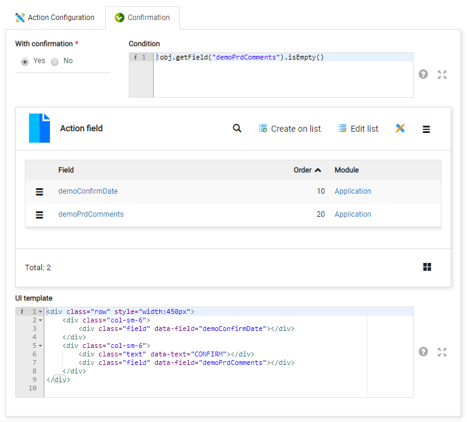

- Search dialog:
	- Group fields by areas
	- New search helper on text/numeric fields:
		- simple rules: `starts with`, `contains`, `lower or equals than`...
		- join rules with `and` `or`

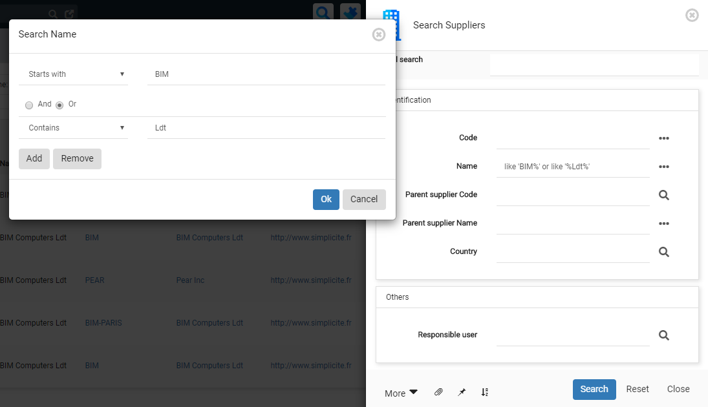

- Search object references:
	- by values: allows to search on any referenced fields (user-key, wildcard, partial key...)
	- by Id (new): search only one reference with the target icon (join by row_id)

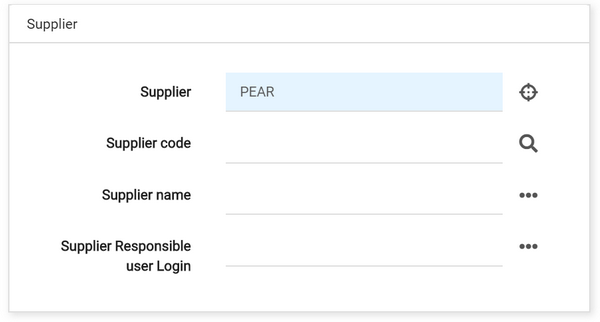


- New global template of list rendering:
	- To show the count of records and the current page number in both title and footer
	- To allow new placement of default footer buttons, navbar...
	- See `Simplicite.UI.Globals.list.template` [here](https:/lesson/docs/ui/responsive).


- Template editor of inherited object:
	- Preserve parent areas (border beige): no change allowed in inherited templates
	- Inherited fields (dashed border) can be moved into child areas

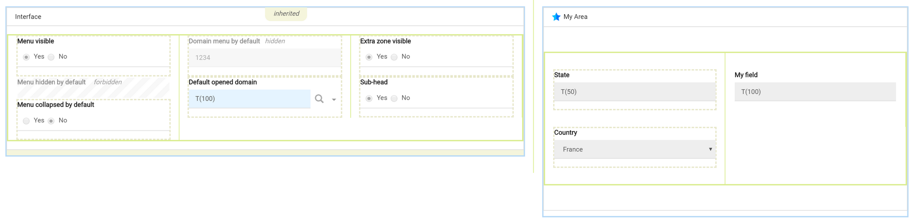

- Template editor allows to hide areas (add `hidden` class to div)
- New `GRID` rendering for long-text field: displays a json 2D array into editable table
- Colors and icons on list of values:
	- to replace the field style on each enum code
	- colored labels and/or icons are used , list, form, trays
	- `<select>` are rendered with `select2` control (see https://select2.org)
	- Coming soon: pivot table chart, transition buttons...

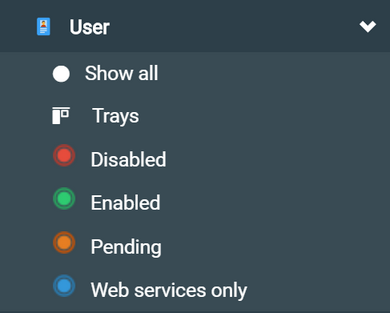

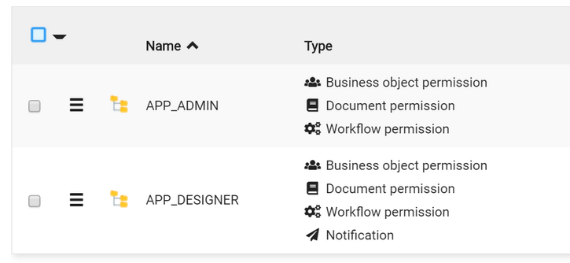

- Preview the treeview hierarchy on main form:

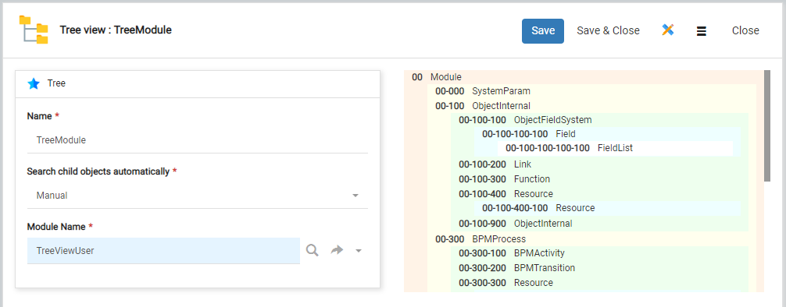

- Notification with hidden target object (Desktop/Androïd/iOS)
	- Send thru custom data of FCM message (ex: You have to sign a new order!) 
	- Open the desired object on ok/tap (ex: the order form)
	- `$ui.onMessageReceived(msg)` can be overrided for specific behaviors
	- Send form has been released to select any accessible object by the Social user

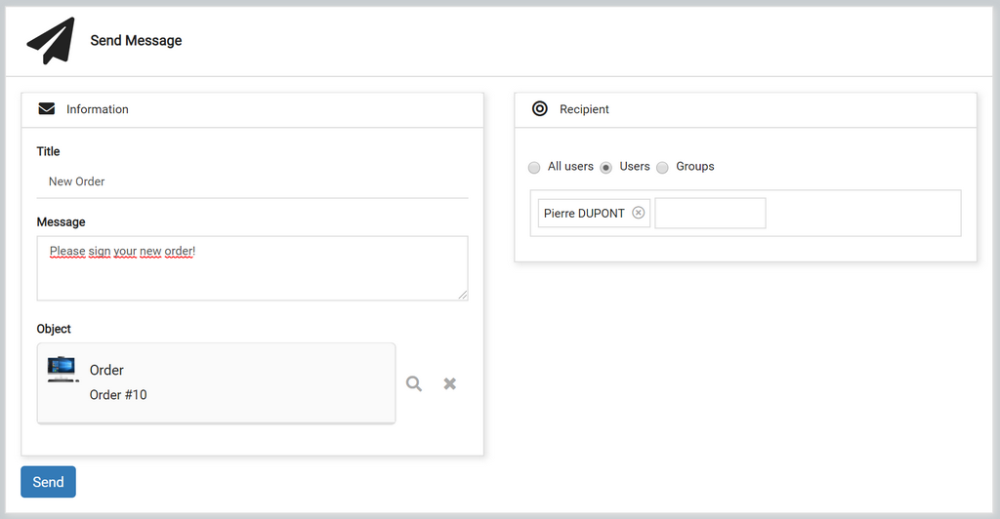

- N,N Links rendered as Pillbox with positive order are inserted on list and are editable:


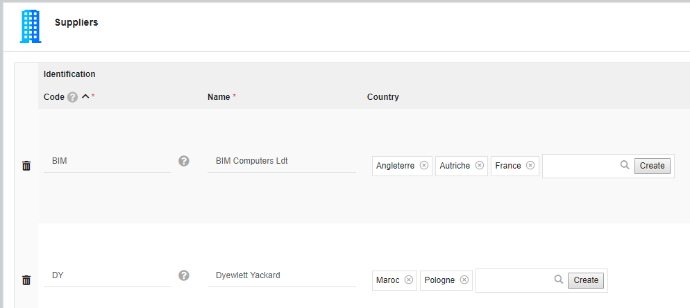

- backported: 
	- clickable error message to show and focus the field
	- XSS security: new jQuery selector `:safeAttr` to clean element attributes


<h2 id="fixes">Fixes</h2>

- Fixed modeler with module filtering
- Passed actual grant to `validatePassword` grant hook (when possible)
- Adapted module creation process and link creation to module visibility and syntax validation
- Fixed patch XML on UI during a module diff
- Fixed error 500 when rejecting externally authenticated user (OAuth2/SAML/...) if sync is not set
- Fixed reset parent context in some particular cases
- Fixed some XSS vulnerabilities on responsive UI
- Fixed datamap name passed to `initDataMapSelect`
- Fixed issue with dynamic JAR folder in case of shared JAR
- Fixed chartJS ticks labels on ENUM x-axis
- Fixed populate references in the search form
- Fixed front constraint when a field is required
- Fixed populate reference in the search form on read-only field
- Fixed test data on enum multiple with less than 3 values
- Fixed issue on POI Excel publications
- Fixed Java documentation page
- Fixed big decimal rounding on UI
- Fixed scope and deeplink preservation with SAML authentication
- Forced webapp deployment failure in case of any **fatal initialisation error**. This means that, for instance,
  if the database is not accessible at startup, the webapp will not be deployed anymore.
- Fixed plus icon on closed sub-tree of treeview
- Fixed parent object context during a populate on UI
- Fixed CSS/JS resources after extra CSS/JS in external object metadata
- Optimized icon selector
- Fixed legacy UI regression on _Cancel_ buttons
- Fixed issue on one of `ZIPTool.build` method
- Backported debug setting for Simplicité service objects
- Fixed exception when no attributes are provided by SAML IdP
- Improved robustness on code editor in some unusual cases
- Backported new `preAuth/postAuth` grant hooks
- Fixed missing dispositions in code editor
- Fixed issues on multiple subsequent usages of modules's Git repo management page
- Fixed default print template styles
- Backported salted internal passwords
- Backported new system parameter `PUBLIC_SESSION_TIMEOUT` to adjust public session' timeout (defaults to 5 min)
- Fixed XSS vulnerabilities on event attributes in `HTMLTool.toSafeHTML`
- Fixed XSS vulnerabilities on list using minified objects
- Preserved line breaks and tabulations in OpenAPI/swagger descriptions

<h2 id="post-release">Backported since release 2020</h2>

- Trello&reg; and Slack&reg; API toolbox
- If a module's URL is a GitHub or GitLab repo URL, the setting is interpreted as a Git setting
- Fixed UI hasChanged on integer + forbidden
- Fixed UI discard or override on ERR_UPDATED
- New UI id of selectObject + selectReference 
- Fixed Search on screen flow
- Fixed target object redirection in treeview
- Fixed navigation after saving bulk associations
- Hidden pagination bar on UI when object has no pagination or useLimit(false)
- Fixed UserFilters default save inhibition
- Fixed associate when all records are selected
- Help access on ImportCSV and ImportXML
- Grouped list: title with the search count and the number of groups
- Fixed template editor to delete orphan field only
- Allows to filter date with is null / is not null
- Fixed message warning and info during creation
- Added `postDelete` and `postDeleteAll` ability to return info/warning or redirect statement
- Fixed persistent error code on mapped REST services
- Fixed code editor without Ace editor (use of a plain textarea)
- Fixed regression on response structure for standard REST services in POST/PUT/DELETE
- Fixed edit list with `isUpdateEnable`
- Linked lists on search (dialog and columns)
- `setValues(row)` has been revised to keep the old values unchanged
- New button to reset datamap fields
- Limited REST API mapping for select objects and hidable objects/attributes from schemas
- new parameter `COMPLETION_SIZE` for field auto-completion (default value 15)
- Fixed partial date rendering month/year
- Hack to show dropdown on list overflow
- Added `GrantHook.socialPost` triggered when a social post is created/updated
- New client hooks `form|list.preload(ctn,obj,params)`: to change object or parameters before the form|list rendering (data loaded)
- The `parseAuth` grant hook now takes session info as second argument instead of a plain auth string.
  the legacy `parseAuth` taking a plain string as second argument is still called but il and **will be removed** in next version.
  You **must** refactor your implementation now to avoid issues when upgrading to next version
- Backported static site external object helper (`com.simplicite.webapp/web/StaticSiteExternalObject)
  to expose a whole static web site (HTML/CSS/JS/images) provided as a single file set (ZIP) resource
- List optimization to get less metadata on each row
- New hook `isMergeEnable` to check if the selected ids are mergeable
- `Simplicite.UI.Globals.onlogout()` new optional handler to override the Quit button
- Backported the possibility to retreive logs using the I/O endpoint
- Links N,N rendered as Pillbox are searchable on list
- Backported unit test type shared code
- Predefined search with list preferences
- Added method `setInitialDate` to datetimepicker to change initial date
- Crosstab cell meta-data (http://community.simplicite.io/t/ajout-de-metadata-dans-un-tableau-croise/2459)
- New accessors `setPredefSearchOnList` and `isPredefSearchOnList` to enable fast access to predefined searches on list
- New short-keys on object form to navigate between records
- Fixed physical size of `rid_table` column
- Show errors on bulk update
- Backported new hook `getExportFileName`
- Fixed TIME rendering
- `postSave`, `postCreate` and `postUpdate` can return a `javascript:` or a `redirect:` statement
- Support multiple `CONTENT` resources as `files set`
- Fulltext search: `preSearchIndex` and `postSearch` with new parameters + use hook `getTargetObjet` to return child objects in case of inheritance
- Fixed social mention @login
- Backported datamap completion
- Backported completion spinner
- Backported optim fulltext search on PostgreSQL
- Backported rendering on long-text with characters counter
- Backported full redolog to store all changes from UI and cascading updates by code
- Backported error messages on create thru a link pillbox
- Backported `data-field` name on table `<td>` to simplify CSS customization per field
- Fixed bulk update or delete with hooks isUpdateEnable or isDeleteEnable
- Backported system parameter `EXPORT_MAX_ROWS` to limit export (to CSV, Excel and PDF), the parameter can be set at object level (postLoad)
