# Version 6.2 release note

> **Note**: This release note corresponds to the **current** minor release.

<!-- replace above note by this one after 6.3 is released:
> **Note**: This minor version 6.2 is now in its **short term maintenance** period.
> Please consider upgrading to the current minor version 6.2.
-->

## Technical documentation

All the technical documentation is available from the [platform website](https://platform.simplicite.io), in particular:

- the [JavaDoc](https://platform.simplicite.io/6.2/javadoc/)
- the [JSDoc](https://platform.simplicite.io/6.2/jsdoc/)

## Compatibility breaking changes

- Due to 3rd party components, the platform is now compiled using a **JDK 17**, it will not run on a JVM of version < 17

- **Bootstrap** v4 and **datetimepicker** v4 have been removed, the UI runs now exclusively with bootstrap5 engine (since Simplicité V5)
- **Fullcalendar** v3 has been removed, it is strongly recommended to use `FULLCALENDAR_VERSION=5`
- **Cordova** hybrid app for mobile device is no more supported, engine only uses the responsive UI directly in a browser and the WebPush feature
- The **PDFBox** lib v2 has been upgraded to v3 which means you will have to refactor any potential direct use of this library.
- A dependency of **commons-vfs2** including an indirect old **okhttp** lib has been upgraded removing this lib, there are no plans to include
  an up-to-date okhttp3 lib because unirest is a good alternative of this lib and is explicitly included
- A minimal length of 25 characters is now required for the I/O password denoted by the `io.password` JVM property or the `IO_PASSWORD` environment variable
  shorter password is now ignored (with an explicit warning at startup)

Included but not yet enabled by default:

- **Chart.js** v4, default charting (e.g. pivot tables' charts) still relies on v3

## Deprecated features

### **iText**

The itext lib usage has been deprecated, no default components relies on it any longer, it will be removed in next major version v7.

    - `PDFTool` methods have been deprecated, we recommend migrating to PDF generation through [HTMLToPDFTool](https://platform.simplicite.io/6.2/javadoc/com/simplicite/util/tools/HTMLToPDFTool.html) or [PDFBox](https://pdfbox.apache.org/).
    - In case you need to continue the use of iText, you will as always be able to integrate it as an additional third-party library, but we recommend buying a licence and using an up-to-date version due to [the licensing and security matters associated with iText 2.1.7](https://kb.itextpdf.com/it5kb/can-itext-2-1-7-itextsharp-4-1-6-or-earlier-be-use).
    - The native PDF exports (lists and module documentation) have been migrated to PDFBox.

## Core changes

### New action to anonymize a user

- with options to sanitize the user (infos, rights, preferences and social interactions)
- extendable with a new PlatformHooks `anonymizeUser`

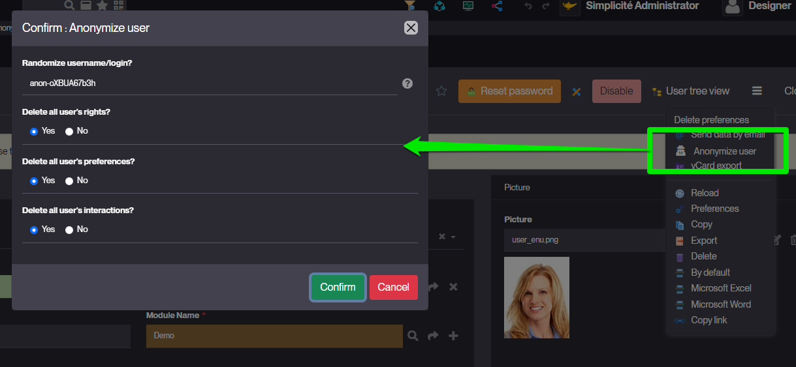

```java
/**
 * Anonymize a user
 * @param login user login to sanitize
 * @param rights true to delete all user's responsibilities
 * @param prefs true to delete all user's preferences (user filters, searches, parameters)
 * @param social true to delete all interactions (social, alert, notif)
 * @param randomizedLogin optional value to randomize the login everywhere in DB (timestamps, sessions history, redolog...)
 */
@Override
public Message anonymizeUser(String login, boolean rights, boolean prefs, boolean social, String randomizedLogin) {
	// sanitize the user infos, rights, preferences and social interactions
	Message m = super.anonymizeUser(login, rights, prefs, social, randomizedLogin);
	if (m.isOk()) {
		// add custom anonymization here in your business objects...
	}
	else {
		// denied
	}
	return m;
}
```

### JSON Backend messages

> no more formatted messages with hashtags "#"

- APIs `Message.formatXXX` will now return JSON messages
- JSONs are serialized to String to be compatible with returns of java hook (pre/postValidate, pre/postSave...)
- Legacy format with "#" is still supported but deprecated (i.e. `code:text#level#field`).
- It is strongly recommended to change/use one of the `Message.formatXXX` to format a message (on validate, save...)

```json
{
	code: "MY_ERROR_CODE", // static TEXT to be translated on UI
	text: "optional additional text in user language",
	field: "myField", // optional related field on UI
	level: "ERROR", // TEXT, INFO, WARNING, ERROR
	actions: [{ action definition }...], // optional list of call to actions
	params: { suggest: "Suggested value" } // optional suggestion of syntax
}
```

### New action to generate object

- a referenced object (0,1) or an aggregated object (0,n) from existing object fields
- designer selects some fields from the object-fields panel
- and sets the linked object name, prefix and table
- then choose the user-key for the new object
- the action generates 2 shared scripts: a patch XML and SQL to migrate the business model and the data
- when XML is applied, the designer must complete the generated object (user-key, rights, user menu...)
- the SQL script can be applied in several instances (dev, test, prod...)
  - populate the new table with distinct values from existing records
  - update the new foreign keys to/from the new table

1. Select fields and click on "Generate object"

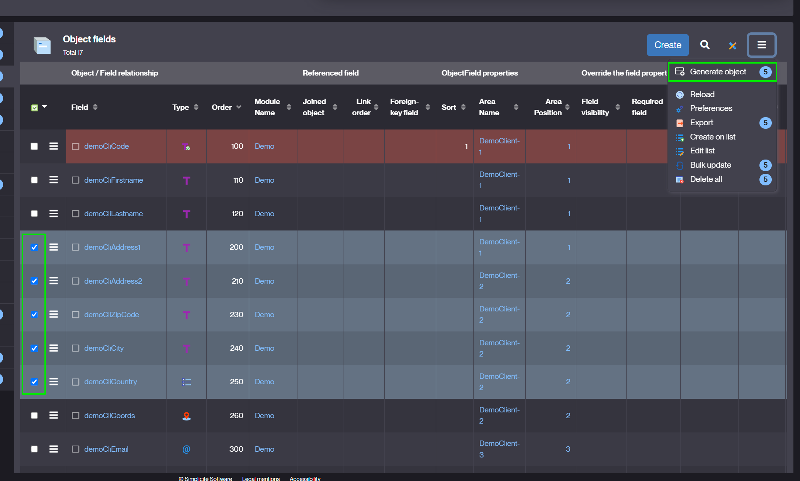

2. Set the link properties and confirm

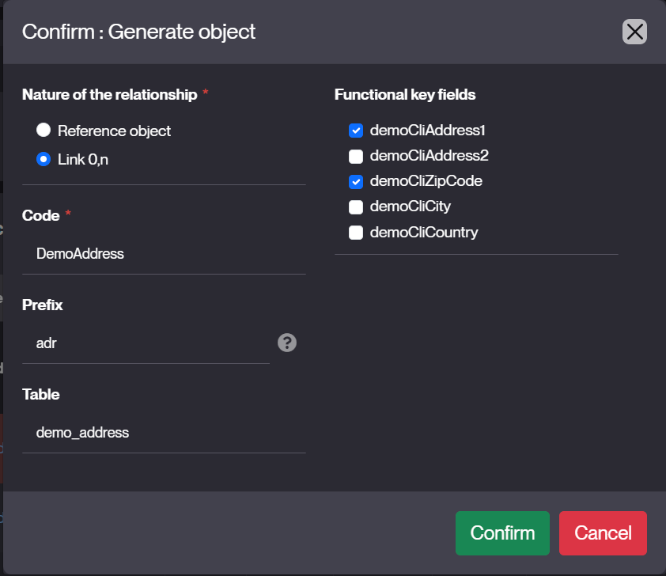

3. Generate the patches

Example after generating a reference table from distinct countries of customers:

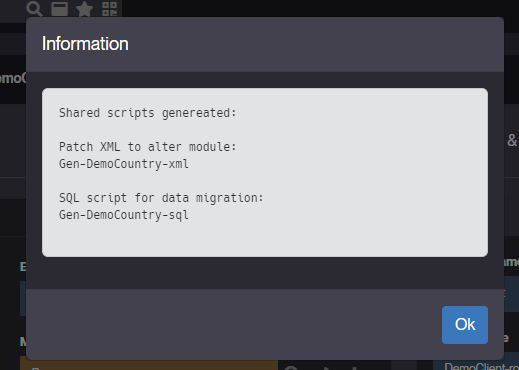
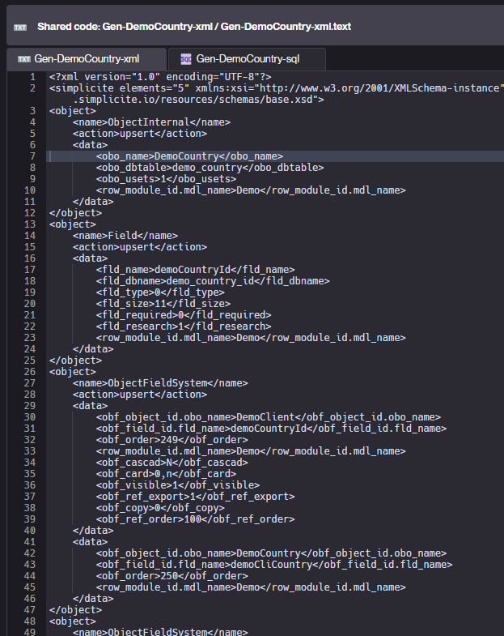


4. Apply them to get the object with migrated data

Designer must finalize the configuration of the generated object.

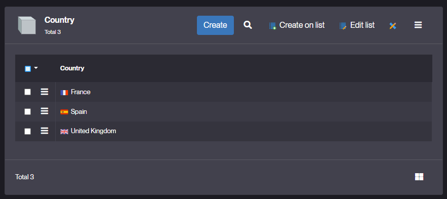

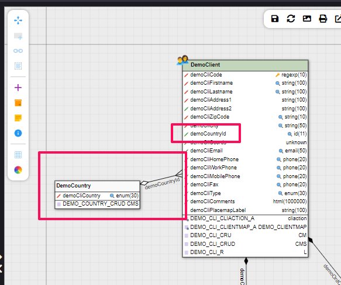

### `customPingResponse` Platform hook

- Added a new `customPingResponse` platform hook to customize the `/ping` JSON response, e.g.:

```java
@Override
public JSONObject customPingResponse(String status, String error) {
	return new JSONObject()
		.put("myCustomStatus", "The status is: " + ("OK".equals(status) ? "All good" : "Houston we have a problem"))
		.put("myCustomError", Tool.isEmpty(error) ? null : "The error is: " + error);
}
```

### Other changes

- New shared script type to apply `XML patches`

- Cascade deletions will always call `pre/postDelete` hooks (no more parameter `DELETE_CHILD_HOOK=no`)

- Added automatic conversion to PDF for a text publication template file (e.g. HTML, plain text, ...) with forced MIME type set to PDF

- Added `minimal` value for `USE_HEALTH` system parameter to restrict healthcheck to monitoring-only data (no information on JVM, server, OS, ...)

- Changed ping and healthcheck to return a `503` instead of a `500` in case of database unavailability

- Added new tags for publication templates:

  - `[SYSPARAM:<parameter name>]` for substituting a system parameter
  - `[LABEL:<object name>:<-|+>]` for substituting singular (`-`) or plural (`+`) object label

- New instances of object during a `DataLink` synchronization:

  - Needs a dedicated user for datalink API to isolate those instances in objects pool
  - Allows distinct rules in hooks:
    - `isDataLinkInstance() && isBatchInstance()`: detect a pull from a host (cron job: bulk resync)
    - `isDataLinkInstance() && isWebServiceInstance()`: detect a push to hosts (REST/PUT: single record)

- New object accessor `forceGroupByFields` to change the group-by fields to search:

```java
boolean previousGroupBy = obj.canGroupByFields();
List<ObjectField> previousFields = obj.getGroupByFields();
try {
	obj.setGroupByFields(true);
	obj.forceGroupByFields(new String[] { "myField1", "myField2" });
	List<String[]> rows = obj.searchGroupBy(false, 1000);
	for (String[] row : rows) {
		// count per myField1,myField2 (last column)
		String count = row[row.length-1];
		// row with field operators (sum, avg...) per myField1,myField2
		obj.setValues(row);
		// ...
	}
}
finally {
	// restore
	obj.setGroupByFields(previousGroupBy);
	obj.setGroupByFields(previousFields);
}
```

- Added static method `Grant.getUserFullName(userId, orLogin)` to get any user's fullname

- Added the ability to configure an explicit "pepper" string for internal password "salting" using the `HASH_PASSWORD_PEPPER` environment variable
  or the `hash.password.pepper` JVM property. This is only taken into account if internal password hashing is enabled (system parameter `SALT_PASSWORD` = `yes`).
  The default "pepper" strategy is still used without this explicit "pepper" string. Note that adding or changing it requires **all users' passwords** to be changed.

- Added a new adapter base class `SimplePDFBoxAdapter` using the PDFBox library. It provides hooks to process the text content of the PDF,
  the PDF document information (title, ...), and the potential form fields entered in a fillable PDF

- `ExternalObject.display` can return an `InputStream` (from a file or anything huge) to be sent by packets in the HTTP response

- New filter "not in" on ENUM field to search unknown LOV values, displayed as "(other)" on UI.

- New `getRefFieldTargetObject` hook to override the target record of a referenced field :

```java
@Override
public String[] getRefFieldTargetObject(String rowId, ObjectField field, String[] row) {
	if (field.getFullInput().contains("myForeignKey")) {
		rowId = getFieldValue("myOtherFkValue"); // target id
		String t[] = new String[3];
		String target = "MyOtherObject";
		t[0] = target; // target object
		t[1] = "the_ajax_"+target; // main target instance
		t[2] = rowId; // target id
		return t;
	}
	return null;
}
```

## UI changes

### The `Call to action` of backend message is now implemented in the alert dialog

    - a backend action can now return other call-to-actions
    - actions to call must be granted to user
    - with the type hidden to avoid direct access thru list or form

### New `hasChangedFields` to determine the global `hasChanged` flag on form:

    - the property `hasChanged` has been improved so that it only triggers if a field has actually been modified (different from the base value)
    - for example, if the user changes a field twice and returns to its original value, the dialog "quit without saving" will no longer appear.

- It is now possible - and recommended - to implement a `ResponsiveExternalObject` Javascript script as a **Javascript class** extending `Simplicite.UI.ExternalObject`
  with an override of the `render` class function, e.g.:

```javascript
Simplicite.UI.ExternalObjects.MyExtObj = class extends (
  Simplicite.UI.ExternalObject
) {
  async render(params, data) {
    this.ctn.find(".mycls").html("Hello world!");
    // or $('#myid').html('Hello world!');
  }
};
```

### New UI tabs options for tabbed areas:

    - tabs positioning on top/left/right/bottom
    - allows to hide all tab labels (to display only icons)
    - configurable on template editor

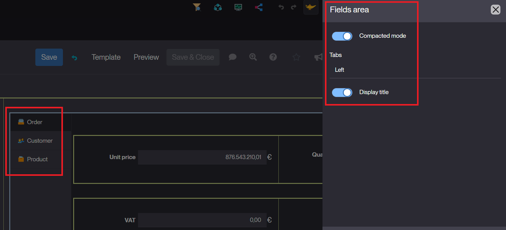

### New UX in object multi-selection (eg used by the associate/pillbox dialog):

    - Added a preview of selected items on the right side of dialog
    - Allows to do several searches without losing previous selections
    - Allows to easily remove all or each item

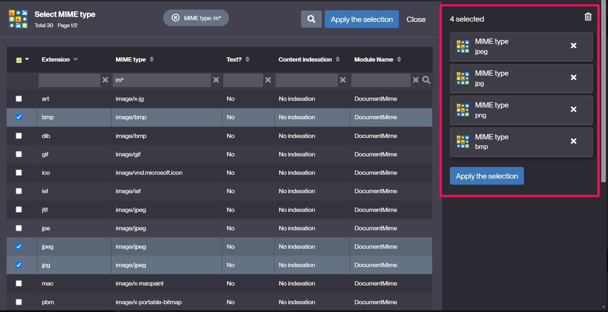

- Optimized menu calls to update counters using a new search service with forced group-by by enum

```javascript
obj.search({}, { groupby: true, groupbyfields: ["myEnumField"] })
.then(list => ...}
```

### New **end-user's dashboards**

    - New group `DASHBOARD_MAKER` to build business dashboards
    - New shortcut granted to group `DASHBOARD` to access the dashboards overview
    - `DASHBOARD_MAKER` can edit its own dashboards, rename and delete
    - he can also share them with other groups (with new group type `dashboard sharing`)

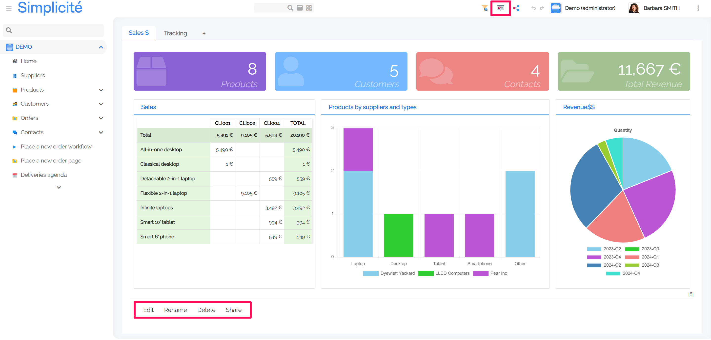

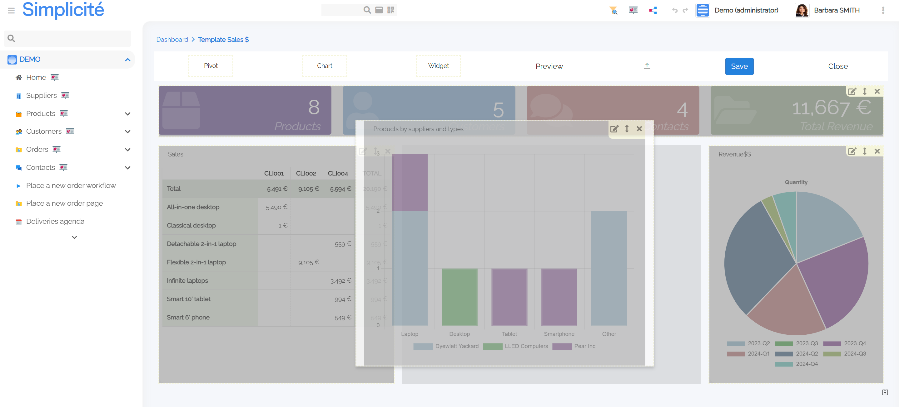

### New user's filters on View

    - allows to add a search bar (new view item) with optional time period and fields
    - the item triggers a new event with users's filters `{ fromDate, toDate, fields... }`
    - the filters are applied to lists, charts and pivot tables (having a date/period or matching filtered fields)
    - external objects have to implement a new handler when they are concerned by filters
    - new front helper to apply view's filters to a business object: `obj.applyFilters(filters)`
    - For example:

```javascript
$("#myWidget")
  .addClass("js-view-filters")
  .on("ui.view.filters", (e, filters) => {
    e.stopPropagation();
    // Apply the filters to widget components
    myobj.applyFilters(filters);
    // Redraw the widget
    myWidget.render();
  });
```

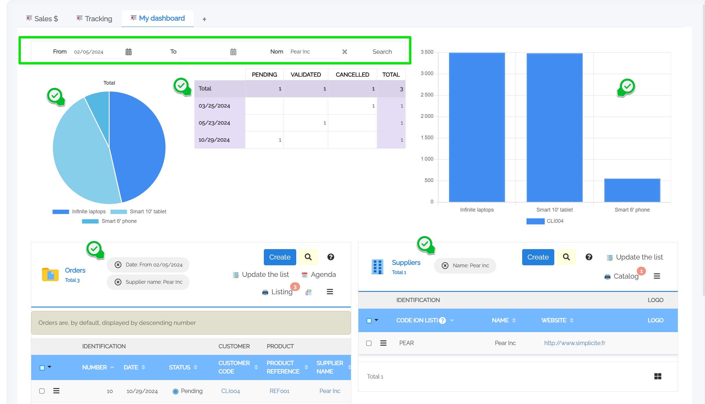

- Improved UX for editing resources and print templates (and deprecated print templates using UI templates)

### Added `SAVE_BEFORE_QUIT_PROCESS` dialog on process activity with several choices:

    - `Save` the current form/activity
    - `Quit` the activity but keep the process in memory
    - `Abandon` the process
    - `Cancel` : stay on the current activity

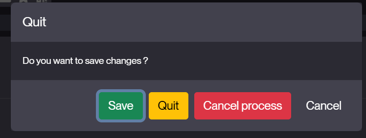

- Color picker has been upgraded to `spectrum-colorpicker2` v2.0.10

- New style helper on `Action` form:
  - to preview a generated button with selected colors
  - to check the level AAA of WCAG contrast (minimum 4.5)


- New style helper on `List code` form:

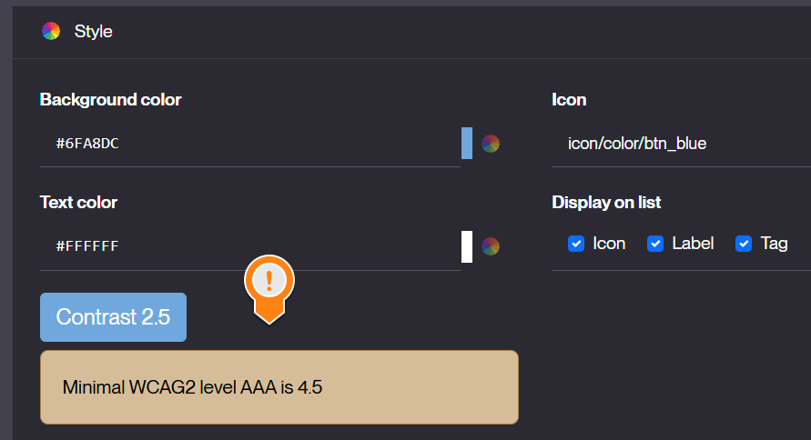

### Removed ajax call within constraints on UI:

    - `[SYSPARAM:name]` is now replaced with session parameter `app.sysparams['name']`
    - `[PARAM:name]` is replaced with the instance local parameter `obj.locals['name']`

### `Bookmarks` on list

    - the record bookmark can be displayed on list item in button options
    - the list can be filtered on "my bookmarks" only

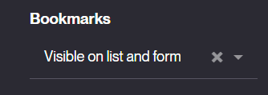


- `Redolog` panel merges children changes in the parent object

Ex: product changes are visible with the supplier changes


## Post-release

### 6.2.0-RC1 (2025-01-23) - release candidate {#version-6.2.0-beta-RC1}

- Initial release candidate for minor version 6.1. See above for details.

### 6.2.0-RC2 (2025-01-31) - release candidate 2 {#version-6.2.0-beta-RC2}

- Fixed some minor Sonar issues
- Added improvements on the DB access page
- Fixed badge filter from enum in menu
- Updated JClouds libs
- Added audit errors in case of outstanding Rhino scripts

### 6.2.0-RC3 (2025-02-07) - release candidate 3 {#version-6.2.0-beta-RC3}

- Fixed regression on DB access
- Used secure random instead of plain random generator
- Security fix in `JSONTool.jsonUser`
- Various minor fixes

### 6.2.0 (2025-02-10) - initial release {#version-6.2.0}

- Initial release for minor version 6.2. See above for details.
- Fixed UI issue with inlined 0,1 link: its child lists will be hidden to preserve only one parent object in form
- Added missing constant `ObjectDB.LIST_READ`

### 6.2.1 (2025-02-13) {#version-6.2.1}

- Fixed contextual values on panel before calling `initRefSelect` hook
- Fixed `AppLog` in database with related asynchronous task
- Improved logging + fallback to internal authentication provider if `AUTH_PROVIDER` is not defined
- Workaround for bootstrap issue 41005 (cause aria-hidden issues on chrome https://github.com/twbs/bootstrap/issues/41005)
- Fixed activity initialization when containing one ACE editor
- Removed duplicate function creation for historic objects
- Added default implementation of service objects' `selectService` hook
  to select matching item form the current list (as set by the `searchService` supposed to be called before)

### 6.2.2 (2025-02-20) {#version-6.2.2}

- Fixed CSS beautifier script loading in code editor
- Fixed empty `getParentObjectRefField()` in `initRefSelect` during completion
- Backported [from v6.3](v6-3#child-objects-change-logs) `Link.setMergeRedologs(true)` to retrieve child redologs in parent panel `Change logs`
- Backported [from v6.3](v6-3#improvements-on-external-objects) UI external objects class metadata + `getResourceURL` and `service` functions
- Backported [from v6.3](v6-3#ocr-library) integration of tesseract.js JS lib for basic client-side OCR

### 6.2.3 (2025-03-07) {#version-6.2.3}

- Fixed useless "save before quit" dialog during record deletion
- Fixed "spring" layout on the modeler
- Backported [from v6.3](v6-3#new-helper-methods) the `ServletTool.success` helper method
- Backported [from v6.3](v6-3#custom-health-check) the `customHealthCheck` platform hook for custom health check
- Backported [from v6.3](v6-3#improved-openapiswagger-schemas) improvements on OpenAPI/Swagger schemas (missing descriptions and `maxLength` on string attributes)

### 6.2.4 (2025-03-19) {#version-6.2.4}

- Fixed action `ObjFieldGenerateObject` without clear cache
- Backported [from v6.3](v6-3#environment-variable-based-configurability) `[ROOT]` and `[URL]` tokens in expressions
- Backported [from v6.3](v6-3#custom-disposition-simplification) implicit rewrite from `*/` to `*/index.html` in static contents
- Fixed audit widget to show only the "Start audit" button
- Backported [from v6.3](v6-3#improved-openapiswagger-schemas) improvements on OpenAPI/Swagger schemas of generic APIs
- Backported [from v6.3](v6-3#improved-mapped-api-configuration) improvements on OpenAPI/Swagger schemas of generic APIs
- Backported [from v6.3](v6-3#development-mode) restrictions in development mode
- Fixed missing flush in API grants' object pools when clearing cache of a single business object or external object
- Backported [from v6.3](v6-3#changed-scope-of-helper-methods) changes on scope of `ObjectCore.(re)setAllFields*` helper methods
- Fixed extend button of UI monitoring

### 6.2.5 (2025-03-28) {#version-6.2.5}

- Backported [from 6.3](v6-3#platform--module-version-check) major version check when importing a module: importing modules exported from
  a higher major versions is now denied as it may have unexpected results
- Fixed meta-object cascade delete without explicit list
- Backported [from v6.3](v6-3#mermaid-widget) the Mermaid widget
- Backported [from v6.3](v6-3#improved-annotations) annotations improvements

### 6.2.6 (2025-04-01) {#version-6.2.6}

- Fixed incorrect syntax of system upgrade SQL statement for SQLServer
- Fixed regression on date period search
- Fixed issues on syntax checking warning messages

### 6.2.7 (2025-04-11) {#version-6.2.7}

- Fixed bookmark deletion from popup
- UI menu: hide the anchor of a single domain (no accordion)
- Backported [from v6.3](v6-3#mail-service-configuration) support for `MAIL_SERVICE` overriding by the same name environment variable (or `mail.service` JVM property)
  and backported support for YAML syntax instead of JSON

### 6.2.8 (2025-04-25) {#version-6.2.8}

- Backported [from v6.3](v6-3#maven-skip-tests) default modules' Maven `skipTests` to `true` to prevent unit tests to be processed,
  by default, outside of a live instance
- Backported [from v6.3](v6-3#improvements-of-the-generic-openidconnect-provider) improvements of the generic OpenIDConnect provider
- Fixed crosstab chart when grouping date per day (`dateGroup='D'`) and field is a datetime
- Backported [from v6.3](v6-3#new-helper-methods) new `getText` helper methods on `PDFTool` to extract raw text content of a PDF document
- Fixed workflow to re-eval data expressions in case of backward/forward
- `$ui.previewDocument` of image will have same rendering as Image field
- Fixed form with 0,1 inlined object containing embedded 0,n panels
- Fixed menu with only 1 domain and 1 object
- Backported [from v6.3](v6-3#environment-variable-based-configurability) `[ENV:<environment variable name>]` substitutions in expressions
- Fixed loss of datetime input in a dialog

### 6.2.9 (2025-05-16) {#version-6.2.9}

- Improved `selectWithoutFilters(rowId)` to exclude the bookmarks filter
- Backported [from v6.3](v6-3#go-to-definition-generalization) generalization of "go to definition" icons (view, pivot table, activity, external object, ...)
- Fixed module diff when using exploded JSON format
- Fixed URI mapping which was not preserving `/health.html` formatted health check page
- Backported [from v6.3](v6-3#environment-variable-based-configurability) `[ENV:<environment variable name>]` substitutions in module settings and system parameters
- Backported [from v6.3](v6-3#environment-variable-based-configurability) the possibility to override a system parameter by an environment variable named `SIMPLICITE_SYSPARAM_<system param name>`
- Fixed list, don't display min/max selector if both have same value
- Fixed missing import origin for dataset imports

### 6.2.10 (2025-05-22) {#version-6.2.10}

- Fixed export of indexed search
- Fixed missing environment variable re-substitutions for system admin singleton after UI update
- Fixed the client tab ID in the case of a tab duplication on Chrome
- Backported [from v6.3](v6-3#environment-variable-based-configurability) `[PROP:<JVM property name>]` substitutions in module settings and system parameters
- Fixed non removed Google font options for CSS declarations (e.g. `Quicksand:wght@300..700` => `Quicksand`)
- Backported [from v6.3](v6-3#improvements-on-external-objects) `getFilename` hook for `ExcelDocumentExternalObject` (and legacy `PDFDocumentExternalObject`)
- Added mention of the the `origin` module remote Git URI (if defined) to avoid ambiguities vs the instance's module Git URI.
  Note that in [v6.3](v6-3#module-git) this legacy custom page is replaced by a dedicated business object exposing the same features

### 6.2.11 (2025-06-20) {#version-6.2.11}

- Fixed missing image wrapping around `[MODEL:]` tags in module's raw Markdown publication
- Backported [from v6.3](v6-3#custom-disposition-simplification) simplifications for custom dispositions
- Fixed form-inlined publication buttons styles
- Fixed dashboard core-cache after UI deletion
- Fixed no "goto definition" button to `View` for `DASHBOARD_MAKER`
- Fixed parent form reload in case of edit-cell in a child panel
- Fixed module filtering in case of reset and populate foreign keys
- Added module filtering support on groups displayed in the _Authorization_ step of the _Create Activity_ system business process
- Fixed signature pad resizing (`fromDataURL` with `ratio=1`)
- Fixed used fields displayed in the "Unused fields" section of the template editor

### 6.2.12 (2025-06-27) {#version-6.2.12}

- Fixed float rendering with progress bar
- Fixed list exports within a view containing multiple instances of the same object
- Backported [from v6.3](v6-3#custom-disposition-simplification) improvements on custom disposition
- Fixed reference field event handling with enum fields

### 6.2.13 (2025-07-18) {#version-6.2.13}

- Fixed textual crosstab without value axis (count)
- Fixed follow link on N,N pillbox creation
- Changed behavior of status `Readonly fields` not to be applied on action confirm fields by default
- Improved platform's "garbage collection" tasks to avoid dropping auth-only sessions as "unknown" sessions
- Improved `$tool.dialog` to close first the same dialog if it already exists
- Backported [from v6.3](v6-3#custom-logout-confirmation-page) the `customLogoutConfirmPage` new platform hook
- Fixed nonce consistency check on OpenIDConnect providers with `"jwt_check_nonce": true`
- Fixed OpenIDConnect auth provider's errors sent on the platform's redirect URI (e.g. when the user authentication has failed or was cancelled)

### 6.2.14 (UNRELEASED) {#version-6.2.14}

- Fixed issue where `initRefSelect` used incorrect parent values for newly created rows in list updates
- Reverted JSON rendering on some system parameters using JSON syntax to avoid unordered "random" JSON reformatting
- Fixed XML import to delete the previous `m_document` record in case of empty document
- Logout for Keycloak OpenIDConnect authentication provider is now purely generic
- Fixed edit-cell of referenced fields in case of populate
