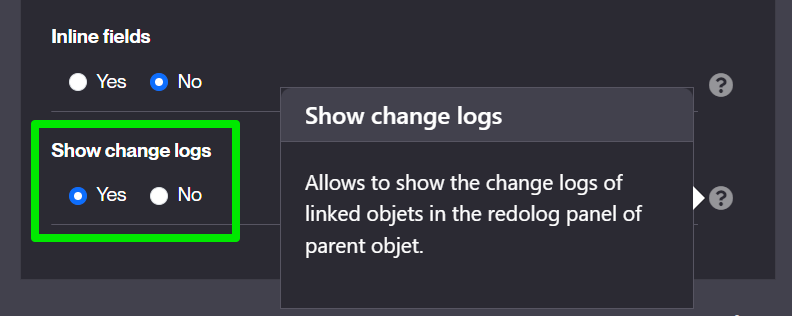

Version 6.3 release note
========================

> **Warning**: This release note corresponds to a **future** minor version which is still in **ALPHA** stage and thus in active developpement.
> <br/>**ALPHA** stage means it is **absolutely not yet suitable** for production

Technical documentation <span id="doc"></span>
----------------------------------------------

All the technical documentation is available from the [platform website](https://platform.simplicite.io), in particular:

- the [JavaDoc](https://platform.simplicite.io/6.3/javadoc/)
- the [JSDoc](https://platform.simplicite.io/6.3/jsdoc/)

Compatibility breaking changes <span id="compatbreakingchanges"></span>
-----------------------------------------------------------------------

<!-- Please put a link to the change in one of the next categories -->

> Nothing so far...

Deprecations
------------

Deprecated features to be removed in the next releases

> Nothing so far...

Features
-------------

New features for the end-user

> Nothing so far...

Enhancements
------------

Features enhancements for the end-user

### Child objects change logs 

Retrieve redologs of child object into the parent `Change log` panel
- new `Link` option `Show change logs`
- or by code `getLink("DemoProduct","demoPrdSupId").setMergeRedologs(true)`



Example: Product updates are visible in the Supplier `Change log` panel


Maker Experience
-----------------

Features enhancements for the designer

> Nothing so far...

Technical
----------

Technical enhacements and features

### Server side events

New servlet `/ui/sse` (asynchronous) to push messages from server to clients thru https

Example to bind a `myEvent` message:

1) Server side:

```java
ServerSideEvent.push("myEvent", new JSONObject().put("info","hello"), userId);
```

userId: null to notify all registered clients or a specific user.

2) Client side: simply add an event listener on `ui.ready`

```javascript
$ui.sse.addEventListener("myEvent", e => {
	let d = JSON.parse(e.data);
	console.log("myEvent message: " + d.info + " at time = " + d.time);
});
```

Predefined server side events:
- `ping`: simple ping thru SSE
- `close`: close the SSE connection
- `reset`: reopen the SSE connection
- `sysparam`: new system parameter flag to push changes from `grant.setParameter("MYPARAM","value")` to client in `$ui.sysparams.MYPARAM="value"`
- `objparam`: push an object parameter to UI in `obj.locals.MYPARAM`
- `enumCounters`: refresh counters in menu when enum or status has changed during save

### Improvements on external objects

- Improved JS class `Simplicite.UI.ExternalObject`:
  - Set metadata `(name, id, URL)` + business object context if any
  - Added `getResourceURL` function to get URL of external object's resources
  - Added `service` function to call server-side `service` hook

### Floating date search

New filter syntax with offset on date or datetime from today's date.
- `[DATE<:offset>]`
- `[DATETIME<:offset>]`
- `offset` = a signed number with unit ('y'ears, 'm'onths, 'w'eeks, 'dw' days no week-end, 'd'ays, 'h'ours, 'm'inutes, 's'econds, 'ms')

Examples

```java
// last 3 months
fieldDate.setFilter(">=[DATE:-3m]");
// in next 15 days
fieldDate.setFilter(">=[DATE] and <=[DATE:15d]");
// before next 12 hours
fieldDatetime.setFilter("<[DATETIME:+12h]");
```

This syntax can be used in predef-search of views/home page.

### Custom health check

Added a new `customHealthCheck` platform hook for custom health check, e.g.:

```java
@Override
public void customHealthCheck(HttpServletRequest request, HttpServletResponse response, boolean minimal) throws Exception {
	AppLog.info("Custom health check called from " + request.getRemoteAddr());

	ServletTool.success(request, response, new JSONObject()
		.put("status", "OK")
		.put("date", Tool.toDatetime(new Date())));
}
```

### Improved OpenAPI/Swagger schemas

The OpenAPI/Swagger schemas of generic APIs have been improved to comply with stricter compliance rules:

- Added missing descriptions on definitions (business objects, errors, ...).
- Added missing `maxLength` constraints for string type attributes in OpenAPI schemas

### Improved mapped API external object configuration

- Added generic mapping capabilities with case conversions, e.g.

```json
{
	"name": "My mapped API",
	"objects": [ "DemoSupplier", "DemoProduct" ], // or "modules": [ "Demo" ]
	"objectsCase": "pascal",
	"fieldsCase": "snake",
	"pathsCase": "kebab"
}
```

- Made `/ping` operation optional (using `"ping": true|false` in configuration, `true` by default for backward compatibility) and added associated `ping` hook
- Added optional `/health` operation (using `"health": true|false` in configuration, `false` by default for backward compatibility) with associated `health` hook

### Added restrictions in development mode only

Some features are now restricted to development mode only.

This development mode is enabled by the `server.devmode=true|false` JVM argument (positionned by the `DEV_MODE` environment variable in Docker containers)

- `devinfo` services (e.g. used by VSCode plugin) are now only accessible in this mode

### Changed scope of helper methods

The `ObjectCore.(re)setAllFields*` helper methods used to iterate on all fields except technical fields (row ID and timestamp fields).

This is an issue in v6 where the characteristics of referenced fields may have an influence on the object behavior
(e.g. setting them updatable means the referenced record can be updated from the referring object).

These referenced fields are thus now also ignored in these helper methods.

Fixes
------