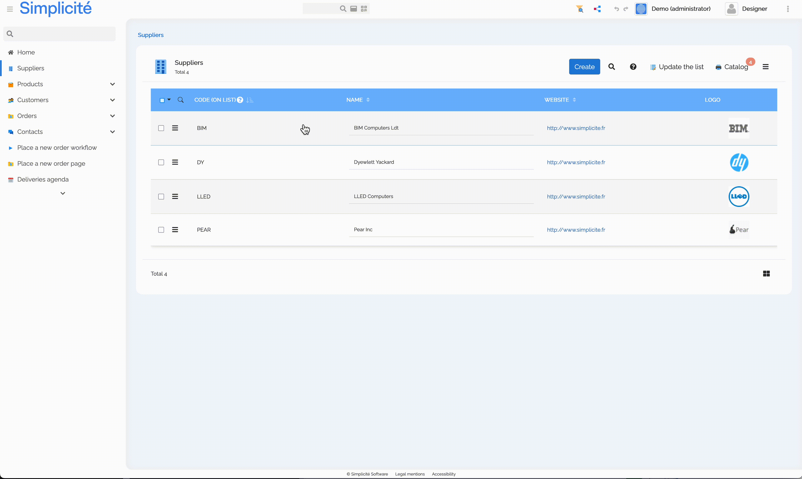
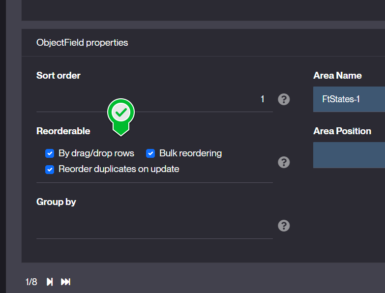
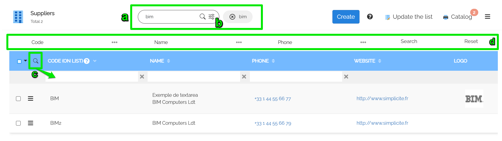
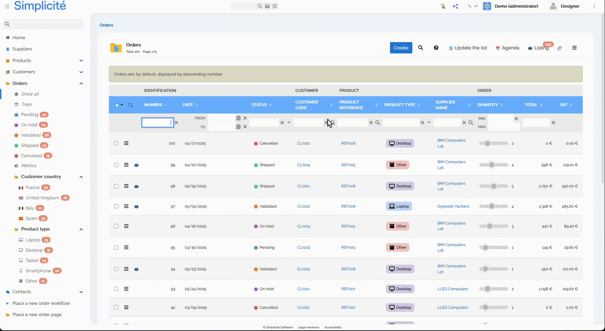
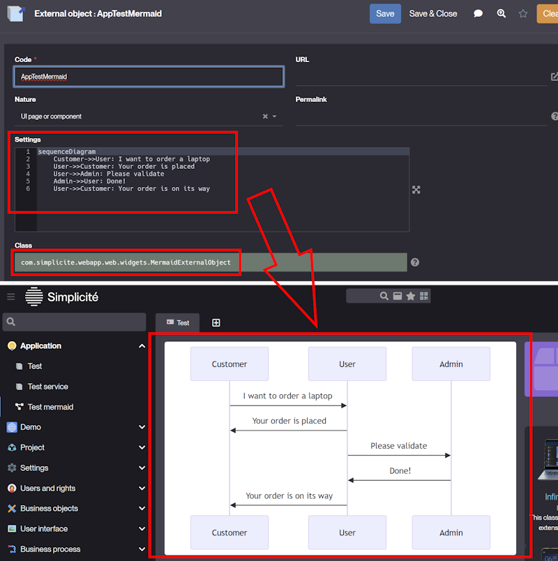
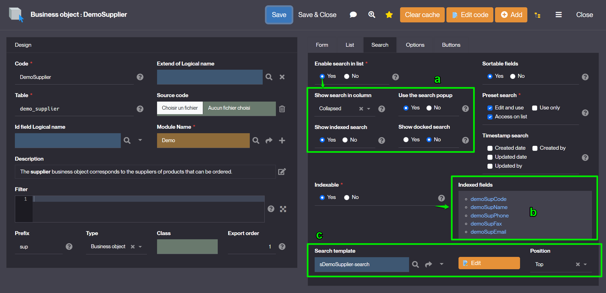
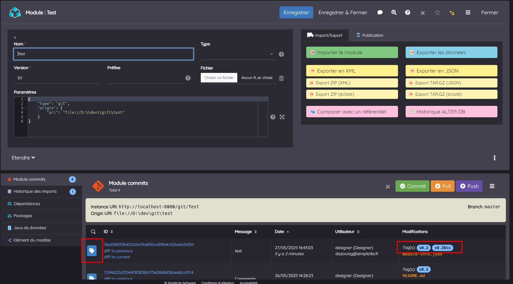
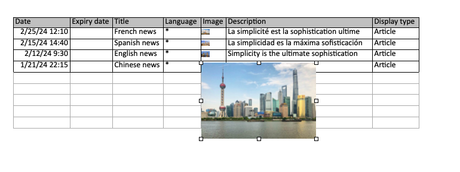

Version 6.3 release note
========================

> **Warning**: This release note corresponds to a **future** minor version which is still in **ALPHA** stage and thus in active development.
> <br/>**ALPHA** stage means it is **absolutely not yet suitable** for production

Compatibility breaking changes
------------------------------

These changes may require action if you use them:

- Some development-oriented features are now restricted to the [development mode](#development-mode)
- The legacy _FranceConnect_ authentication provider has been removed (it was already deprecated in previous minor versions)
  because it can be configured as a purely generic OpenIDConnect authentication provider (note that the generic OpenIDConnect
  provider is also compliant with _FranceConnect+_ authentication service)
- Some deprecated methods and constants that have been marked "for removal" for several previous versions have been removed.
  They were already generating compilation errors in the previous versions so they are supposed to have been already refactored.

Deprecations
------------

These deprecated features may be removed in the next releases, you should take action if you use them
in order to anticipate their future removal:

- Some new methods and constants have been marked deprecated and should be refactored accordingly
  to the proposal (see Javadoc and/or deprecation logs). They are not yet marked "for removal"
  thus won't generate compilation errors but only warnings.

Features
--------

New features for the end-user

### Context menu on lists

Added context menus to lists. When multiple rows are selected, only bulk operations are shown, while single selections display row-specific actions.



### Other Quality of Life improvements

- On lists, <kbd>Ctrl</kbd>+<kbd>Click</kbd> to select a line

### Quick list ordering

This feature allows user to reorder records using a persitent integer field of the business object.

New object field `Reorderable` property on the integer field:



with 3 options to persist the recalculated orders in this field:
- Allows the user to reorder the rows in a list by drag&drop
- Renum thru bulk action the current search with an increment value
- Reorder in case of create/update a row to an existing order


### UI guides

UI guides are tours for usage onbording.

#### Group GUIDE_MAKER

New menu to access guides for makers:
- User guides: full definitions with steps settings and permissions
- Guide usages: to track who used a guide and when 
- Guide recorder: helper to build a tour skeleton during UI usage


Guides can be:
- defined to be launched from any view, home page, business object and external object
- accessible during a limited period
- permitted to user groups
- defined with many steps 
	- into a single page
	- or several asynchronous pages/dialogs
	- with user interaction (to click on button, complete fields...)

#### Group GUIDE_USER

- The user need the responsibility `GUIDE_USER`.
- Permiited guide can be automatically launched (once), or replayed with a button.


Enhancements
------------

Features enhancements for the end-user

### Enhanced list search UX

- a) Indexed/fulltext search can be displayed at the top of the list
- b) Full search on dialog (or docked on left) is a separated button (no more toggle between search modes)
- c) Search by column is a small toggle button in the columns header
- d) A specific search bar can be added to the top or side of the list



- e) When searching a reference, you can now select multiple references at once.



:::note

Goes hand in hand with "[Enhanced search configuration](#enhanced-search-configuration)"

:::

### Search helper on a floating date

TBC


### Child objects change logs

Retrieve redo logs of child object into the parent `Change log` panel
- new `Link` option `Show change logs`
- or by code `getLink("DemoProduct","demoPrdSupId").setMergeRedologs(true)`


Example: Product updates are visible in the Supplier `Change log` panel


Maker Experience
----------------

Features enhancements for the designer

### Improved annotations

All annotations now include a `desc` attribute that can be used to document the related class/method.
New annotations have also been added to annotate the business and external objects' hooks.

E.g.

```java
@BusinessObjectAction(desc = "This actions corresponds to the MY_ACTION configured action")
public String myActionMethod(Action action) {
	(...)
}
```

### Mermaid widget

A new configurable external object class (`MermaidExternalObject`) allows to display Mermaid charts.

E.g.



The chart specification can be either **static** as in the example above (set in the _Settings_ field)
or **dynamic** using the dedicated hook `getMermaidChartSpec`.

E.g.

```java
package com.simplicite.extobjects.MyModule;

import com.simplicite.util.ObjectDB;
import com.simplicite.util.Tool;
import com.simplicite.util.tools.Parameters;

public class AppTestMermaid extends com.simplicite.webapp.web.widgets.MyMermaidExtObject {
	private static final long serialVersionUID = 1L;

	@Override
	public String getMermaidChartSpec(Parameters params) {
		// Embedded in a business object?
		String obj = params.getParameter("object");
		if ("MyObject".equals(obj)) {
			// Retrieve the current business object instance
			ObjectDB o = getGrant().getObject(params.getParameter("inst"), obj);

			// Generate a dynamic specification using the current record of the business object instance
			return
				"graph LR\n"
				+ "  subgraph \"" + o.getDisplay() + "\"\n"
				+ "    subgraph \"" + o.getFieldValue("myField") + "\"\n"
				+ "      " + o.getFieldValue("myOtherField") + "\n"
				+ "    end\n"
				+ "  end\n";
		}
		// Else, defaults to the static specification
		return super.getMermaidChartSpec(params);
	}
}
```

### "Go to definition" generalization

New contextual buttons to go to the component's definition, available for:
- View
- Crosstab
- Activity
- Timesheet
- TreeView
- External object

### Enhanced search configuration

- a) 4 new properties to allow search on list (column, dialog, docked, index)
- b) preview of indexed fields when the object is indexable
- c) allows to edit a search-bar template added to the list



Edit search template on list:


:::note

Goes hand in hand with "[Enhanced list search UX](#enhanced-list-search-ux)"

:::

### Module Git

The legacy `ModuleGIT` external object has been removed. Its features are now available on the `ModuleCommit` business object linked to the `Module` object.

This business object now displays the Git tag(s) of each commit and a new row-level action allows to put a tag on a given commit (the push action now also pushes the tags):



### Modeler search

New search prompt to outline items on model:


### 🥷 Business Data Anonymisation

TBC

Technical
----------

Technical enhancements and features

### ECJ Java compiler

The platform now uses the **Eclipse Java Compiler** (ECJ) instead of the JDK compiler.

This is transparent and more efficient. It also allows to deploy the platform on a JRE instead of a JDK keeping Java custom code compilation possible.

> **Reminder**: Java compilation can be explicitly enabled or disabled using the `server.compiler` JVM argument (defaults to `true`)
> which is driven by the `COMPILER` environment variable in our Docker images.

The compiler options can be customized if needed using the `JAVA_COMPILER_OPTIONS` system parameter which is provided as `-g -warn:unused,deprecation` in order
to make more visible (as warnings) all deprecated usages and unused variables/methods in the custom code (not that compilation warnings
are non blocking but should be fixed).

The list of possible compiler options are described [in the Eclipse documentation](https://help.eclipse.org/latest/index.jsp?topic=%2Forg.eclipse.jdt.doc.user%2Ftasks%2Ftask-using_batch_compiler.htm).

### JS $console tool

New global variable `$console`, by default:
- uses the default navigator `console`
- `$console.error` logs the stack trace + UI alert
- `$console.info|log|warn` can be overridden

`$app.info|warn|error...` are still accessible but it is strongly recommended to use `$console` instead.

### Server side events

New servlet `/ui/sse` (asynchronous) to push messages from server to clients thru https

Example to bind a `myEvent` message:

1) Server side:

```java
ServerSideEvent.push("myEvent", new JSONObject().put("info","hello"), userId);
```

userId: null to notify all registered clients or a specific user.

2) Client side: simply add an event listener on `ui.ready`

```javascript
$ui.sse.addEventListener("myEvent", e => {
	let d = JSON.parse(e.data);
	console.log("myEvent message: " + d.info + " at time = " + d.time);
});
```

Predefined server side events:
- `ping`: simple ping thru SSE
- `close`: close the SSE connection
- `reset`: reopen the SSE connection
- `sysparam`: new system parameter flag to push changes from `grant.setParameter("MYPARAM","value")` to client in `$ui.sysparams.MYPARAM="value"`
- `objparam`: push an object parameter to UI in `obj.locals.MYPARAM`
- `enumCounters`: refresh counters in menu when enum or status has changed during save

### Improvements on external objects

#### Server side

- Added `getFilename` hook for `ExcelDocumentExternalObject` (and legacy `PDFDocumentExternalObject`)

#### Client side

- Improved JS class `Simplicite.UI.ExternalObject`:
  - Set metadata `(name, id, URL)` + business object context if any
  - Added `getResourceURL` function to get URL of external object's resources
  - Added `service` function to call server-side `service` hook

### Floating date search

New filter syntax with offset on date or datetime from today's date.
- `[DATE<:offset>]`
- `[DATETIME<:offset>]`
- `offset` = a signed number with unit ('y'ears, 'm'onths, 'w'eeks, 'dw' days no week-end, 'd'ays, 'h'ours, 'm'inutes, 's'econds, 'ms')

Examples

```java
// last 3 months
fieldDate.setFilter(">=[DATE:-3m]");
// in next 15 days
fieldDate.setFilter(">=[DATE] and <=[DATE:15d]");
// before next 12 hours
fieldDatetime.setFilter("<[DATETIME:+12h]");
```

This syntax can be used in predef-search of views/home page.

### Custom health check

Added a new `customHealthCheck` platform hook for custom health checks, e.g.:

```java
@Override
public void customHealthCheck(HttpServletRequest request, HttpServletResponse response, boolean minimal) throws Exception {
	AppLog.info("Custom health check called from " + request.getRemoteAddr());

	ServletTool.success(request, response, new JSONObject()
		.put("status", "OK")
		.put("date", Tool.toDatetime(new Date())));
}
```

### Custom logout confirmation page

Added a new `customLogoutConfirmPage` platform hook for a custom logout confirmation page, e.g.:

```java
@Override
public void customLogoutConfirmPage(HttpServletRequest request, HttpServletResponse response) throws Exception {
	// ZZZ must use a "try with" to commit HTTP response ZZZ
	try (PrintWriter out = response.getWriter()) {
		out.print("Bye bye!");
	}
}
```

### Improved OpenAPI/Swagger schemas

The OpenAPI/Swagger schemas of generic APIs have been improved to comply with stricter compliance rules:

- Added missing descriptions on definitions (business objects, errors, ...).
- Added missing `maxLength` constraints for string type attributes in OpenAPI schemas

### Improved mapped API configuration

For mapped API external objects:

- Added generic mapping capabilities with case conversions, e.g.

```json
{
	"name": "My mapped API",
	"objects": [ "DemoSupplier", "DemoProduct" ], // or "modules": [ "Demo" ]
	"objectsCase": "pascal",
	"fieldsCase": "snake",
	"pathsCase": "kebab"
}
```

- Made `/ping` operation optional (using `"ping": true|false` in configuration, `true` by default for backward compatibility) and added associated `ping` hook
- Added optional `/health` operation (using `"health": true|false` in configuration, `false` by default for backward compatibility) with associated `health` hook

### Development mode

On development environments, you **must** set the `DEV_MODE` environment variable to `true`.

Failing to do so will prevent the use of the following features :
- the `devinfo` services (e.g. used by VSCode plugin)
- the `/maven` embedded Maven repository
- [reminder] Java code formatting (which requires some additional JVM capabilities to be enabled)

The development mode is enabled by the `server.devmode=true|false` JVM argument (positioned by the `DEV_MODE` environment variable in Docker containers)

### Changed scope of helper methods

The `ObjectCore.(re)setAllFields*` helper methods used to iterate on all fields except technical fields (row ID and timestamp fields).

This is an issue in v6 where the characteristics of referenced fields may have an influence on the object behavior
(e.g. setting them updatable means the referenced record can be updated from the referring object).

These referenced fields are thus now also ignored in these helper methods.

### Platform / module version check

A module exported from a higher major version for the platform (e.g. from the future major version 7)
will now be refused **at module import** as it may cause unexpected results.

Importing modules exported from lower major version is still supported.

### `beforeSave` and `afterSave` front hooks

`Simplicite.UI.BusinessObject` contains 2 new `beforeSave` and `afterSave` front hooks:

```javascript
/**
 * Front hook before calling Ajax object.save()
 * @param ctn Form container
 * @param obj Object (same as this)
 * @param index record index (edit list)
 * @param cbk callback(true|false) (must return 'true' to continue or 'false' to stop/reject promise)
 */
beforeSave(ctn, obj, index, cbk) {
	cbk && cbk(true);
}

/**
 * Front hook after calling Ajax object.save()
 * @param ctn Form container
 * @param obj Object (same as this)
 * @param index record index (edit list)
 * @param cbk callback(true|false) (must return 'true' to continue or 'false' to stop/reject promise)
 */
afterSave(ctn, obj, index, cbk) {
	cbk && cbk(true);
}
```

:::note

Previous hooks `form.beforesave` and `form.beforesave` are still available but it is recommended to use the class BusinessObject.

:::

### Mail service configuration

It is now possible to override the `MAIL_SERVICE` system param by a same name environment variable (or the equivalent `mail.service` JVM property)

It is also now possible ti use YAML syntax instead of JSON for this configuration.

### Maven skip tests

The `skipTests` Maven property is now set by default in the `pom.xml` files of the module.
The reason is that in the great majority of cases the unit tests are supposed to be processed within a live Simplicité instance, not locally.

It it however possible to change this behavior by explicitly setting the `"skipTests": false` in the `"maven: {...}"` block of the module's settings.
In this case you should be able to launch unit tests locally if non of them need to be processed within a live Simplicité instance.

### Improvements of the generic OpenIDConnect provider

The additional authorize URL parameters `acr_values` and `prompt` parameters are now supported in the `AUTH_PROVIDERS` system parameter.

The `nonce` string used by the protocol has also been increased with some additional randomness.

### Environment variable based configurability

- Added `[ROOT]`, `[URL]`, `[ENV:<environment variable name>[:<default value>]]` and `[PROP:<JVM property name>[:<default value>]]` substitutions in expressions
- Added the above `[ENV:]` and `[PROP:]` substitutions in module settings
- Added the above `[ENV:]` and `[PROP:]` substitutions in **loaded** values of system parameters
  (this does not apply to raw system parameter values read from the database using `Grant.getSystemParam("...")`)
- Added the possibility to override a system parameter by an environment variable named `SIMPLICITE_SYSPARAM_<system param name>`
  (this applies only to **loaded** values of system parameters)

### New helper methods

- `ServletTool.success(request, response, JSONObject)` for success (HTTP code 200) responses
- `PDFTool.getText(File|bute[])` to extract raw text content of a PDF document

### Images in excel exports

An experimental feature allows to include images in excel exports, although it comes with the following limitations:

- image anchoring does not work as expected (images don't follow the lines/columns when reordering)
- images adapt to default row size, which is quite small
- it can severely affect the exported file size, so image inclusion will be made optional in the future

In the meantime, it can be activated through the system parameter `FEATURE_FLAGS`

```json
{
  "images_in_excel_exports": true
}
```



### Custom disposition simplification

A new  `StaticSiteExternalObjectDisposition` custom disposition helper class has been added.

The principle of this class is to store the credentials (auth token and Ajax key) in the browser's session storage and redirect to a "static site" external object.
If this external object uses the frontend JS lib (of version 3.1.*+) these credentials are automatically used to retrieve the current's session grant.

The low level `HTMLTool` class has been improved to provide disposition-related get resource methods.

An implicit rewrite has been added from `*/` to `*/index.html` in "static site" external object contents.

### OCR library

- The tesseract.js JS lib  has been integrated to provide with basic client-side OCR

### Docker health check

Docker images now enables a **default** health check command (`HEALTHCHECK`) calling the ping endpoint (`/ping`)
with an call interval of 1 minute and a 3 seconds timeout (after a start period of 10 minutes during which
the call interval is of 30s):

```text
HEALTHCHECK --interval=60s --timeout=3s --start-period=600s --start-interval=30s CMD curl --fail http://localhost:8080/ping || exit 1
```

If you have implemented a custom ping endpoint response, make sure this **default** health check
command is compliant with it (or change it to comply with it).

:::tip
The default values of the intervals, timeout and start period should be fine for most cases but may be adapted
in some **very particular** cases (e.g. where start time is very long because it waits for a slow external system to start up).
:::

### Java builder for business object

TBC
